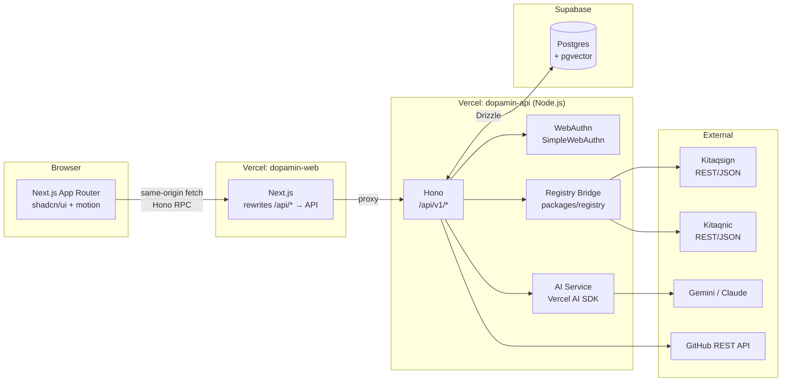
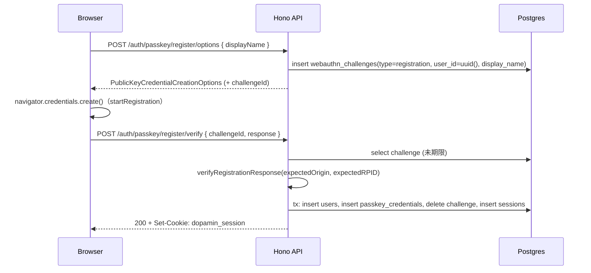

# ドパ民.com（dopamin.com）要件定義書

| 項目 | 内容 |
|---|---|
| 版 | v0.1.2（2026-08-25） |
| プロダクト | ドパ民.com / dopamin.com — Z世代向けドメイン管理プラットフォーム（疑似レジストラ） |
| チーム | チームドパ民（Team B）: 佐々木 琢登・星 はるか・上原 拓也 |
| 位置づけ | GMO Internet Internship in kitaQ Webアプリケーションコース（2026/08/24–28）成果物 |
| 本書の役割 | プロダクト要件の SSOT（Single Source of Truth）。仕様駆動開発における `docs/specs/*` のマスタードキュメント |
| タグライン | 考えるのは楽しく、設定は考えなくていい。 |

---

## 0. 本書の使い方（人間・コーディングエージェント共通）

- 本書は `docs/requirements.md` に置く。機能単位の詳細仕様は `docs/specs/<feature>.md` に分割し、本書の要件ID（`FR-xx` / `NFR-xx`）を必ず参照する。
- 優先順位: **本書 < レジストリの Swagger UI（API仕様の正）**。それ以外は本書が優先。本書と spec が矛盾したら本書を直す PR を先に出す。
- `【要確認】` タグは未確定事項。実装前に確認し、確定したら本書を更新する。推測で実装しない。
- 優先度の定義: **P0** = 8/28 発表までに必須 / **P1** = 差別化・加点対象 / **P2** = 余力があれば。
- エージェントへの指示: 1タスク = 1 spec = 1 PR。`pnpm check`（lint / format / typecheck / test）がグリーンでない変更は main に入れない。

---

## 1. プロダクト概要

### 1.1 一言で

ドメインを初めて取る個人開発者が、**「決める」ことだけ楽しみ、「設定」は考えずに済む**疑似レジストラ。AI が名前を提案し、登録前に「既存と紛らわしくないか」を独自性スコアで可視化し、取得後はリポジトリの中身からサブドメイン構成を提案する。

### 1.2 背景（インターン課題）

- お題: お名前.com 相当の「疑似レジストラサービス」を、Claude を主体とした AI 駆動開発でチーム制作し、最終日にデプロイ＋成果発表する（5日間ハッカソン形式）。
- 会員が保有するドメインの **登録・更新・情報修正・廃止・復旧・移管・情報参照** を、疑似レジストリ **Kitaqsign / Kitaqnic** への EPP 相当コマンド（HTTP/REST + JSON）として実行する。
- 期間中に「レジストリからの仕様変更通知」が届くシナリオがあり、変更に耐える設計が求められる。
- 各チームなりのアレンジ（ターゲット絞り込み・独自機能・UI/UX）が必須。

### 1.3 ペルソナ

| ペルソナ | 状況 | 求めていること |
|---|---|---|
| 個人開発者（学生・若手） | ポートフォリオ / 個人サービス用に初めてドメインを取る | 迷わず、短時間で、後悔しない名前を取りたい |
| ドメイン名が決まっていない人 | ニックネームや用途はあるが名前が固まらない | 候補を出してほしい。似た名前と被りたくない |
| サブドメインを発行したい人 | ドメインは取ったが `api.` / `docs.` 等の構成に悩む | プロジェクト内容に合った構成を提案してほしい |

### 1.4 課題（お名前.com の「ドパ減」ポイント）と解決

| # | 課題 | 解決（本プロダクト） |
|---|---|---|
| 1 | 登録前の判断材料が少ない。空き確認・類似提案はあるが「既存と紛らわしくないか」を確認できない | **独自性スコア**を登録前に表示（FR-05） |
| 2 | 取得して終わりになりやすい。取得後の使い方・構成支援が弱い | **サブドメイン設計支援**（FR-13）。リポジトリの中身から構成を提案 |
| 3 | 取るまでのステップが多い | 必要な判断を絞った **3ステップ導線**（候補 → スコア確認 → 登録）（FR-03/04/06） |

### 1.5 差別化ポイント

1. **逆張りスコア（独自性スコア）**: 既存サービスと「似ていない」ことを数値化。ブランド保護で使われる類似検知の考え方を、登録前の判断材料に転用。
2. **登録前チェック**: 空き確認と同時にスコアを提示し、登録ボタンの手前で判断を完結させる。
3. **取得後の設計支援**: GitHub リポジトリの構成から、適したサブドメイン構成を提案する。

### 1.6 評価基準への対応

| 評価基準（GMO） | 本プロダクトでの対応 |
|---|---|
| 1. 機能網羅性 | 必須7機能を P0 として最優先実装（§2.1） |
| 2. AI駆動開発の実践度 | Spec-Driven + Loop Engineering（§18）、CLAUDE.md、AI ログ機能（FR-14）で開発プロセス自体を可視化 |
| 3. 設計・実装品質 | Bridge 層でレジストリ差分を吸収（§11）、EPP ステータス・Grace Period を型で表現、契約テスト |
| 4. UI/UX | ターゲットを絞った導線、shadcn/ui + motion による一貫した UI（§15） |
| 5. 発表・デモ | デモシナリオ（§3.3）とデモデータリセット（FR-16）を用意 |

---

## 2. スコープ

### 2.1 機能スコープ

| ID | 機能 | 優先度 | 出典 |
|---|---|---|---|
| FR-01 | パスキー認証（サインアップ / ログイン / パスキー管理） | P0 | 技術要件 |
| FR-02 | 保有ドメイン一覧 | P0 | GMO 必須（info） |
| FR-03 | ドメイン検索・空き確認 | P0 | GMO 必須（check） |
| FR-04 | AI ドメイン候補生成（ニックネーム → 候補） | P1 | チーム差別化 |
| FR-05 | 独自性スコア | P1 | チーム差別化 |
| FR-06 | ドメイン登録 | P0 | GMO 必須（create） |
| FR-07 | ドメイン詳細・情報参照 | P0 | GMO 必須（info） |
| FR-08 | 更新（有効期限延長） | P0 | GMO 必須（renew） |
| FR-09 | 情報修正（NS・コンタクト） | P0 | GMO 必須（update） |
| FR-10 | 廃止 | P0 | GMO 必須（delete） |
| FR-11 | 復旧（RGP） | P0 | GMO 必須（restore） |
| FR-12 | 移管（IN / OUT） | P0 | GMO 必須（transfer） |
| FR-13 | サブドメイン設計支援（GitHub リポ解析） | P1 | チーム差別化 |
| FR-14 | AI ログ | P1 | チーム（プロトタイプ由来） |
| FR-15 | 操作ログ（レジストリ通信ログ） | P1 | GMO「エラーシミュレーション」対応 |
| FR-16 | デモデータリセット | P1 | 発表用 |
| FR-17 | AI 設定（プロバイダ / モデル切替） | P2 | 技術要件（AI SDK 抽象化） |
| FR-18 | エラー表示・レジストリ障害時の挙動 | P0 | GMO「エラーシミュレーション」対応 |

### 2.2 非スコープ

- 決済・課金・料金表示（価格は表示しない、または固定ダミー）
- DNS ゾーン管理（A/CNAME/MX 等のレコード編集）。サブドメイン設計は「設計書」の提案・保存までで、DNS 反映は行わない
- Whois 情報公開代行、ドメインパーキング、オークション、バックオーダー
- メール / プッシュ通知、多言語対応（日本語のみ）、管理者画面、リセラー機能
- 本物の EPP（XML over TLS）接続

### 2.3 制約

| 制約 | 内容 |
|---|---|
| 期間 | 2026/08/25（火）〜 08/28（金）16:00 成果発表。実質 3.5 日 |
| レジストリ | Kitaqsign（`https://docs.kitaqsign.com/swagger-ui/index.html`）/ Kitaqnic（`https://docs.kitaqnic.com/swagger-ui/index.html`）。両方の Swagger が仕様の正。認証方式・エンドポイント・リクエスト/レスポンス形式は実装前に両方確認する |
| PII | コンタクト情報の氏名・メール等は許可されたダミー値のみ使用。実在個人情報を登録・保存しない |
| AI ツール | Claude（Claude Code）をメインに使う。他 AI との併用を見越した設計は可 |
| デプロイ | 開発完了後に必ずデプロイ（先は自由 → Vercel） |
| 無料枠 | Vercel Hobby は組織リポジトリからの Git 連携デプロイ不可 → GitHub Actions + Vercel CLI で CI/CD を自前構築 |
| ソース管理 | チームで GitHub リポジトリを用意・管理 |

---

## 3. ユーザーフロー

### 3.1 メインフロー（初回利用〜登録〜設計）

```
[サインアップ] 表示名を入力 → パスキー作成（生体認証/PIN） → ダッシュボード（空）
      ↓
[候補を考える] ニックネーム + 用途キーワード → AI が候補6件を提示（TLD 込み）
      ↓
[登録前チェック] 各候補に 空き状況（check）+ 独自性スコア を並べて表示。直接入力も可
      ↓
[登録] 候補を選ぶ → 期間・NS を最小限入力（既定値あり） → create → 完了
      ↓
[取得後の設計] 「サブドメイン設計に進む」→ 公開リポ URL を入力 → 構成提案 → 保存
```

### 3.2 管理フロー

- ダッシュボードで保有ドメインを一覧 → 詳細画面で状態・有効期限・NS・EPP ステータスを確認（レジストリから最新化）
- 詳細画面から 更新 / 情報修正 / 廃止 / 復旧 / 移管（AuthCode 取得・移管申請）を実行
- すべての操作は操作ログに記録され、AI 呼び出しは AI ログに記録される

### 3.3 デモシナリオ（発表用・約5分）

1. パスキーでサインアップ（ユーザー名入力なしでログインできることを示す）
2. ニックネーム「たくたく」+ 用途「学生エンジニア」→ AI 候補 6 件
3. 候補の空き状況と独自性スコアを比較 → 有名サービスに似た候補が低スコアになることを示す
4. `.com` を Kitaqsign に登録（3クリック）
5. GitHub の公開リポ URL を入力 → `api.` / `docs.` / `app.` などの構成提案 → 保存
6. 別のドメインで 更新 → 廃止 → 復旧（RGP）を実演。EPP ステータス遷移が画面に反映されることを示す
7. Kitaqnic 側のドメインで移管 IN（AuthCode）を実演
8. レジストリ通信エラーを発生させ、ユーザー向けメッセージ・操作ログ・再同期で復帰する様子を示す
9. AI ログを開き、開発中も含めて AI をどう使ったかを話す

---

## 4. 機能要件

各要件は「概要 / 振る舞い / 受け入れ条件（AC）」で記述する。詳細（画面項目・API 契約・テスト観点）は `docs/specs/<feature>.md` に置く。

### FR-01 パスキー認証【P0】

- **概要**: メール・パスワードを一切使わず、パスキー（WebAuthn）のみでサインアップ・ログインする。Supabase Auth は使用せず、Hono 側で SimpleWebAuthn により自前実装する（設計詳細 §12）。
- **振る舞い**:
  - サインアップ: 表示名（1〜32文字）を入力 → `registration options` 取得 → ブラウザのパスキー作成 → 検証成功でユーザー作成 + セッション発行。
  - ログイン: ユーザー名入力なし。Discoverable Credential（Resident Key）でブラウザがパスキーを選択 → 検証成功でセッション発行。
  - ログアウト: セッションを失効させる。
  - パスキー管理（設定画面）: 登録済みパスキーの一覧（名前・作成日・最終利用日）、追加登録、削除（最後の1つは削除不可）。
- **AC**:
  - AC-01-1: 対応ブラウザ（Chrome / Safari / Edge 最新）でサインアップ〜ログアウト〜再ログインが完了する。
  - AC-01-2: ログイン画面にテキスト入力欄が存在しない（ボタン1つ）。
  - AC-01-3: 未認証で `/dashboard` 以下にアクセスするとログイン画面へリダイレクトされる。API は 401 を返す。
  - AC-01-4: signature counter の後退（クローン検知）時は認証を拒否しログに記録する。
  - AC-01-5: パスキー非対応環境ではその旨を案内する（フォールバック認証は提供しない）。

### FR-02 保有ドメイン一覧【P0】

- **概要**: ログインユーザーが保有するドメインを一覧表示する（プロトタイプ画面「保有ドメイン一覧」）。
- **振る舞い**:
  - 表示項目: ドメイン名 / レジストリ（kitaqsign・kitaqnic）/ 状態バッジ（Active・RGP・Pending Delete・移管中 等）/ 有効期限 / 最終同期時刻。
  - 一覧は DB のキャッシュを表示し、「最新化」ボタンで各ドメインを `info` で再同期する。
  - 行クリックで詳細（FR-07）へ遷移。0件時はドメイン検索（FR-03）への CTA を表示。
- **AC**:
  - AC-02-1: 他ユーザーのドメインは表示されない（API 側で `user_id` によるフィルタ）。
  - AC-02-2: 有効期限が 30 日以内のドメインは警告バッジを表示する。
  - AC-02-3: 状態バッジは EPP ステータス（§11.3）から決定的に導出される。

### FR-03 ドメイン検索・空き確認【P0】

- **概要**: 文字列を入力し、TLD ごとの空き状況を確認する（EPP `check`）。
- **振る舞い**:
  - 入力: SLD（`example`）+ TLD 選択、または FQDN 直接入力。複数 TLD の一括確認に対応。
  - TLD → レジストリのルーティングは設定テーブル（§11.2）に従う。
  - 結果: `空き` / `取得済み` / `確認不可（エラー）` の3状態と、空きの場合は独自性スコア（FR-05）を並べて表示。
  - 取得済みの場合は代替候補（別 TLD・綴り違い）を提示する（GMO オプション「類似ドメイン提案」のミニ版）。
  - 入力バリデーション: RFC 1035 準拠のラベル（英数字とハイフン、先頭末尾ハイフン不可、1〜63文字）。IDN は非対応。
- **AC**:
  - AC-03-1: 1回の検索で選択した全 TLD の結果が 3 秒以内に返る（レジストリ応答が正常な場合）。
  - AC-03-2: 一部レジストリがエラーでも、他の結果は表示される（部分失敗を許容）。
  - AC-03-3: 不正な文字列はレジストリに送らず、クライアント + サーバー双方で弾く。

### FR-04 AI ドメイン候補生成【P1】

- **概要**: ニックネームと用途キーワードから、ドメイン名候補を AI が 6 件提案する。
- **振る舞い**:
  - 入力: ニックネーム（必須）、用途・キーワード（任意）、希望 TLD（任意・既定は全対応 TLD）。
  - 出力: 候補 6 件。各候補は `sld` / `tld` / `理由（40字以内）` を持つ（structured output）。
  - 候補は自動で FR-03 の check と FR-05 のスコア算出にかけ、結果を候補カードに反映する。
  - 候補カードをクリックすると検索欄に反映され、そのまま登録（FR-06）に進める。
  - 「もう一度考える」で再生成（前回の候補を除外するよう指示）。
- **AC**:
  - AC-04-1: 候補は必ず 6 件、重複なし、バリデーション（AC-03-3）を通過したもののみ表示。
  - AC-04-2: AI 応答は 10 秒以内。超過時はエラー表示して手入力を促す。
  - AC-04-3: AI 呼び出しは AI ログ（FR-14）に記録される。

### FR-05 独自性スコア（逆張りスコア）【P1】

- **概要**: 候補ドメイン名が既存の有名サービス・ブランドと「紛らわしくないか」を 0〜100 で表示する。高いほど独自性が高い。算出方式は埋め込みモデルによる類似検索（詳細 §14）。
- **振る舞い**:
  - 入力: SLD（TLD は無視）。
  - 出力: スコア（整数）/ ラベル（`独自性高` ≥70・`やや紛らわしい` 40–69・`紛らわしい` <40）/ 最も近い既存名 上位3件と類似度。
  - 表示: 候補カードと検索結果に小さなゲージで表示。クリックで上位3件の内訳を展開。
  - 同一 SLD の結果は 24 時間キャッシュする。
- **AC**:
  - AC-05-1: `google` / `amazon` / `youtube` 等の有名名は `紛らわしい` 判定になる（検証セットで確認）。
  - AC-05-2: スコア算出はレジストリ通信と独立しており、レジストリ障害時も表示される。
  - AC-05-3: 算出 1 件あたり 1.5 秒以内（埋め込み API + pgvector 検索）。

### FR-06 ドメイン登録【P0】

- **概要**: 空きドメインを登録する（EPP `create`）。
- **振る舞い**:
  - 登録ダイアログの入力: 期間（1〜10年、既定 1年）/ ネームサーバー（既定: レジストリ既定値または空、後から FR-09 で設定可）/ コンタクト（ユーザーの登録者プロファイルを自動適用、ダミー PII）。
  - 実行順: 直前に `check` を再実行 → 空きなら `create` → 成功後 `info` で確定情報を取得し DB に保存。
  - 成功画面で「サブドメイン設計に進む」（FR-13）と「詳細を見る」を提示。
  - 取得済み（競合）時はその旨を表示し、代替候補（FR-03）へ誘導。
- **AC**:
  - AC-06-1: 登録成功後、一覧（FR-02）に即時反映され、状態が `Active`（`ok`）になる。
  - AC-06-2: `create` がタイムアウトした場合、二重登録を避けるため再送せず、`info` で存在確認して結果を確定する。
  - AC-06-3: 登録操作は操作ログ（FR-15）に request / response を記録する。

### FR-07 ドメイン詳細・情報参照【P0】

- **概要**: 1ドメインの詳細をレジストリから取得して表示する（EPP `info`）。
- **振る舞い**:
  - 表示: ドメイン名 / レジストリ / EPP ステータス一覧（バッジ + 説明）/ 登録日・有効期限 / ネームサーバー / 登録者コンタクト（ダミー）/ 猶予期間情報（RGP 残日数など）/ 移管可能日（登録・前回移管から 60 日ルール）。
  - 画面表示時にレジストリから `info` を取得し、DB を更新（レジストリが正、§6.5）。
  - 操作パネル: 更新 / 情報修正 / 廃止 / 復旧 / 移管。状態に応じて実行不可な操作は無効化し理由を表示する。
- **AC**:
  - AC-07-1: `serverUpdateProhibited` 等の Server ステータスがある場合、対応する操作ボタンが無効化される（Server > Client の優先順位）。
  - AC-07-2: `info` に失敗した場合は DB キャッシュを「最終同期時刻」付きで表示し、再試行ボタンを出す。

### FR-08 更新（有効期限延長）【P0】

- **概要**: 有効期限を延長する（EPP `renew`）。
- **振る舞い**: 期間（1〜10年）と現在の有効期限を入力して `renew` → 新しい有効期限を表示。`renew` には現在の有効期限（curExpDate）を渡す【要確認: 両レジストリの `renew` の必須パラメータ】。
- **AC**:
  - AC-08-1: 成功後、詳細・一覧の有効期限が更新される。
  - AC-08-2: 合計有効期間が上限（10年）を超える要求は送信前に弾く。

### FR-09 情報修正（NS・コンタクト）【P0】

- **概要**: ネームサーバーとコンタクト情報を変更する（EPP `update`）。
- **振る舞い**:
  - NS: 2〜13 件のホスト名を追加・削除（差分を `add` / `rem` として送る）。
  - コンタクト: 登録者（Registrant）必須、技術（Technical）任意。管理（Admin）・請求（Billing）は扱わない（ICANN Registration Data Policy 2025-08-21 準拠）。
  - Client ステータスの付与・解除（`clientTransferProhibited` 等）を「ロック」トグルとして提供【要確認: レジストリが Client ステータス更新に対応しているか】。
- **AC**:
  - AC-09-1: NS 変更後 `info` で反映を確認し、画面に表示される。
  - AC-09-2: `serverUpdateProhibited` 中は操作を受け付けない。

### FR-10 廃止【P0】

- **概要**: ドメインを削除する（EPP `delete`）。
- **振る舞い**: 確認ダイアログでドメイン名の再入力を求める。Add Grace Period（登録後 5 日）内なら「無課金で取消扱い」の旨、それ以降は「30 日間の復旧猶予（RGP）後に完全削除」の旨を表示して実行。成功後は状態を `redemptionPeriod`（または即時削除）に更新。
- **AC**:
  - AC-10-1: 削除後、一覧に RGP バッジと残日数が表示される（レジストリが RGP を返す場合）。
  - AC-10-2: `clientDeleteProhibited` / `serverDeleteProhibited` 中は実行できない。

### FR-11 復旧（RGP）【P0】

- **概要**: 削除猶予期間内のドメインを復旧する（EPP `restore`、RFC 3915 の `rgp:restore`）。
- **振る舞い**: `redemptionPeriod` のドメインにのみ「復旧」ボタンを表示。実行時に復旧費用が発生する旨を表示（金額はダミー）。レジストリが 2 段階（request → report）を要求する場合は両方を実行する【要確認: 各レジストリの restore フロー】。
- **AC**:
  - AC-11-1: 復旧後、状態が `ok`（Active）に戻る。
  - AC-11-2: `pendingDelete` のドメインでは復旧ボタンが表示されない。

### FR-12 移管（IN / OUT）【P0】

- **概要**: 他レジストラ（本アプリの別ユーザー・別レジストラ相当を含む）との間でドメインを移管する（EPP `transfer`）。
- **振る舞い**:
  - 移管 OUT: 保有ドメインの AuthCode を表示（コピー可）。表示は操作ログに記録。
  - 移管 IN: ドメイン名 + AuthCode を入力 → `transfer request` → 状態「移管申請中（pendingTransfer）」で一覧に表示 → 完了後 `info` で取り込み。
  - 登録・前回移管から 60 日以内は移管不可の旨を表示（ICANN ルール）。レジストリが即時承認 / 承認待ちのどちらかは Swagger に従う【要確認】。
  - 移管ステータスの照会（`transfer query`）と、承認 / 拒否（受け側）は P2。
- **AC**:
  - AC-12-1: 正しい AuthCode で移管申請が受理され、一覧に移管中として表示される。
  - AC-12-2: 誤った AuthCode はレジストリのエラーをユーザー向けメッセージに変換して表示する。

### FR-13 サブドメイン設計支援【P1】

- **概要**: 取得済みドメインに対し、GitHub の公開リポジトリの中身からサブドメイン構成を AI が提案する。
- **振る舞い**:
  - 入力: 対象ドメイン、公開リポジトリ URL（`https://github.com/<owner>/<repo>`）。
  - 解析（サーバー側・GitHub REST API、サーバー保有トークンで認証しレート制限を緩和）: リポ説明・トピック・言語比率・README（先頭 8KB）・ルート直下のツリー・`package.json` / `pyproject.toml` 等のマニフェスト・`apps/` `packages/` `docs/` `api/` などの構造ヒント。
  - 提案（structured output）: 3〜8 件の `{ host, purpose, recordType(A|CNAME|ALIAS), target(例: Vercel/GitHub Pages), priority(必須|推奨|任意) }` と 全体方針（120字以内）。
  - 保存: 提案を編集（追加・削除・名前変更）して「サブドメイン設計」としてドメインに紐付け保存。DNS への反映は行わず、設定手順のテキスト（コピー用）を生成する。
- **AC**:
  - AC-13-1: 公開リポの URL 入力から提案表示まで 15 秒以内。
  - AC-13-2: 存在しない / 非公開リポは「取得できません」と明示し、代替として「プロジェクト概要をテキスト入力」で提案できる。
  - AC-13-3: 保存した設計は詳細画面から再表示・再編集できる。

### FR-14 AI ログ【P1】

- **概要**: アプリ内の AI 呼び出し（候補生成・スコア・サブドメイン提案）を右サイドパネルに時系列で表示する。
- **振る舞い**: 各エントリに 機能名 / プロバイダ・モデル / 入力要約 / 出力要約 / レイテンシ / トークン数（取得できる場合）を表示。クリックで生の出力（JSON）を展開。ユーザー自身のログのみ表示。
- **AC**:
  - AC-14-1: すべての AI 呼び出しが成功・失敗を問わず記録される。
  - AC-14-2: プロンプト全文ではなく要約 + 構造化出力を保存する（DB 肥大防止）。

### FR-15 操作ログ（レジストリ通信ログ）【P1】

- **概要**: レジストリへの EPP 相当コマンドの送受信を記録し、ユーザーが参照できる。
- **振る舞い**: コマンド / レジストリ / 対象ドメイン / 結果（成功・エラーコード）/ レイテンシ / 日時を一覧表示。詳細で request / response（機密値はマスク）を表示。
- **AC**:
  - AC-15-1: タイムアウト・5xx・レジストリ拒否のいずれもエラー種別付きで記録される。
  - AC-15-2: API キー・AuthCode は `***` にマスクされる。

### FR-16 デモデータリセット【P1】

- **概要**: 発表・検証用に、ログインユーザーの DB 上のデータを既定のデモ状態に戻す。
- **振る舞い**: ユーザーのドメイン・設計・ログを削除し、デモ用ドメイン（各状態のサンプル: Active / RGP / 期限間近 / 移管中）を投入する。レジストリ側の状態はリセットできないため、デモ用ドメインは `dopamin-demo-<短いランダム>` 命名でレジストリに実登録するか、`mock` レジストリ（§11.1）に紐付ける【要確認: レジストリ側にテスト用ドメインの削除・再利用制約があるか】。
- **AC**:
  - AC-16-1: `DEMO_RESET_ENABLED=true` の環境でのみ実行可能。
  - AC-16-2: リセット後、デモシナリオ（§3.3）の 6〜8 が再現できる。

### FR-17 AI 設定【P2】

- **概要**: 設定画面から使用する LLM プロバイダ / モデルをユーザー単位で切り替える（Vercel AI SDK による抽象化を UI に露出）。
- **振る舞い**: 選択肢は環境変数で有効化されたプロバイダのみ（`google` / `anthropic`）。API キーはサーバー側のみ保持し、ユーザー入力は受け付けない。
- **AC**: 切替後の AI 呼び出しが AI ログ上で選択したモデル名になっている。

### FR-18 エラー表示・レジストリ障害時の挙動【P0】

- **概要**: レジストリ通信エラー（タイムアウト・5xx・拒否応答・仕様不一致）を、ユーザーが次の行動を取れる形で表示し、ローカル状態を壊さない。
- **振る舞い**:
  - 統一エラー形式（§10.3）で API が返し、Web は種別ごとのメッセージ（例: 「Kitaqsign が応答しません。しばらくして再試行してください」）と再試行ボタンを表示。
  - 参照系（`check` / `info`）は指数バックオフで最大 2 回自動再試行。更新系（`create` / `renew` / `update` / `delete` / `restore` / `transfer`）は自動再試行せず、タイムアウト時は `info` で結果を照合する。
  - 仕様不一致（レスポンススキーマ検証失敗）は `REGISTRY_SPEC_MISMATCH` として記録し、画面には「レジストリの仕様変更の可能性」と表示。
- **AC**:
  - AC-18-1: レジストリの URL を無効化した状態で全画面がクラッシュせず、エラー表示 + 再試行が機能する。
  - AC-18-2: 更新系コマンドのタイムアウト後に DB とレジストリの状態が一致する（`info` 照合）。

---

## 5. 非機能要件

| ID | 区分 | 要件 |
|---|---|---|
| NFR-01 | 性能 | API の p95 レイテンシ（レジストリ・AI 呼び出しを除く自前処理）300ms 以内。ページ初期表示 LCP 2.5s 以内 |
| NFR-02 | 信頼性 | レジストリが正（Source of Truth）。DB は表示用キャッシュ + 履歴。更新系コマンドは冪等性を考慮し、タイムアウト時は `info` で照合する |
| NFR-03 | セキュリティ | セッション Cookie は `HttpOnly; Secure; SameSite=Lax`。更新系 API は `Origin` ヘッダ検証。秘密情報（レジストリ認証・AI キー・GitHub トークン）は `apps/api` の環境変数のみに置き、クライアントに露出しない |
| NFR-04 | 認可 | すべてのドメイン操作は `user_id` で所有権を検証（Hono ミドルウェア）。RLS は使用しない |
| NFR-05 | 入力検証 | すべての外部入力（HTTP・レジストリ応答・AI 出力・GitHub 応答）を zod で検証してから使う |
| NFR-06 | 可観測性 | 操作ログ・AI ログを DB に保存。Vercel の関数ログにリクエスト ID 付きで構造化ログ（JSON）を出力 |
| NFR-07 | 変更耐性 | レジストリ仕様変更は `packages/registry` のアダプタ内で吸収し、ドメイン層・UI に波及させない（§11.5） |
| NFR-08 | アクセシビリティ | キーボード操作可能、フォーカス可視、`prefers-reduced-motion` でアニメーション抑制、コントラスト比 4.5:1 |
| NFR-09 | 対応環境 | デスクトップ優先、モバイル幅（375px）でも操作可能。ブラウザは Chrome / Safari / Edge 最新 |
| NFR-10 | 言語 | UI は日本語。コード・コミット・spec は日本語コメント可、識別子は英語 |
| NFR-11 | コスト | Vercel Hobby / Supabase Free / AI API 無料枠内で運用。AI 呼び出しはキャッシュとレート制御で抑制 |
| NFR-12 | 品質ゲート | `biome check` / `tsc --noEmit` / `vitest` が CI で必須。カバレッジは数値目標を置かず、スコア算出・アダプタ・状態導出はユニットテスト必須 |

---

## 6. システムアーキテクチャ

### 6.1 全体構成



### 6.2 レイヤーと責務

| レイヤー | 場所 | 責務 |
|---|---|---|
| Presentation | `apps/web` | 画面・フォーム・楽観的 UI・エラー表示。ビジネスロジックを持たない |
| API / Application | `apps/api/src/routes`, `apps/api/src/services` | 認証・認可、ユースケースのオーケストレーション（check → create → info など）、ログ記録 |
| Domain | `packages/shared` | ドメインモデル（`DomainRecord`、EPP ステータス、Grace Period）、正規化・導出ロジック、zod スキーマ |
| Registry Bridge | `packages/registry` | `RegistryAdapter` インターフェースと Kitaqsign / Kitaqnic / Mock 実装。レジストリ固有の形式差・認証差・エラー差を吸収 |
| Data | `packages/db` | Drizzle スキーマ・マイグレーション・クライアント |

### 6.3 Web ↔ API の通信

- Vercel を 2 プロジェクトに分けるが、**ブラウザは常に Web のオリジンとだけ通信する**。`apps/web/next.config.ts` の `rewrites` で `/api/:path*` → `${API_ORIGIN}/api/:path*` にプロキシする。
  - 理由: Cookie（セッション）と WebAuthn の RP ID をひとつのオリジンに揃えるため。`*.vercel.app` は Public Suffix List 登録済みで、別プロジェクト間で Cookie を共有できない。
  - CORS 設定は不要（同一オリジン）。API を直接叩かれた場合に備え、Hono 側でも `Origin` 検証を行う。
- サーバーコンポーネント / Route Handler から API を呼ぶ場合は `API_ORIGIN` を直接使い、リクエストの Cookie を転送する。
- 型共有: `apps/api` が `export type AppType = typeof app` を公開し、`apps/web` は `hc<AppType>('/api/v1')`（Hono RPC）で型安全に呼び出す。リクエスト / レスポンスの zod スキーマは `packages/shared` に置き、`@hono/zod-validator` で検証する。

### 6.4 レジストリ Bridge 層

- お名前.com の NAVI / API / BRIDGE / REGISTRY 構成に倣い、レジストリ差分を Bridge 層に閉じ込める。
- `RegistryAdapter` は EPP 相当の 8 操作（`check` `info` `create` `renew` `update` `delete` `restore` `transfer` + `transferQuery`）を、正規化された入出力型で提供する（§11.1）。
- TLD → レジストリのルーティングは `packages/registry/src/routing.ts` の設定で決める（§11.2）。
- `mock` アダプタをローカル開発・テスト・デモ用に用意し、環境変数で切り替える。

### 6.5 データ整合性の方針

- ドメインの状態はレジストリが正。DB の `domains` は「ユーザーとドメインの紐付け」「表示用キャッシュ」「同期時刻」を持つ。
- 読み取り: 一覧は DB、詳細は `info` で最新化して DB を更新。
- 書き込み: レジストリ成功 → DB 更新の順（write-through）。レジストリ成功後の DB 更新失敗は操作ログに残し、次回 `info` で自己修復する。
- 更新系コマンドのタイムアウト: 再送しない。`info` で結果を照合し、存在すれば成功扱いで DB を更新する。

---

## 7. 技術スタック

| 領域 | 技術 | バージョン方針 / 備考 |
|---|---|---|
| モノレポ | Turborepo + pnpm workspaces | Node.js 22 LTS。`turbo run build lint typecheck test` |
| FE フレームワーク | Next.js（App Router, TypeScript） | 最新安定版。Server Components 既定、フォームは Client Component |
| スタイリング | Tailwind CSS | v4。デザイントークンは CSS 変数で定義 |
| UI | shadcn/ui | `apps/web/components/ui` に取り込み。Radix ベース |
| アニメーション | motion（旧 Framer Motion） | ページ遷移・スコアゲージ・候補カード出現。`prefers-reduced-motion` 尊重 |
| Lint / Format | Biome | ルートの `biome.json` を全パッケージで共有。ESLint / Prettier は使わない |
| BE フレームワーク | Hono | Vercel Functions 上で Node.js ランタイム。`@hono/zod-validator`、Hono RPC |
| 言語 | TypeScript | `strict: true`。`any` 禁止（Biome ルール） |
| DB | Supabase Postgres + pgvector | Supabase Auth / RLS / Storage は使わない。Postgres として利用 |
| ORM | Drizzle ORM + drizzle-kit | 接続は `postgres`（postgres.js）。実行時は Supavisor トランザクションモード（6543, `prepare: false`）、マイグレーションは直結（5432） |
| 認証 | SimpleWebAuthn（`@simplewebauthn/server` / `@simplewebauthn/browser`） | パスキーのみ。セッションは DB 管理の不透明トークン |
| AI | Vercel AI SDK（`ai`, `@ai-sdk/google`, `@ai-sdk/anthropic`） | `generateObject` による structured output、`embed` / `embedMany` で埋め込み |
| 外部 API | GitHub REST API | サーバー側トークン（`GITHUB_TOKEN`、公開リポのみ） |
| テスト | Vitest（unit / contract）、Playwright（E2E, P2） | contract テストは Swagger から作成した fixture を使う |
| CI/CD | GitHub Actions + Vercel CLI | `vercel build` → `vercel deploy --prebuilt` |
| ホスティング | Vercel（Web / API 別プロジェクト） | Hobby プラン |
| 設計 | Figma（MCP 経由で参照） | UI 実装時に Figma MCP からデザイン情報を取得 |

---

## 8. リポジトリ構成

```
dopamin/
├─ apps/
│  ├─ web/                      # Next.js
│  │  ├─ app/                   # App Router（§15.1 の画面）
│  │  ├─ components/ui/         # shadcn/ui
│  │  ├─ components/            # 機能コンポーネント
│  │  ├─ lib/api.ts             # Hono RPC クライアント（hc<AppType>）
│  │  ├─ lib/webauthn.ts        # @simplewebauthn/browser ラッパー
│  │  └─ next.config.ts         # rewrites: /api/* → API_ORIGIN
│  └─ api/                      # Hono（Vercel Functions, Node.js）
│     ├─ src/index.ts           # app 定義、AppType export（Vercel はこの default export を使う）
│     ├─ src/dev.ts             # ローカル開発用 Node サーバー（@hono/node-server, :8787）
│     ├─ src/routes/            # auth / domains / ai / logs / demo / health
│     ├─ src/services/          # ユースケース（domain.service.ts, ai.service.ts, ...）
│     ├─ src/middleware/        # session, origin-check, request-id, error-handler
│     ├─ src/lib/               # webauthn, ai-provider, github, logger
│     ├─ tsup.config.ts         # デプロイ用に dist/index.js へバンドル（@dopamin/* を取り込む）
│     └─ vercel.json            # outputDirectory: dist
├─ packages/                    # 内部パッケージは TS ソースを直接 export（ビルド不要）
│  ├─ shared/                   # zod スキーマ、型、定数（TLD, EPP status）、導出ロジック
│  ├─ db/                       # Drizzle schema / migrations / client / seed
│  ├─ registry/                 # RegistryAdapter IF、kitaqsign / kitaqnic / mock、routing
│  └─ tsconfig/                 # base.json（各パッケージの tsconfig が extends）
├─ docs/
│  ├─ requirements.md           # 本書
│  ├─ specs/                    # 機能別仕様（FR-xx を参照）
│  ├─ adr/                      # 設計判断記録（ADR-0001 ...）
│  └─ registry/                 # Swagger から抽出した仕様メモ・fixture（JSON）
├─ .github/workflows/
│  ├─ ci.yml                    # lint / typecheck / test（PR・push）
│  └─ deploy.yml                # main push → Vercel 本番 / PR → プレビュー（api → web の 2 ジョブ）
├─ CLAUDE.md                    # エージェント向け規約（§18.4）
├─ turbo.json
├─ biome.json
├─ pnpm-workspace.yaml
└─ package.json
```

パッケージ名は `@dopamin/web` `@dopamin/api` `@dopamin/shared` `@dopamin/db` `@dopamin/registry`。

---

## 9. データモデル

Drizzle スキーマは `packages/db/src/schema/*.ts`。すべてのテーブルに `created_at timestamptz default now()` を持つ。ID は `uuid`（`gen_random_uuid()`）。

### 9.1 テーブル定義

**users**

| 列 | 型 | 備考 |
|---|---|---|
| id | uuid PK | |
| display_name | text NOT NULL | 1〜32 文字 |
| ai_provider | text | `google` / `anthropic` / NULL（既定は環境変数） |
| ai_model | text | NULL で既定 |

**passkey_credentials**

| 列 | 型 | 備考 |
|---|---|---|
| id | text PK | credential ID（base64url） |
| user_id | uuid FK users | ON DELETE CASCADE |
| public_key | bytea NOT NULL | COSE 公開鍵 |
| counter | bigint NOT NULL | signature counter |
| transports | text[] | `internal` / `hybrid` 等 |
| device_type | text | `singleDevice` / `multiDevice` |
| backed_up | boolean | |
| aaguid | text | |
| name | text | 表示用（AAGUID から推定 or ユーザー指定） |
| last_used_at | timestamptz | |

**webauthn_challenges**（サーバーレスでも安全にチャレンジを保持する）

| 列 | 型 | 備考 |
|---|---|---|
| id | uuid PK | |
| challenge | text NOT NULL | base64url |
| type | text NOT NULL | `registration` / `authentication` |
| user_id | uuid | 登録時は事前採番したユーザー ID（未作成） |
| display_name | text | 登録時のみ |
| expires_at | timestamptz NOT NULL | 5 分 |

**sessions**

| 列 | 型 | 備考 |
|---|---|---|
| id | text PK | 32 byte ランダム（base64url）。Cookie 値 |
| user_id | uuid FK users | |
| expires_at | timestamptz NOT NULL | 7 日、アクセス時に延長 |
| user_agent | text | |

**contacts**（登録者プロファイル。PII はダミー固定）

| 列 | 型 | 備考 |
|---|---|---|
| id | uuid PK | |
| user_id | uuid FK users | |
| registry | text | `kitaqsign` / `kitaqnic`。レジストリ側コンタクト ID を持つ場合 |
| registry_contact_id | text | レジストリが発行する ID（thick モデル） |
| role | text NOT NULL | `registrant` / `tech` |
| name | text NOT NULL | ダミー（例: `Dopamin Demo User`） |
| email | text NOT NULL | ダミー（`<user_id>@example.invalid`） |
| org | text | |
| payload | jsonb | レジストリに送った生データ（住所等のダミー） |

**domains**

| 列 | 型 | 備考 |
|---|---|---|
| id | uuid PK | |
| user_id | uuid FK users | |
| name | text NOT NULL UNIQUE | FQDN 小文字 |
| sld | text NOT NULL | |
| tld | text NOT NULL | ドットなし |
| registry | text NOT NULL | `kitaqsign` / `kitaqnic` / `mock` |
| registry_ref | text | レジストリ側 ID（ROID 相当）があれば |
| statuses | text[] NOT NULL | EPP ステータス（§11.3） |
| nameservers | text[] NOT NULL DEFAULT '{}' | |
| registered_at | timestamptz | レジストリの crDate |
| expires_at | timestamptz | exDate |
| last_transfer_at | timestamptz | 60 日ルール用 |
| rgp_status | text | `redemptionPeriod` / `pendingDelete` / NULL |
| rgp_until | timestamptz | 猶予期限（レジストリが返す場合） |
| raw_info | jsonb | 最後の `info` レスポンス |
| synced_at | timestamptz | |

**transfers**

| 列 | 型 | 備考 |
|---|---|---|
| id | uuid PK | |
| user_id | uuid FK users | |
| domain_name | text NOT NULL | |
| registry | text NOT NULL | |
| direction | text NOT NULL | `in` / `out` |
| status | text NOT NULL | `pending` / `approved` / `rejected` / `cancelled` |
| requested_at | timestamptz | |
| completed_at | timestamptz | |
| raw | jsonb | |

**subdomain_plans**

| 列 | 型 | 備考 |
|---|---|---|
| id | uuid PK | |
| domain_id | uuid FK domains | |
| repo_url | text | |
| repo_summary | jsonb | 解析結果（言語・構造ヒント・README 抜粋） |
| proposal | jsonb | `{ policy: string, items: SubdomainItem[] }` |
| updated_at | timestamptz | |

**reference_names**（独自性スコア用の参照コーパス）

| 列 | 型 | 備考 |
|---|---|---|
| id | uuid PK | |
| name | text NOT NULL UNIQUE | 正規化済み SLD / ブランド名 |
| source | text NOT NULL | `tranco` / `curated-jp` / `curated-tech` |
| embedding | vector(768) NOT NULL | HNSW インデックス（cosine） |
| embedding_model | text NOT NULL | |

**uniqueness_checks**（スコアのキャッシュ）

| 列 | 型 | 備考 |
|---|---|---|
| id | uuid PK | |
| sld | text NOT NULL | |
| embedding_model | text NOT NULL | |
| score | integer NOT NULL | 0〜100 |
| top_similar | jsonb NOT NULL | `[{ name, similarity }]` 上位 3 件 |
| UNIQUE(sld, embedding_model) | | |

**operation_logs**（レジストリ通信ログ）

| 列 | 型 | 備考 |
|---|---|---|
| id | uuid PK | |
| user_id | uuid FK users | |
| request_id | text | |
| registry | text NOT NULL | |
| command | text NOT NULL | `check` / `info` / `create` / ... |
| domain_name | text | |
| status | text NOT NULL | `success` / `error` / `timeout` / `spec_mismatch` |
| error_code | text | §10.3 のコード |
| registry_code | text | レジストリが返したコード |
| request | jsonb | マスク済み |
| response | jsonb | マスク済み |
| latency_ms | integer | |

**ai_logs**

| 列 | 型 | 備考 |
|---|---|---|
| id | uuid PK | |
| user_id | uuid FK users | |
| feature | text NOT NULL | `domain_candidates` / `uniqueness` / `subdomain_plan` |
| provider | text NOT NULL | |
| model | text NOT NULL | |
| input_summary | text | 200 字以内 |
| output | jsonb | 構造化出力 |
| tokens_in / tokens_out | integer | 取得可能な場合 |
| latency_ms | integer | |
| status | text NOT NULL | `success` / `error` |
| error_message | text | |

### 9.2 主要な導出ロジック（`packages/shared`）

- `deriveDisplayStatus(statuses, rgp_status)` → `active` / `rgp` / `pending_delete` / `transfer_pending` / `hold` / `inactive` / `locked`
- `isOperationAllowed(op, statuses)` → Server ステータスを Client より優先して判定
- `transferEligibleAt(registered_at, last_transfer_at)` → 60 日後の日付
- `daysUntil(expires_at)` → 期限警告

---

## 10. API 設計（Hono）

ベースパス `/api/v1`。すべて JSON。認証必須のルートは `session` ミドルウェアで `c.get('user')` を設定する。

### 10.1 ルート一覧

| メソッド | パス | 認証 | 概要 | FR |
|---|---|---|---|---|
| GET | `/health` | 不要 | 稼働確認（DB 接続・各レジストリの疎通結果を含む） | — |
| POST | `/auth/passkey/register/options` | 不要 | `{ displayName }` → 登録オプション | FR-01 |
| POST | `/auth/passkey/register/verify` | 不要 | attestation 検証 → ユーザー作成 + セッション | FR-01 |
| POST | `/auth/passkey/login/options` | 不要 | 認証オプション（allowCredentials 空） | FR-01 |
| POST | `/auth/passkey/login/verify` | 不要 | assertion 検証 → セッション | FR-01 |
| POST | `/auth/logout` | 要 | セッション失効 | FR-01 |
| GET | `/auth/me` | 要 | ユーザー情報 | FR-01 |
| GET | `/auth/passkeys` | 要 | パスキー一覧 | FR-01 |
| POST | `/auth/passkeys/register/options` `/verify` | 要 | 追加登録（excludeCredentials 指定） | FR-01 |
| DELETE | `/auth/passkeys/:id` | 要 | 削除（最後の 1 件は 409） | FR-01 |
| GET | `/domains` | 要 | 保有一覧（DB） | FR-02 |
| POST | `/domains/sync` | 要 | 全保有ドメインを `info` で再同期 | FR-02 |
| POST | `/domains/check` | 要 | `{ sld, tlds[] }` または `{ names[] }` → 各結果（空き・レジストリ・スコア） | FR-03/05 |
| POST | `/domains` | 要 | `{ name, period, nameservers? }` → check → create → info | FR-06 |
| GET | `/domains/:name` | 要 | `info` で最新化して返す（失敗時はキャッシュ + `stale: true`） | FR-07 |
| POST | `/domains/:name/renew` | 要 | `{ period }` | FR-08 |
| PATCH | `/domains/:name` | 要 | `{ nameservers?, contacts?, clientStatuses? }` | FR-09 |
| DELETE | `/domains/:name` | 要 | 廃止 | FR-10 |
| POST | `/domains/:name/restore` | 要 | 復旧 | FR-11 |
| GET | `/domains/:name/auth-code` | 要 | 移管 OUT 用 AuthCode | FR-12 |
| POST | `/transfers` | 要 | `{ name, authCode }` → 移管 IN 申請 | FR-12 |
| GET | `/transfers` | 要 | 移管一覧 | FR-12 |
| GET | `/transfers/:id` | 要 | 状態照会（`transferQuery`） | FR-12 |
| POST | `/ai/domain-candidates` | 要 | `{ nickname, purpose?, tlds?, exclude? }` → 候補 6 件 + check + score | FR-04 |
| POST | `/ai/uniqueness` | 要 | `{ slds[] }` → スコア | FR-05 |
| POST | `/domains/:name/subdomain-plan` | 要 | `{ repoUrl? , description? }` → 提案（保存前） | FR-13 |
| PUT | `/domains/:name/subdomain-plan` | 要 | 編集済み設計を保存 | FR-13 |
| GET | `/domains/:name/subdomain-plan` | 要 | 保存済み設計 | FR-13 |
| GET | `/logs/ai` | 要 | AI ログ（ページング） | FR-14 |
| GET | `/logs/operations` | 要 | 操作ログ（ページング） | FR-15 |
| POST | `/demo/reset` | 要 | デモデータリセット（`DEMO_RESET_ENABLED` 時のみ） | FR-16 |
| PATCH | `/settings/ai` | 要 | `{ provider, model }` | FR-17 |

### 10.2 共通ミドルウェア

1. `requestId`: `x-request-id` を採番しログに付与
2. `originCheck`: 更新系（POST/PATCH/PUT/DELETE）で `Origin` が `WEBAUTHN_ORIGIN` と一致しなければ 403
3. `session`: Cookie `dopamin_session` を検証し `user` を設定。期限が 3 日を切っていたら延長
4. `errorHandler`: 例外を §10.3 の形式に変換。想定外エラーは 500 + request_id

### 10.3 統一エラー形式

```json
{
  "error": {
    "code": "REGISTRY_TIMEOUT",
    "message": "Kitaqsign が応答しませんでした。",
    "retryable": true,
    "registry": "kitaqsign",
    "registryCode": "2400",
    "requestId": "req_01J..."
  }
}
```

| code | HTTP | 意味 |
|---|---|---|
| `VALIDATION_ERROR` | 400 | zod 検証失敗（`details` にフィールド） |
| `UNAUTHORIZED` | 401 | 未ログイン / セッション失効 |
| `FORBIDDEN` | 403 | 所有権なし / Origin 不一致 |
| `NOT_FOUND` | 404 | |
| `CONFLICT` | 409 | 取得済み・最後のパスキー削除など |
| `OPERATION_NOT_ALLOWED` | 409 | EPP ステータスにより不可（`details.statuses`） |
| `REGISTRY_REJECTED` | 422 | レジストリが拒否（`registryCode` 付き） |
| `REGISTRY_TIMEOUT` | 504 | |
| `REGISTRY_UNAVAILABLE` | 502 | 5xx / 接続不能 |
| `REGISTRY_SPEC_MISMATCH` | 502 | レスポンスがスキーマに合わない（仕様変更の疑い） |
| `AI_UNAVAILABLE` | 503 | AI プロバイダエラー / タイムアウト |
| `RATE_LIMITED` | 429 | AI・GitHub のレート制限 |
| `INTERNAL` | 500 | |

### 10.4 レスポンス例（`POST /domains/check`）

```json
{
  "results": [
    {
      "name": "takutaku.com",
      "registry": "kitaqsign",
      "availability": "available",
      "uniqueness": { "score": 82, "label": "high", "topSimilar": [{ "name": "takaku", "similarity": 0.61 }] }
    },
    { "name": "takutaku.jp", "registry": "kitaqnic", "availability": "unavailable", "uniqueness": null },
    { "name": "takutaku.net", "registry": "kitaqsign", "availability": "error", "error": { "code": "REGISTRY_TIMEOUT" } }
  ]
}
```

---

## 11. レジストリ連携（Bridge 層）

### 11.1 `RegistryAdapter` インターフェース（`packages/registry`）

```ts
export type RegistryId = 'kitaqsign' | 'kitaqnic' | 'mock';

export interface RegistryAdapter {
  readonly id: RegistryId;
  readonly specVersion: string;                 // Swagger のバージョン or 取得日
  check(names: string[]): Promise<CheckResult[]>;
  info(name: string): Promise<DomainInfo>;
  create(input: CreateInput): Promise<DomainInfo>;
  renew(name: string, input: RenewInput): Promise<DomainInfo>;
  update(name: string, input: UpdateInput): Promise<DomainInfo>;
  delete(name: string): Promise<DeleteResult>;
  restore(name: string): Promise<DomainInfo>;
  transferRequest(name: string, authCode: string): Promise<TransferResult>;
  transferQuery(name: string): Promise<TransferResult>;
  authCode(name: string): Promise<string>;      // 移管 OUT 用【要確認: info に含まれるか専用 API か】
}
```

- 入出力型（`CheckResult` / `DomainInfo` / ...）は `packages/shared` の正規化型。レジストリ固有のフィールド名・日付形式・エラーコードはアダプタ内で変換する。
- 各アダプタは `fetch` ベースの薄い HTTP クライアント + zod によるレスポンス検証（`.passthrough()` で未知フィールドは許容、必須フィールド欠落は `REGISTRY_SPEC_MISMATCH`）。
- タイムアウト: 参照系 5 秒、更新系 15 秒（`AbortSignal.timeout`）。
- すべての呼び出しは `operation_logs` に記録する（呼び出し側の `RegistryClient` ラッパーが担当。アダプタはログを意識しない）。
- `mock` アダプタ: インメモリ + DB（`domains.raw_info`）で状態遷移を再現。`MOCK_REGISTRY_FAIL_MODE=timeout|5xx|reject|spec_mismatch` でエラーシミュレーションができる。

### 11.2 TLD ルーティング（初期値・【要確認】）

| TLD | レジストリ | 根拠 |
|---|---|---|
| `.com` `.net` | kitaqsign | プロトタイプのデモデータ（onamae-sample.com / expired-demo.net が kitaqsign） |
| `.jp` | kitaqnic | プロトタイプのデモデータ（gmo-hackathon.jp が kitaqnic） |
| `.shop` 他 | 要確認 | 各 Swagger の対応 TLD を確認して `routing.ts` に反映 |

ルーティングは `packages/registry/src/routing.ts` の 1 箇所で管理し、UI の TLD 選択肢はここから生成する。

### 11.3 EPP ステータスと表示・操作制約

| EPP ステータス | 表示 | 制約 |
|---|---|---|
| `ok` | Active | なし |
| `inactive` | NS 未設定 | 情報修正で NS 設定を促す |
| `clientHold` / `serverHold` | 停止中 | 警告表示 |
| `clientTransferProhibited` / `serverTransferProhibited` | 移管ロック | 移管 OUT 不可 |
| `clientDeleteProhibited` / `serverDeleteProhibited` | 削除ロック | 廃止不可 |
| `clientUpdateProhibited` / `serverUpdateProhibited` | 更新ロック | 情報修正不可（Client 側はロック解除可、Server 側は不可） |
| `pendingTransfer` | 移管中 | 全操作不可 |
| `redemptionPeriod` | 復旧猶予（RGP） | 復旧のみ可 |
| `pendingDelete` | 削除待ち | 全操作不可 |

Server ステータスは Client ステータスより優先される。

### 11.4 Grace Period の扱い

| GP | 期間（目安・TLD 依存） | アプリでの扱い |
|---|---|---|
| Add GP | 5 日 | 廃止時に「無課金取消」の案内 |
| Renew GP / Transfer GP | 5 日 | 表示のみ |
| Auto-Renew GP | 30〜45 日 | 表示のみ |
| Redemption GP | 30 日 | 復旧ボタン + 残日数 |
| Pending Delete | 5 日 | 操作不可の案内 |

期間はレジストリの応答（`rgp_until` 等）があればそれを優先し、なければ上記目安で計算する。

### 11.5 仕様変更通知への対応手順

1. 通知を受けたら `docs/registry/<registry>/CHANGELOG.md` に日時・変更内容を記録し、Swagger から新しい fixture を取得する。
2. `packages/registry` の該当アダプタの zod スキーマ・マッピングだけを修正する。`packages/shared` の正規化型は変えない（変える場合は ADR を書く）。
3. contract テスト（fixture ベース）を更新してグリーンにする。
4. `specVersion` を更新し、`/health` に表示する。
5. UI・サービス層に変更が及んだ場合は本書の該当 FR を更新する。

### 11.6 エラーシミュレーション対応（GMO 要件）

- `mock` アダプタの `MOCK_REGISTRY_FAIL_MODE` と、実レジストリの URL を無効値にする方法の両方で確認する。
- 確認項目: (a) 画面がクラッシュしない (b) エラー種別が正しく表示される (c) 操作ログに記録される (d) 更新系タイムアウト後に `info` 照合で状態が一致する (e) 参照系の自動再試行が最大 2 回で止まる。

---

## 12. 認証・セッション設計（パスキー自前実装）

### 12.1 方針

- Supabase Auth は使わない。WebAuthn の Relying Party は `apps/api`（SimpleWebAuthn）。資格情報は `passkey_credentials`、セッションは `sessions` テーブルで管理する。
- RP ID = Web の本番ドメイン（例: `dopamin.vercel.app` または独自ドメイン）。`WEBAUTHN_RP_ID` / `WEBAUTHN_ORIGIN` は環境変数。プレビュー環境では URL が毎回変わるため、パスキーはプレビューごとに登録し直す（許容）。
- `authenticatorSelection`: `residentKey: 'required'`, `userVerification: 'preferred'`。ログイン時は `allowCredentials` を空にして Discoverable Credential を使う。

### 12.2 登録シーケンス



認証も同様（`challenge` → `startAuthentication` → `verifyAuthenticationResponse` → counter 更新 → セッション発行）。`counter` が保存値以下の場合は拒否し `operation_logs` 相当の監査ログ（`ai_logs` ではなく Vercel ログ）に記録する。

### 12.3 セッション

- Cookie: `dopamin_session=<id>; Path=/; HttpOnly; Secure; SameSite=Lax; Max-Age=604800`
- DB 側で `expires_at` を検証。ログアウト・パスキー全削除でセッション削除。
- CSRF: `SameSite=Lax` + 更新系の `Origin` 検証（§10.2）。

### 12.4 セキュリティ上の注意

- チャレンジは 1 回限り・5 分で失効。検証成功時に必ず削除する。
- `passkey_credentials.public_key` は改竄検出のため更新しない（counter のみ更新）。
- 表示名以外の個人情報を収集しない。

---

## 13. AI 設計

### 13.1 プロバイダ抽象化（Vercel AI SDK）

```ts
// apps/api/src/lib/ai-provider.ts
export function resolveModel(user?: User) {
  const provider = user?.ai_provider ?? env.AI_PROVIDER;      // 'google' | 'anthropic'
  const model = user?.ai_model ?? env.AI_MODEL;
  return provider === 'anthropic' ? anthropic(model) : google(model);
}
export function resolveEmbeddingModel() { /* EMBEDDING_PROVIDER / EMBEDDING_MODEL */ }
```

- 生成は `generateObject`（zod スキーマ必須）。自由文生成は行わない。
- 既定: `AI_PROVIDER=google`（Google AI Studio の無料枠）。`ANTHROPIC_API_KEY` がある環境では `anthropic` を選択可。
- タイムアウト 10 秒、失敗時は 1 回だけ別プロバイダにフォールバック（両方有効な場合）。
- 出力は必ず zod で再検証してから使う（AI 出力は信用しない）。

### 13.2 プロンプト管理

- `apps/api/src/prompts/<feature>.ts` にシステムプロンプトと few-shot を置く。プロンプト変更は spec の更新を伴う。
- 候補生成の要点: RFC 1035 準拠、6 件、重複禁止、除外リスト尊重、日本語の理由 40 字以内、TLD は許可リスト内。
- サブドメイン提案の要点: 入力はリポ解析結果の JSON。`www` は必ず含める。モノレポ構造（`apps/*`）ごとに 1 ホスト提案。`priority` は 必須/推奨/任意。

### 13.3 埋め込み

- `embed` / `embedMany` で参照コーパスと候補を同一モデルで埋め込む。モデルは環境変数（既定 `EMBEDDING_PROVIDER=google`, `EMBEDDING_MODEL` は 768 次元設定）。
- モデルを変えたら `reference_names` を再生成する（`embedding_model` 列で世代管理）。

### 13.4 ログ

- すべての AI 呼び出しは `ai_logs` に記録（成功・失敗とも）。プロンプト全文は保存せず `input_summary` と構造化出力のみ。

---

## 14. 独自性スコア仕様

### 14.1 参照コーパス（`reference_names`）

| source | 内容 | 件数目安 |
|---|---|---|
| `tranco` | Tranco トップリストの SLD（重複除去） | 10,000 |
| `curated-tech` | 開発者向けサービス・OSS 名（GitHub, Vercel, Supabase, Notion, Figma ...） | 300 |
| `curated-jp` | 国内主要サービス・ブランド名（ローマ字表記） | 300 |

投入は `pnpm --filter @dopamin/db seed:reference`（`docs/registry/../data/*.csv` から）。

### 14.2 算出手順

1. 正規化: 小文字化、ハイフン除去、数字はそのまま（`gmo-hackathon` → `gmohackathon`）。埋め込み入力は `"<正規化SLD>"` 単体。
2. 候補を埋め込み、pgvector で cosine 類似度上位 10 件を取得（`embedding <=> $1`）。
3. `sim = max(similarity)`。
4. `score = round(100 * clamp((1 - sim - θ_low) / (θ_high - θ_low), 0, 1))`。`θ_low` / `θ_high` は環境変数（既定値は検証セットで較正して決める。初期値 `θ_low=0.05`, `θ_high=0.45`）。
5. ラベル: `high`（≥70）/ `medium`（40–69）/ `low`（<40）。
6. 結果を `uniqueness_checks` にキャッシュ（`sld + embedding_model` で一意）。

### 14.3 較正と検証

- 検証セット `docs/specs/uniqueness.validation.json`: 有名名 30 件（`low` になるべき）、造語 30 件（`high` になるべき）。CI のユニットテストでは較正済み閾値での分類を fixture 化して回帰確認する。
- 【要確認】短い文字列に対する埋め込みの弁別力が不足する場合（例: `gogle` が `google` に十分近づかない）、編集距離 / Jaro-Winkler をガードとして併用し `score = min(score_embedding, score_lexical)` とする。この判断は較正結果を見て ADR に記録する。

---

## 15. UI / UX 要件

### 15.1 画面一覧（Next.js App Router）

| パス | 画面 | 主な要素 | FR |
|---|---|---|---|
| `/` | ランディング | タグライン、「パスキーではじめる」CTA | — |
| `/signup` | サインアップ | 表示名入力 + パスキー作成ボタン | FR-01 |
| `/login` | ログイン | ボタン 1 つ（テキスト入力なし） | FR-01 |
| `/dashboard` | 保有ドメイン一覧 | テーブル、状態バッジ、最新化、0 件 CTA | FR-02 |
| `/domains/new` | ドメイン検索・登録 | AI 候補セクション（ニックネーム・用途）、直接入力セクション、結果カード（空き + スコア）、登録ダイアログ | FR-03/04/05/06 |
| `/domains/[name]` | ドメイン詳細 | 状態・期限・NS・コンタクト・猶予情報、操作パネル（更新/修正/廃止/復旧/移管） | FR-07〜12 |
| `/domains/[name]/subdomains` | サブドメイン設計 | リポ URL 入力、提案リスト（編集可）、設定手順テキスト | FR-13 |
| `/transfers` | 移管 | 移管 IN フォーム、移管一覧 | FR-12 |
| `/logs` | ログ | 操作ログ / AI ログ タブ | FR-14/15 |
| `/settings` | 設定 | パスキー管理、AI 設定、デモリセット | FR-01/16/17 |
| 共通 | サイドバー + AI ログパネル | プロトタイプ踏襲（左: ナビ、右: AI ログのスライドイン） | FR-14 |

### 15.2 デザイン原則

- 「考えるのは楽しく、設定は考えなくていい」: 登録までの必須入力は **ドメイン名・期間** の 2 つ。NS・コンタクトは既定値で進められる。
- 判断材料は登録ボタンの手前に集約する（空き + スコア + 理由を同じカードに）。
- 専門用語（EPP ステータス、RGP）は必ず日本語ラベル + 補足ツールチップで示す。
- 破壊的操作（廃止・移管 OUT）は確認ダイアログでドメイン名再入力。
- カラー: 紫〜ピンクのグラデーション（発表資料のトーン）をアクセントに、本文は中立色。Tailwind のトークンとして `--color-brand-*` を定義。
- Figma のデザインがある画面は Figma MCP で取得した値（余白・色・タイポ）を優先する。

### 15.3 コンポーネント・アニメーション

- shadcn/ui: `Button` `Card` `Dialog` `Table` `Badge` `Tabs` `Form` `Input` `Select` `Tooltip` `Sheet`（AI ログ）`Skeleton` `Sonner`（トースト）。
- motion: 候補カードのスタガー出現（80ms 間隔）、スコアゲージのカウントアップ、AI ログのスライドイン、ページ遷移のフェード。`useReducedMotion` で無効化。
- ローディング: レジストリ・AI 呼び出し中は Skeleton + 進行中ラベル（「Kitaqsign に確認中…」）。

### 15.4 レスポンシブ・a11y

- 1024px 以上: サイドバー常時表示。未満: ハンバーガー。
- すべてのインタラクティブ要素に `aria-label` / フォーカスリング。テーブルはモバイルでカード表示に切替。

---

## 16. インフラ・CI/CD

### 16.1 Vercel プロジェクト

| プロジェクト | ルート | フレームワーク | 備考 |
|---|---|---|---|
| `dopamin-web` | `apps/web` | Next.js | `API_ORIGIN` を環境変数で設定し rewrites に使用 |
| `dopamin-api` | `apps/api` | Hono（Vercel の Hono プリセット、なければ `hono/vercel` の `handle(app)` を `api/index.ts` で export） | Node.js 22 ランタイム |

- Git 連携は使わない（組織リポジトリ + Hobby プランの制約）。GitHub Actions から Vercel CLI でデプロイする。
- 本番ドメイン: 初期は `*.vercel.app`。独自ドメイン取得時は `WEBAUTHN_RP_ID` / `WEBAUTHN_ORIGIN` / `API_ORIGIN` を更新する。

### 16.2 GitHub Actions

**`ci.yml`**（PR / push）
1. `pnpm install --frozen-lockfile`
2. `pnpm lint`（ルートの Biome を全パッケージに一括適用）
3. `pnpm turbo run typecheck test build`（Turborepo のキャッシュで未変更パッケージはスキップ）

**`deploy.yml`**（`main` push → 本番、PR → プレビュー。`apps/**`・`packages/**`・lockfile 変更時のみ）
- Web と API を 1 ワークフロー・2 ジョブで **api → web の順**にデプロイする。`apps/web/next.config.ts` の rewrites はビルド時に `API_ORIGIN` を読むため、プレビューでは直前にデプロイした API のプレビュー URL を Web のビルドに渡す必要がある（本番は Vercel プロジェクトに設定した固定の `API_ORIGIN` を使う）。
- 各ジョブの手順（リポジトリルートで実行。Root Directory は Vercel プロジェクト設定から `vercel pull` が取り込む）:
  1. `pnpm install --frozen-lockfile`
  2. `vercel pull --yes --environment=<production|preview> --token=$VERCEL_TOKEN`（`VERCEL_ORG_ID` / `VERCEL_PROJECT_ID` を env に）
  3. `vercel build [--prod]`
  4. `vercel deploy --prebuilt [--prod]` → Web / API の URL を PR コメントに投稿（1 コメントを更新）
- GitHub Secrets: `VERCEL_TOKEN` / `VERCEL_ORG_ID` / `VERCEL_PROJECT_ID_WEB` / `VERCEL_PROJECT_ID_API`。アプリの環境変数（§17）は Vercel プロジェクト側で管理する。
- マイグレーション: `api` ジョブの前段で `pnpm --filter @dopamin/db migrate`（`DIRECT_DATABASE_URL`）。失敗時はデプロイしない。【要確認】マイグレーションが作成された時点で追加する。

### 16.3 Supabase

- プロジェクト 1 つ（Free）。`vector` 拡張を有効化。
- 接続文字列: 実行時は Supavisor（transaction mode, ポート 6543）、マイグレーションは直結（5432）。
- Supabase Auth / RLS / Storage / Edge Functions は使わない。

### 16.4 環境

| 環境 | Web | API | DB | レジストリ |
|---|---|---|---|---|
| local | `localhost:3000` | `localhost:8787` | Supabase（開発用スキーマ or ローカル Supabase） | `mock` または実レジストリ |
| preview | PR ごとの URL | PR ごとの URL | 本番と同じ Supabase（`DEMO_RESET_ENABLED=false`） | 実レジストリ |
| production | `dopamin-web.vercel.app` | `dopamin-api.vercel.app` | Supabase | 実レジストリ |

---

## 17. 環境変数

### `apps/web`

| 変数 | 用途 |
|---|---|
| `API_ORIGIN` | rewrites 先（`https://dopamin-api.vercel.app`）。サーバー専用 |
| `NEXT_PUBLIC_APP_ORIGIN` | 表示・OGP 用 |

### `apps/api`

| 変数 | 用途 |
|---|---|
| `DATABASE_URL` | Supavisor（6543）接続文字列 |
| `DIRECT_DATABASE_URL` | マイグレーション用（5432） |
| `WEBAUTHN_RP_ID` / `WEBAUTHN_RP_NAME` / `WEBAUTHN_ORIGIN` | WebAuthn RP 設定 |
| `KITAQSIGN_BASE_URL` / `KITAQSIGN_API_KEY`（または認証情報）| 【要確認: Swagger の認証方式】 |
| `KITAQNIC_BASE_URL` / `KITAQNIC_API_KEY`（同上）| 【要確認】 |
| `REGISTRY_MODE` | `real` / `mock` |
| `MOCK_REGISTRY_FAIL_MODE` | `none` / `timeout` / `5xx` / `reject` / `spec_mismatch` |
| `AI_PROVIDER` / `AI_MODEL` | 既定の生成モデル |
| `EMBEDDING_PROVIDER` / `EMBEDDING_MODEL` | 埋め込みモデル |
| `GOOGLE_GENERATIVE_AI_API_KEY` / `ANTHROPIC_API_KEY` | プロバイダ API キー |
| `UNIQUENESS_THETA_LOW` / `UNIQUENESS_THETA_HIGH` | スコア較正値 |
| `GITHUB_TOKEN` | 公開リポ取得のレート制限緩和（読み取りのみのスコープ） |
| `DEMO_RESET_ENABLED` | `true` で FR-16 有効 |
| `LOG_LEVEL` | `info` / `debug` |

### GitHub Actions Secrets

`VERCEL_TOKEN` `VERCEL_ORG_ID` `VERCEL_PROJECT_ID_WEB` `VERCEL_PROJECT_ID_API` `DIRECT_DATABASE_URL`

ローカルは `.env.example` を各 app に置き、`.env.local` は git 管理外。

---

## 18. 開発プロセス（Spec-Driven + Loop Engineering）

### 18.1 フロー

```
docs/specs/<feature>.md（人間 + Claude で作成）
   → Claude Code が実装（コード + テスト）
   → pnpm check（Biome / tsc / Vitest）→ 赤ならエージェントが修正して再実行
   → PR（テンプレートに spec へのリンク・AC チェックリスト）
   → レビュー（人間 + Claude によるレビューコメント）
   → squash merge → CI → 自動デプロイ
```

### 18.2 spec の書式（`docs/specs/_template.md`）

1. 対象 FR / 優先度 / 担当
2. ユーザーストーリー
3. 画面・UI（Figma リンク、状態一覧）
4. API 契約（ルート・zod スキーマ・エラー）
5. データ変更（テーブル・マイグレーション）
6. 受け入れ条件（本書の AC をコピーし必要なら追加）
7. テスト観点（unit / contract / e2e）
8. 未決事項

### 18.3 ブランチ・コミット

- `main` 保護。`feat/<fr-id>-<slug>`、`fix/...`、`docs/...`。
- Conventional Commits（`feat(api): FR-06 create domain`）。
- PR は 1 spec 単位・小さく。レビュー前に `pnpm check` 必須。

### 18.4 `CLAUDE.md`（エージェント規約）に含める内容

- 本書と spec の読み方、優先順位（§0）
- コマンド: `pnpm dev` / `pnpm check` / `pnpm test` / `pnpm db:migrate` / `pnpm db:generate`
- 規約: zod を境界で必ず使う、`any` 禁止、秘密情報はクライアントに出さない、レジストリ固有の処理は `packages/registry` 以外に書かない、AI 出力は再検証する
- テスト: ロジック変更にはテストを伴う。契約テストの fixture は `docs/registry/**`
- 禁止: `main` への直接 push、`.env.local` のコミット、実在 PII の投入
- 作業ログ: 大きな設計判断は `docs/adr/` に ADR を残す

### 18.5 役割分担（初期案・チームで確定）

| 領域 | 担当 |
|---|---|
| 基盤（モノレポ・CI/CD・Vercel・Supabase・認証） | 上原 |
| レジストリ Bridge（Kitaqsign / Kitaqnic / mock・必須 7 機能 API） | 【要確認】 |
| フロント（画面・shadcn/ui・motion・Figma） | 【要確認】 |
| AI（候補生成・スコア・サブドメイン提案） | 【要確認】 |
| 発表資料・デモ | 全員 |

---

## 19. テスト方針

| 種別 | 対象 | ツール | 必須度 |
|---|---|---|---|
| unit | `packages/shared` の導出ロジック、スコア計算、zod スキーマ | Vitest | 必須 |
| unit | アダプタのマッピング（fixture → 正規化型）、エラー変換 | Vitest | 必須 |
| contract | 各レジストリの Swagger から作った fixture でアダプタを検証。仕様変更時の回帰検出 | Vitest + fixture（`docs/registry`） | 必須 |
| integration | Hono ルート（`app.request()`）を `mock` レジストリ + テスト DB で検証。認可・エラー形式 | Vitest | 必須（主要ルート） |
| e2e | デモシナリオ（§3.3）の 1〜5。WebAuthn は Playwright の Virtual Authenticator（CDP）を使用 | Playwright | P2 |
| manual | エラーシミュレーション（§11.6）、実レジストリでの全操作 | チェックリスト（`docs/specs/manual-checklist.md`） | 必須（発表前日） |

---

## 20. マイルストーン（2026/08/25–28）

| 日 | ゴール | 主なタスク |
|---|---|---|
| 8/25（火） | 骨格が動く | モノレポ雛形、Biome / tsconfig、CI、Vercel 2 プロジェクト + GitHub Actions デプロイ、Supabase + Drizzle スキーマ、パスキー認証（FR-01）、両 Swagger の読み込みと `docs/registry` の仕様メモ、`RegistryAdapter` IF + mock、Kitaqsign の `check` / `create` / `info`、一覧・詳細画面の枠 |
| 8/26（水） | 必須機能が揃う | `renew` / `update` / `delete` / `restore` / `transfer`（FR-08〜12）、Kitaqnic アダプタ、エラー処理（FR-18）、操作ログ（FR-15）、AI 候補生成（FR-04）、独自性スコア（FR-05）+ 参照コーパス投入 |
| 8/27（木） | 差別化が揃う | サブドメイン設計（FR-13）、AI ログ（FR-14）、デモリセット（FR-16）、UI 仕上げ（motion・空状態・エラー状態）、契約テスト、仕様変更通知への対応（届いていれば）、本番デプロイと通しテスト |
| 8/28（金） | 発表 | 10:00 朝会 → バッファ（バグ修正・較正）、資料作成、デモリハーサル 2 回、16:00 成果発表 |

**Definition of Done（発表時点）**: 必須 7 機能が本番 URL で両レジストリに対して動作 / パスキーでログインできる / デモシナリオ 1〜9 が通る / CI グリーン / 本書と spec が実装と一致。

---

## 21. 前提・未決事項・リスク

### 21.1 前提（本書で置いた仮定。誤っていれば本書を修正）

- レジストリは Kitaqsign / Kitaqnic の両方に対応し、TLD でルーティングする。
- 価格・決済は扱わない。
- サブドメイン設計は DNS に反映しない（設計書 + 手順テキストまで）。
- パッケージマネージャは pnpm、Node.js 22。
- AI の既定プロバイダは Google（Gemini）。Claude は開発ツールとして主体的に使う。
- 参照コーパスは Tranco + 手動キュレーション。

### 21.2 未決事項（【要確認】一覧）

| # | 項目 | 確認先 | 期限 |
|---|---|---|---|
| 1 | 両レジストリの認証方式・ベース URL・エンドポイント・リクエスト/レスポンス形式 | Swagger UI | 8/25 午前 |
| 2 | 対応 TLD と TLD → レジストリのルーティング | Swagger / 運営 | 8/25 |
| 3 | `renew` の必須パラメータ（現在の有効期限が必要か） | Swagger | 8/26 |
| 4 | `restore` が 1 段階か 2 段階（request / report）か | Swagger | 8/26 |
| 5 | `transfer` の承認フロー（即時 / 承認待ち）、AuthCode の取得方法 | Swagger | 8/26 |
| 6 | Client ステータス（ロック）の更新可否 | Swagger | 8/26 |
| 7 | テスト用ドメインの削除・再利用制約（デモリセットの実現方法） | 運営 | 8/26 |
| 8 | コンタクトのダミー値として許可される形式 | 運営 | 8/25 |
| 9 | 独自性スコアの閾値較正結果と、編集距離ガード併用の要否 | チーム（較正後） | 8/27 |
| 10 | 役割分担 | チーム | 8/25 |

### 21.3 リスク

| リスク | 影響 | 対策 |
|---|---|---|
| Swagger と本書の想定が大きく異なる | 必須機能の遅延 | 8/25 午前に両 Swagger を精読し、Bridge 層の IF を先に固定。UI はモックで先行 |
| 期間中の仕様変更通知 | アダプタ修正 | §11.5 の手順。契約テストで影響範囲を即時把握 |
| パスキー自前実装のハマり（RP ID / origin 不一致、プレビュー URL） | ログイン不能 | 8/25 に本番 URL で通す。プレビューは登録し直し前提。`mock` 認証は作らない（本番と同じ経路で検証） |
| Vercel 2 プロジェクト間の Cookie / rewrites | 認証が通らない | rewrites を最初にデプロイして確認。ダメなら API を Next.js Route Handler にマウントする案へ切替（ADR 化） |
| AI 無料枠のレート制限 | 候補生成失敗 | キャッシュ、フォールバックプロバイダ、失敗時は手入力導線 |
| 埋め込みの弁別力不足 | スコアが説得力を欠く | 較正セットで早期検証、編集距離ガードを用意 |
| 時間不足 | P1 未完 | P0 → P1 の順を厳守。P1 は FR-05 → FR-04 → FR-13 → FR-14 → FR-16 の順 |

---

## 22. 用語集

| 用語 | 意味 |
|---|---|
| レジストリ | TLD ごとの台帳管理団体。本件では Kitaqsign / Kitaqnic（疑似） |
| レジストラ | ICANN 認定の直販事業者。本アプリが疑似的に担う |
| EPP | Extensible Provisioning Protocol（RFC 5730）。本件では HTTP/REST + JSON に置換 |
| RGP | Redemption Grace Period（RFC 3915）。削除後 30 日の復旧猶予 |
| AuthCode | 移管時の本人確認コード |
| SLD / TLD | Second-Level / Top-Level Domain（`example` / `.com`） |
| Discoverable Credential | 認証器側にユーザー情報を持つパスキー。ユーザー名入力なしでログイン可 |
| RP ID | WebAuthn の Relying Party 識別子（ドメイン） |
| Bridge 層 | レジストリ差分を吸収するアダプタ層（お名前.com の BRIDGE に倣う） |

---

## 23. 参考資料

- Kitaqsign API（Swagger UI）: https://docs.kitaqsign.com/swagger-ui/index.html
- Kitaqnic API（Swagger UI）: https://docs.kitaqnic.com/swagger-ui/index.html
- RFC 5730 Extensible Provisioning Protocol: https://datatracker.ietf.org/doc/html/rfc5730
- RFC 3915 Domain Registry Grace Period Mapping for EPP: https://datatracker.ietf.org/doc/html/rfc3915
- ICANN EPP Status Codes: https://www.icann.org/resources/pages/epp-status-codes-2014-06-16-en
- GMO インターン資料「ドメイン概要および作成するアプリについて」（2〜11 章）
- チーム要件定義スライド「ドパ民.com」（2026-08-24）
- SimpleWebAuthn: https://simplewebauthn.dev/
- Vercel AI SDK: https://ai-sdk.dev/
- Drizzle ORM: https://orm.drizzle.team/

---

### 更新履歴

| 版 | 日付 | 内容 |
|---|---|---|
| v0.1 | 2026-08-25 | 初版。技術選定（Turborepo / Next.js + Hono 分離 / Drizzle / パスキー自前実装 / AI SDK / 埋め込みスコア）を反映 |
| v0.1.1 | 2026-08-25 | モノレポ雛形の実装に合わせて §8（tsup / vercel.json、biome-config 廃止）と §16.2（CI 手順）を更新。判断は ADR-0001 |
| v0.1.2 | 2026-08-25 | §15 / §16.2: デプロイワークフローを `deploy-web.yml` / `deploy-api.yml` の 2 ファイルから `deploy.yml`（api → web の 2 ジョブ）に変更。プレビューで API の URL を Web ビルドに渡すため |
