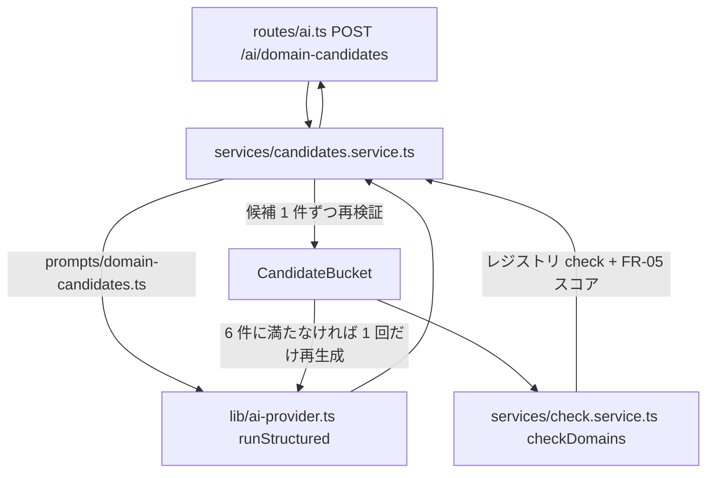

# spec: AI ドメイン候補生成

| 項目 | 内容 |
|---|---|
| 対象 FR / NFR | FR-04（候補生成）/ FR-03（空き確認）/ FR-05（独自性スコア）/ NFR-05（入力検証）。要件は `docs/requirements.md` §10.1 `POST /ai/domain-candidates` / §13.2 |
| 優先度 | P1 |
| 担当 | @takutaku |
| Issue | #66 |
| ブランチ | `sasaki/nightly-2026-08-27` |

---

## 0. ユーザーストーリー

- 利用者として、ニックネームやアプリ名を入れるだけで、空きが確認済みで独自性スコアの付いた
  ドメイン候補を 6 件見たい。気に入ったカードをクリックすればそのまま登録（FR-06）に進みたい。
- 「もう一度考える」で前回と違う候補が欲しい（前回分は除外して再生成）。

## 1. 現状

- AI 呼び出しの基盤は `apps/api/src/lib/ai-provider.ts`（#65）にある（`runStructured`:
  上限 10 秒・1 回のフォールバック・zod 再検証・`ai_logs` 記録）。詳細は `docs/specs/ai-logs.md`。
- 独自性スコアは `packages/shared` の純粋関数（#28 / #155、`docs/specs/uniqueness/`）。
- 空き確認は `apps/api/src/routes/domains.ts` の `POST /domains/check` にインラインで書かれていた。
- 候補生成の契約・プロンプト・サービス・ルートは無かった。`apps/api/src/prompts/` 自体が無かった。

## 2. 設計

### 2.1 契約を 3 層に分ける

`packages/shared/src/ai-candidates.ts` に 3 つのスキーマを置く。

1. `domainCandidatesRequestSchema` — クライアントからの入力（HTTP）
2. `domainCandidatesOutputSchema` — AI の structured output
3. `domainCandidatesResponseSchema` — 空き確認とスコアを足した応答

**2 を厳しくしない**のが要点。`generateObject` に渡すスキーマを `sldSchema` まで厳格にすると、
1 件でも RFC 1035 違反が混ざった瞬間に応答全体が捨てられ、正しい 5 件まで失う。
そこで AI の素の出力（`rawDomainCandidateSchema`）は「3 つの文字列」という形だけを保証し、
値の妥当性は候補 1 件ずつ `domainCandidateSchema` で再検証する（AC-04-1
「バリデーション（AC-03-3）を通過したもののみ表示」の担保点はここ）。

### 2.2 採否と再生成

`CandidateBucket` が採否を持つ。

- 除外キーは SLD（`excludeKey`）。`dopamin.com` と `dopamin` のどちらで渡されても同じものとして弾く。
- **弾いた候補も除外リストに積む**。再生成で同じ名前が返っても無限に繰り返さないため。
- `reason` の 40 字上限は表示上の制約（FR-04）なので、超過は候補を捨てずに切り詰める。
  ドメイン名としての妥当性（RFC 1035 / 許可 TLD）だけを「捨てる基準」にする。
- 6 件に満たなければ 1 回だけ再生成する。**2 回とも AI 応答が返ったうえで**届かない場合は
  揃った分だけ返す。`rawDomainCandidateSchema` は「3 つの文字列」しか見ないので、AI 応答が
  成功しても再検証（RFC 1035 / 許可 TLD / `tlds` 指定 / FQDN 全体）で全件落ちることはあり、
  その場合は `{ candidates: [] }` の 200 になる。
- **再生成（2 回目）の `runStructured` が失敗した場合**は捕捉していないため、1 回目で採用済みの
  候補も含めて `AI_UNAVAILABLE`（503）/ `RATE_LIMITED`（429）になる（§8 #2）。

### 2.3 上限時間

AC-04-2 は「AI 応答は 10 秒以内」。再生成があるので、**1 リクエスト合計**で
`AI_CALL_TIMEOUT_MS`（10 秒）に収める。経過時間を引いた残り予算を 2 回目に渡し、
残りが `AI_FALLBACK_MIN_BUDGET_MS` 未満なら 2 回目を始めない。
実効 AI 設定（FR-17）は 1 リクエストで 1 回だけ引き、両方の試行で使い回す。

### 2.4 check の共有

`POST /domains/check` の本体を `apps/api/src/services/check.service.ts` に移し、
候補生成から再利用する（振る舞いは変えていない）。応答の 1 件の形も
`packages/shared/src/api.ts` の `domainCheckResultSchema` に切り出して共有する。
FR-05 のスコアはインメモリの lexical 計算なのでレジストリ通信と独立して付く（AC-05-2）。

## 3. 画面・UI

本書の範囲外（候補カードの接続は #88）。

## 4. API 契約

| メソッド | パス | リクエスト | レスポンス | エラー |
|---|---|---|---|---|
| POST | `/ai/domain-candidates` | `{ nickname: 1..64, purpose?: ≤200, tlds?: ≤22, exclude?: ≤30 }` | `{ candidates: [{ sld, tld, reason, check }] }` | 401 / 400（`nickname` 必須）/ 503 `AI_UNAVAILABLE` / 429 `RATE_LIMITED` |

- スキーマは `packages/shared/src/ai-candidates.ts`。`check` は `domainCheckResultSchema`。
- UI ラベルは「ニックネームまたはアプリ名」だが API のパラメータ名は `nickname`（§10.1）。
- `candidates` が 0 件の 200 もあり得る（AC-04-1 の 6 件は上限であって保証ではない）。

## 5. データ変更

なし（`ai_logs` への記録は `runStructured` が行う）。

## 6. 受け入れ条件

- [x] AC-04-1: 候補は 6 件・重複なし・バリデーション通過のみ
- [x] AC-04-2: 上限 10 秒。超過は `AI_UNAVAILABLE`
- [x] AC-04-3: 成功・失敗とも `ai_logs` に記録される（試行ごとに 1 行）
- [x] AC-05-2: レジストリ障害時も候補と独自性スコアは返る

## 7. テスト観点

| 種別 | 内容 |
|---|---|
| unit | `packages/shared/src/ai-candidates.test.ts`: 入力の正規化、不正 SLD の拒否、素の出力を捨てないこと、`excludeKey` |
| 契約 / 統合 | `apps/api/test/routes/ai-candidates.test.ts`: 6 件 + check + スコア、重複 / 不正 SLD / 許可外 TLD の除去と 1 回だけの再生成、`exclude`、`tlds` 絞り込み、`ai_logs` 記録、AI 失敗時 503、レジストリ障害時のスコア、401 / 400 |
| 手動 | 「もう一度考える」で前回と違う候補が出ること |

## 8. 未決事項・要確認

| # | 事項 | 本書の仮置き | 選択肢 |
|---|---|---|---|
| 1 | 2 回とも応答があったが 6 件に届かない場合の扱い | 揃った分だけ返す（0 件も 200。画面は件数を前提にしない） | 3 回目を試す / 明示エラーにする |
| 2 | 2 回目の生成が失敗したときに 1 回目の部分結果を返すか | 現状は部分結果を捨てて 503 / 429 | 2 回目を捕捉して部分返却に倒す（実装変更が必要） |

---

## 更新履歴

| 版 | 日付 | 内容 |
|---|---|---|
| v0.1 | 2026-08-27 | 初版（#66 の実装に合わせて起票） |
| v0.1.1 | 2026-08-27 | 実装との乖離を修正。再生成が失敗したときは部分結果を捨てて 503 / 429 になること、再検証で全件落ちれば 0 件の 200 になることを明記 |
