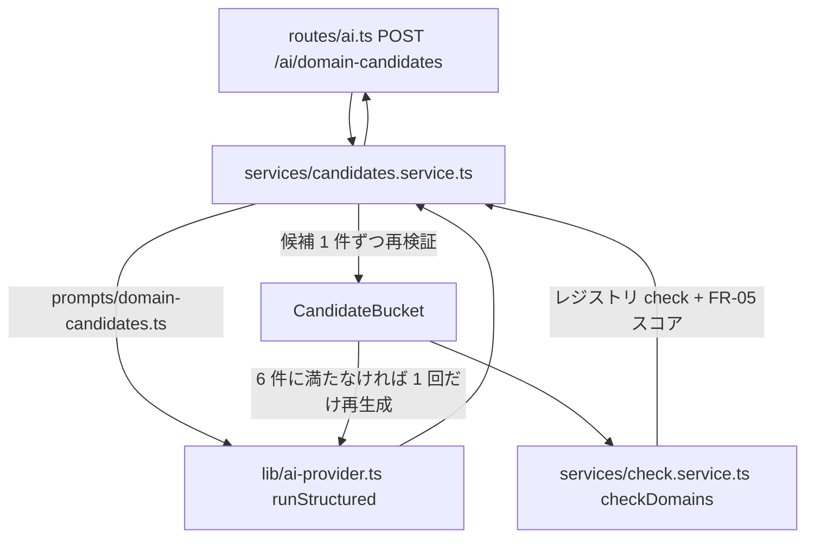

# spec: AI ドメイン候補生成

| 項目 | 内容 |
|---|---|
| 対象 FR / NFR | FR-04（候補生成）/ FR-03（空き確認）/ FR-05（独自性スコア）/ NFR-05（入力検証）。要件は `docs/requirements.md` §10.1 `POST /ai/domain-candidates` / §13.2 |
| 優先度 | P1 |
| 担当 | @takutaku |
| Issue | #66 |
| ブランチ | `sasaki/nightly-2026-08-27` |

---

## 0. ユーザーストーリー

- 利用者として、ニックネームやアプリ名を入れるだけで、空きが確認済みで独自性スコアの付いた
  ドメイン候補を 6 件見たい。気に入ったカードをクリックすればそのまま登録（FR-06）に進みたい。
- 「もう一度考える」で前回と違う候補が欲しい（前回分は除外して再生成）。

## 1. 現状

**API 側は実装済み**（#174）。作り直しは不要で、残っていたのは Web 側の配線だけ（§3）。

| 層 | 置き場所 | 状態 |
|---|---|---|
| ルート | `apps/api/src/routes/ai.ts` | 実装済み（`POST /ai/domain-candidates`、`requireSession` で認証必須） |
| サービス | `apps/api/src/services/candidates.service.ts` | 実装済み（`CandidateBucket` の採否・1 回だけの再生成・合計 10 秒予算） |
| プロンプト | `apps/api/src/prompts/domain-candidates.ts` | 実装済み（§13.2 の制約を列挙。few-shot は未配置） |
| 契約 | `packages/shared/src/ai-candidates.ts` | 実装済み（3 層。§2.1） |
| AI 基盤 | `apps/api/src/lib/ai-provider.ts` | 実装済み（`runStructured`: 上限 10 秒・1 回のフォールバック・zod 再検証・`ai_logs` 記録）。詳細は `docs/specs/ai-logs.md` |
| 空き確認 + スコア | `apps/api/src/services/check.service.ts` | 実装済み（独自性スコアは `packages/shared` の純粋関数。`docs/specs/uniqueness/`） |
| Web（モック） | `apps/web/lib/api/mock/mock-services.ts` | 実装済み（`NEXT_PUBLIC_API_MODE=mock` の既定経路。`ai-timeout` / `partial-failure` シナリオ付き） |
| **Web（実 API）** | `apps/web/lib/api/http/http-services.ts` | **`candidates.generate` が `NOT_IMPLEMENTED` を投げていた** ← 本書 §3 で配線 |

- 実 API モードでスコアが出るのは #158（実 Tranco コーパス投入）以降。`POST /domains/check` の
  `uniqueness` は available な行にのみ付く（§10.4）。
- AI を実際に呼ぶにはプロバイダのキーが要る。キーが 1 本も無い環境では
  `AI_UNAVAILABLE`（503）になる（#186 で緩和を提案中。`docs/specs/ai-gateway.md`）。

## 2. 設計

### 2.1 契約を 3 層に分ける

`packages/shared/src/ai-candidates.ts` に 3 つのスキーマを置く。

1. `domainCandidatesRequestSchema` — クライアントからの入力（HTTP）
2. `domainCandidatesOutputSchema` — AI の structured output
3. `domainCandidatesResponseSchema` — 空き確認とスコアを足した応答

**2 を厳しくしない**のが要点。`generateObject` に渡すスキーマを `sldSchema` まで厳格にすると、
1 件でも RFC 1035 違反が混ざった瞬間に応答全体が捨てられ、正しい 5 件まで失う。
そこで AI の素の出力（`rawDomainCandidateSchema`）は「3 つの文字列」という形だけを保証し、
値の妥当性は候補 1 件ずつ `domainCandidateSchema` で再検証する（AC-04-1
「バリデーション（AC-03-3）を通過したもののみ表示」の担保点はここ）。

### 2.2 採否と再生成

`CandidateBucket` が採否を持つ。

- 除外キーは SLD（`excludeKey`）。`dopamin.com` と `dopamin` のどちらで渡されても同じものとして弾く。
- **弾いた候補も除外リストに積む**。再生成で同じ名前が返っても無限に繰り返さないため。
- `reason` の 40 字上限は表示上の制約（FR-04）なので、超過は候補を捨てずに切り詰める。
  ドメイン名としての妥当性（RFC 1035 / 許可 TLD）だけを「捨てる基準」にする。
- 6 件に満たなければ 1 回だけ再生成する。**2 回とも AI 応答が返ったうえで**届かない場合は
  揃った分だけ返す。`rawDomainCandidateSchema` は「3 つの文字列」しか見ないので、AI 応答が
  成功しても再検証（RFC 1035 / 許可 TLD / `tlds` 指定 / FQDN 全体）で全件落ちることはあり、
  その場合は `{ candidates: [] }` の 200 になる。
- **再生成（2 回目）の `runStructured` が失敗した場合**は捕捉していないため、1 回目で採用済みの
  候補も含めて `AI_UNAVAILABLE`（503）/ `RATE_LIMITED`（429）になる（§8 #2）。

### 2.3 上限時間

AC-04-2 は「AI 応答は 10 秒以内」。再生成があるので、**1 リクエスト合計**で
`AI_CALL_TIMEOUT_MS`（10 秒）に収める。経過時間を引いた残り予算を 2 回目に渡し、
残りが `AI_FALLBACK_MIN_BUDGET_MS` 未満なら 2 回目を始めない。
実効 AI 設定（FR-17）は 1 リクエストで 1 回だけ引き、両方の試行で使い回す。

### 2.4 check の共有

`POST /domains/check` の本体を `apps/api/src/services/check.service.ts` に移し、
候補生成から再利用する（振る舞いは変えていない）。応答の 1 件の形も
`packages/shared/src/api.ts` の `domainCheckResultSchema` に切り出して共有する。
FR-05 のスコアはインメモリの lexical 計算なのでレジストリ通信と独立して付く（AC-05-2）。

### 2.5 プロバイダ別の味付け（xai だけ）

`xai`（Grok）を選んでいるときだけ、システムプロンプトに**ユーモアの個性付け**を足す。
Grok を選ぶ動機は「無難な候補ではなく、思わず笑える名前が欲しい」であることが多いため、
プロバイダの選択をそのまま作風の選択として扱う。

- **候補名**: 無難な組み合わせより「なんでそれ!?」と言いたくなる意外性を優先する。
  覚えやすい造語、遊び心のある接尾辞（`inu` を付ける等）、語呂・ダジャレを歓迎する。
- **`reason`**: ユーモア文体の短い 1 文。基本は大げさな持ち上げで、毎回ちょうど 1 件だけを
  はっきり皮肉と分かる文体の「皮肉枠」にする（どれを皮肉枠にするかはモデルの裁量。
  皮肉枠でも人格攻撃は禁止で、茶化す対象は名前や状況に限る）。

**変えないもの**（味付けは文体だけに効かせ、契約には触らない）:

| 対象 | 扱い |
|---|---|
| 出力契約（§2.1 の 3 層スキーマ） | 不変。`rawDomainCandidateSchema` → `domainCandidateSchema` の再検証もそのまま |
| 件数（`DOMAIN_CANDIDATE_COUNT`） | 不変 |
| §13.2 の制約（RFC 1035 / 許可 TLD / 重複禁止 / 除外リスト / `reason` 40 字） | **厳守**。味付けは制約の上書きではなく追加 |
| 10 秒予算（§2.3） | 不変 |
| `google` / `anthropic` のプロンプト | **一切変えない**（味付け文は xai の分岐内に閉じる） |

**禁止**: 下品・攻撃的・人格攻撃・人を傷つける表現。発表デモでそのまま見せられるラインを守らせる。
`reason` は既存の候補カードに収まる長さ（40 字上限は §13.2 の制約がそのまま効く）。

> **皮肉枠が 1 件である保証**: 「ちょうど 1 件」はプロンプトでの指示であって、
> 出力契約では担保していない（`reason` は文字列としてしか検証しない）。
> 0 件や 2 件になっても API はエラーにせず、そのまま返す。

> **フォールバック時の扱い**: 味付けは「ユーザーが選んだプロバイダ」で決まり、
> `runStructured` が別プロバイダにフォールバックしても切り替えない（§13.1 のフォールバックは
> 呼び出しの途中で起きるため）。xai を選んで google に落ちた場合は、味付き文のまま
> google が答える。作風はユーザーの選択に紐づくものなので、これを意図した挙動とする。

新しいプロバイダを足したときは、`PROVIDER_FLAVOR`（`apps/api/src/prompts/domain-candidates.ts`）に
載せなければ味付け無し = `DOMAIN_CANDIDATES_INSTRUCTIONS` と文字列として完全に同一になる
（`domain-candidates.test.ts` が文字列一致で担保している）。
