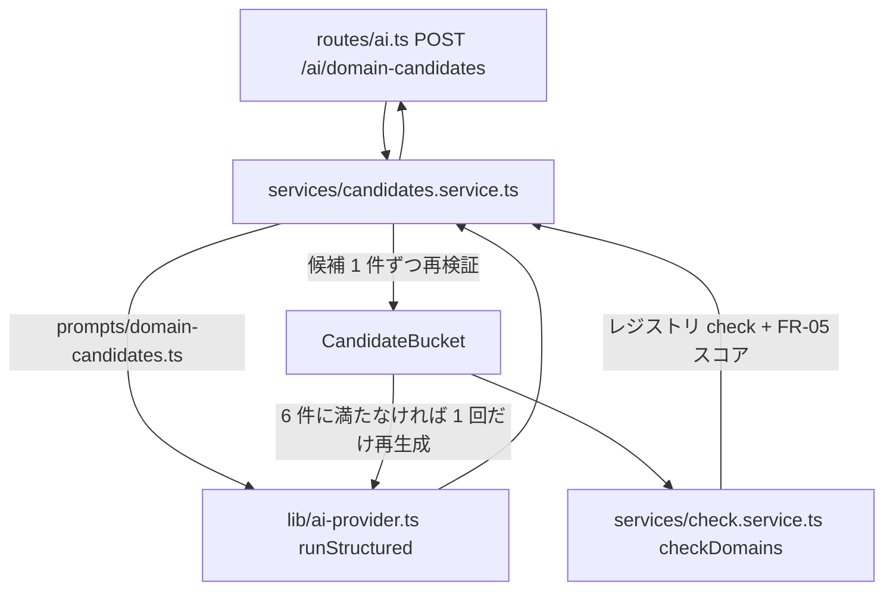

# spec: AI ドメイン候補生成

| 項目 | 内容 |
|---|---|
| 対象 FR / NFR | FR-04（候補生成）/ FR-03（空き確認）/ FR-05（独自性スコア）/ NFR-05（入力検証）。要件は `docs/requirements.md` §10.1 `POST /ai/domain-candidates` / §13.2 |
| 優先度 | P1 |
| 担当 | @takutaku |
| Issue | #66 |
| ブランチ | `sasaki/nightly-2026-08-27` |

---

## 0. ユーザーストーリー

- 利用者として、ニックネームやアプリ名を入れるだけで、空きが確認済みで独自性スコアの付いた
  ドメイン候補を 6 件見たい。気に入ったカードをクリックすればそのまま登録（FR-06）に進みたい。
- 「もう一度考える」で前回と違う候補が欲しい（前回分は除外して再生成）。

## 1. 現状

**API 側は実装済み**（#174）。作り直しは不要で、残っていたのは Web 側の配線だけ（§3）。

| 層 | 置き場所 | 状態 |
|---|---|---|
| ルート | `apps/api/src/routes/ai.ts` | 実装済み（`POST /ai/domain-candidates`、`requireSession` で認証必須） |
| サービス | `apps/api/src/services/candidates.service.ts` | 実装済み（`CandidateBucket` の採否・1 回だけの再生成・合計 10 秒予算） |
| プロンプト | `apps/api/src/prompts/domain-candidates.ts` | 実装済み（§13.2 の制約を列挙。few-shot は未配置） |
| 契約 | `packages/shared/src/ai-candidates.ts` | 実装済み（3 層。§2.1） |
| AI 基盤 | `apps/api/src/lib/ai-provider.ts` | 実装済み（`runStructured`: 上限 10 秒・1 回のフォールバック・zod 再検証・`ai_logs` 記録）。詳細は `docs/specs/ai-logs.md` |
| 空き確認 + スコア | `apps/api/src/services/check.service.ts` | 実装済み（独自性スコアは `packages/shared` の純粋関数。`docs/specs/uniqueness/`） |
| Web（モック） | `apps/web/lib/api/mock/mock-services.ts` | 実装済み（`NEXT_PUBLIC_API_MODE=mock` の既定経路。`ai-timeout` / `partial-failure` シナリオ付き） |
| **Web（実 API）** | `apps/web/lib/api/http/http-services.ts` | **`candidates.generate` が `NOT_IMPLEMENTED` を投げていた** ← 本書 §3 で配線 |

- 実 API モードでスコアが出るのは #158（実 Tranco コーパス投入）以降。`POST /domains/check` の
  `uniqueness` は available な行にのみ付く（§10.4）。
- AI を実際に呼ぶにはプロバイダのキーが要る。キーが 1 本も無い環境では
  `AI_UNAVAILABLE`（503）になる（#186 で緩和を提案中。`docs/specs/ai-gateway.md`）。

## 2. 設計

### 2.1 契約を 3 層に分ける

`packages/shared/src/ai-candidates.ts` に 3 つのスキーマを置く。

1. `domainCandidatesRequestSchema` — クライアントからの入力（HTTP）
2. `domainCandidatesOutputSchema` — AI の structured output
3. `domainCandidatesResponseSchema` — 空き確認とスコアを足した応答

**2 を厳しくしない**のが要点。`generateObject` に渡すスキーマを `sldSchema` まで厳格にすると、
1 件でも RFC 1035 違反が混ざった瞬間に応答全体が捨てられ、正しい 5 件まで失う。
そこで AI の素の出力（`rawDomainCandidateSchema`）は「3 つの文字列」という形だけを保証し、
値の妥当性は候補 1 件ずつ `domainCandidateSchema` で再検証する（AC-04-1
「バリデーション（AC-03-3）を通過したもののみ表示」の担保点はここ）。

### 2.2 採否と再生成

`CandidateBucket` が採否を持つ。

- 除外キーは SLD（`excludeKey`）。`dopamin.com` と `dopamin` のどちらで渡されても同じものとして弾く。
- **弾いた候補も除外リストに積む**。再生成で同じ名前が返っても無限に繰り返さないため。
- `reason` の 40 字上限は表示上の制約（FR-04）なので、超過は候補を捨てずに切り詰める。
  ドメイン名としての妥当性（RFC 1035 / 許可 TLD）だけを「捨てる基準」にする。
- 6 件に満たなければ 1 回だけ再生成する。2 回試しても届かない場合は揃った分だけ返す
  （0 件になる場合は `runStructured` が既に `AI_UNAVAILABLE` を投げている）。

### 2.3 上限時間

AC-04-2 は「AI 応答は 10 秒以内」。再生成があるので、**1 リクエスト合計**で
`AI_CALL_TIMEOUT_MS`（10 秒）に収める。経過時間を引いた残り予算を 2 回目に渡し、
残りが `AI_FALLBACK_MIN_BUDGET_MS` 未満なら 2 回目を始めない。
実効 AI 設定（FR-17）は 1 リクエストで 1 回だけ引き、両方の試行で使い回す。

### 2.4 check の共有

`POST /domains/check` の本体を `apps/api/src/services/check.service.ts` に移し、
候補生成から再利用する（振る舞いは変えていない）。応答の 1 件の形も
`packages/shared/src/api.ts` の `domainCheckResultSchema` に切り出して共有する。
FR-05 のスコアはインメモリの lexical 計算なのでレジストリ通信と独立して付く（AC-05-2）。

## 3. 画面・UI / Web の配線

候補カード自体の実装は #88 の範囲。本節は**サービス層の配線**（`NEXT_PUBLIC_API_MODE=http` で
実 API を叩く経路）を定める。モックモードの挙動は変えない。

### 3.1 `candidates.generate` → `POST /ai/domain-candidates`

`apps/web/lib/api/http/http-services.ts` の `candidates.generate` を Hono RPC で
`POST /api/v1/ai/domain-candidates` に繋ぐ。ブラウザは同一オリジンの `/api/*` だけを叩き、
`next.config.ts` の rewrites が API に転送する（§6.3）。

応答は `packages/shared` の `domainCandidatesResponseSchema` で検証してから ViewModel に写す。
スキーマは shared が SSOT で、`client.ts` では re-export するだけにする（ワイヤ形式を二重定義しない）。
検証に落ちた場合は `INTERNAL`——レジストリの仕様変更ではないので `REGISTRY_SPEC_MISMATCH` にはしない。

### 3.2 `toCheckedFields` を検索経路と共有する

API は候補 1 件ごとに `POST /domains/check` と**同じ `check` の形**を返す（§2.4）。
そのため空き確認と独自性スコアの写像を `toCheckedFields` に切り出し、
検索経路（`domains.check` → `SearchResult`）と候補経路（→ `Candidate`）で共有する。

| 写像 | 内容 |
|---|---|
| `registry` | `null`（未対応 TLD / 障害）は ViewModel が `null` を持てないため `"mock"` に倒す。その行は必ず `availability: "error"` |
| `availability` | そのまま |
| `uniqueness` | `topSimilar` → `nearest` に写す。`null` はそのまま通す（unavailable / error の行） |
| `alternatives` | 実 API は返さないので `[]` |

同じ写像を 2 か所に持たないことが目的。特に `topSimilar → nearest` は FR-05 のレビュー（#155）で
一度直した箇所なので、二重管理にすると次の修正で片方が取り残される。

### 3.3 失敗は `"ai"` origin として扱う

AI 呼び出しの失敗は、レジストリの失敗と**同じエラーコードで返ってくる**
（`REGISTRY_TIMEOUT` / `REGISTRY_UNAVAILABLE`。§10.3 の統一形式は「相手」を持たない）。
相手を明示しないと `apps/web/lib/error-messages.ts` の `AI_COPY` に入らず、
S-23 でレジストリ向けの文言が出てしまう。

そこで `unwrap` と `toApiClientError` に任意の `origin` を通し、AI ルートでは `"ai"` を渡す。

- 既に `ApiClientError` なものは**上書きしない**（`notImplemented` が自分で `origin` を持つため）
- 統一エラー形式から組み立てる経路・ネットワーク失敗・素の Error のいずれでも載せられる

### 3.4 デモ経路（本番）

`NEXT_PUBLIC_API_MODE` は未設定だと `mock` に倒れる（`apps/web/lib/api/mode.ts`）。
本番で実 AI を見せるには `http` を明示設定する必要がある（requirements §17 に追記済み）。

## 4. API 契約

| メソッド | パス | リクエスト | レスポンス | エラー |
|---|---|---|---|---|
| POST | `/ai/domain-candidates` | `{ nickname: 1..64, purpose?: ≤200, tlds?: ≤22, exclude?: ≤30 }` | `{ candidates: [{ sld, tld, reason, check }] }` | 401 / 400（`nickname` 必須）/ 503 `AI_UNAVAILABLE` / 429 `RATE_LIMITED` |

- スキーマは `packages/shared/src/ai-candidates.ts`。`check` は `domainCheckResultSchema`。
- UI ラベルは「ニックネームまたはアプリ名」だが API のパラメータ名は `nickname`（§10.1）。

## 5. データ変更

なし（`ai_logs` への記録は `runStructured` が行う）。

## 6. 受け入れ条件

- [x] AC-04-1: 候補は 6 件・重複なし・バリデーション通過のみ
- [x] AC-04-2: 上限 10 秒。超過は `AI_UNAVAILABLE`
- [x] AC-04-3: 成功・失敗とも `ai_logs` に記録される（試行ごとに 1 行）
- [x] AC-05-2: レジストリ障害時も候補と独自性スコアは返る

## 7. テスト観点

| 種別 | 内容 |
|---|---|
| unit | `packages/shared/src/ai-candidates.test.ts`: 入力の正規化、不正 SLD の拒否、素の出力を捨てないこと、`excludeKey` |
| 契約 / 統合 | `apps/api/test/routes/ai-candidates.test.ts`: 6 件 + check + スコア、重複 / 不正 SLD / 許可外 TLD の除去と 1 回だけの再生成、`exclude`、`tlds` 絞り込み、`ai_logs` 記録、AI 失敗時 503、レジストリ障害時のスコア、401 / 400 |
| 契約 / 統合（Web） | `apps/web/lib/api/http/http-services.test.ts`: 叩く URL と送信 JSON、`check` の写像（`topSimilar → nearest`）、unavailable 行の `uniqueness: null`、レジストリ障害行でもスコアが付くこと（AC-05-2）、0 件、契約ずれの `INTERNAL`、503 / 504 / 401 が `origin: "ai"` 付きで返ること |
| 手動 | 「もう一度考える」で前回と違う候補が出ること。`NEXT_PUBLIC_API_MODE=http` で候補 6 件とスコアが実データで出ること |

## 8. 未決事項・要確認

| # | 事項 | 本書の仮置き | 選択肢 |
|---|---|---|---|
| 1 | 2 回試しても 6 件に届かない場合の扱い | 揃った分だけ返す（画面は件数を前提にしない） | 3 回目を試す / 明示エラーにする |

---

## 更新履歴

| 版 | 日付 | 内容 |
|---|---|---|
| v0.1 | 2026-08-27 | 初版（#66 の実装に合わせて起票） |
| v0.2 | 2026-08-27 | §1 を API 実装済みの実態に更新。§3 に Web 配線（`candidates.generate` → `POST /ai/domain-candidates`、`toCheckedFields` の検索経路との共有、`"ai"` origin によるエラー文言の出し分け、本番の `NEXT_PUBLIC_API_MODE=http`）を追記。§7 に Web の契約テスト行を追加。#185 |
