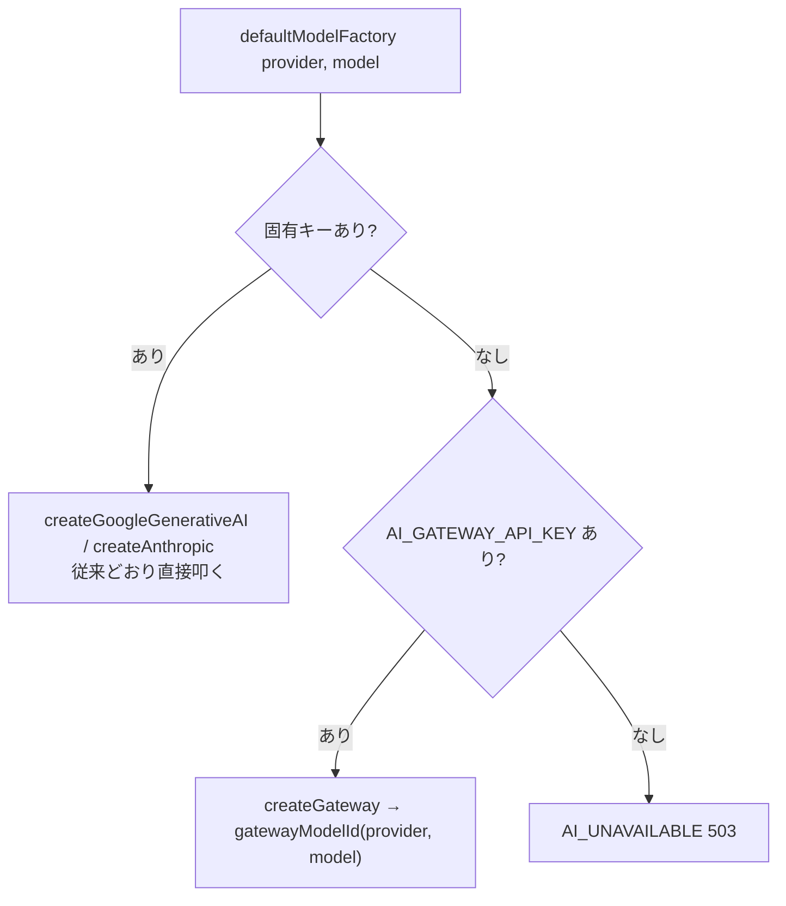

# spec: AI Gateway 経由のプロバイダ有効化

| 項目 | 内容 |
|---|---|
| 対象 FR / NFR | FR-17（AI 設定）/ FR-04・FR-13（AI を使う機能）/ NFR-03（秘密情報をクライアントに出さない）/ NFR-05（環境変数の検証）。要件は `docs/requirements.md` §13.1 / §17 |
| 優先度 | P1（発表デモで実 AI を動かすための前提） |
| 担当 | @Hoshi316 |
| Issue | #179 |
| ブランチ | `feat/ai-gateway-provider` |

---

## 0. ユーザーストーリー

- チームメンバーとして、**配布された `AI_GATEWAY_API_KEY` 1 本だけ**で AI 機能を動かしたい。
  各自が Google AI Studio や Anthropic のアカウントを作ってキーを取得するのは、
  発表前日の時間コストとして見合わない。
- 本番環境の運用者として、プロバイダごとにキーを登録し直さずに Vercel 側の 1 本で済ませたい。

## 1. 現状

- `apps/api/src/lib/ai-provider.ts` の `defaultModelFactory` が、`aiProviderApiKey()` で
  引いたプロバイダ固有キーが `undefined` なら**必ず** `AI_UNAVAILABLE`（503）を投げる。
- `apps/api/src/services/settings.ts` の `hasApiKey()` も固有キーの有無だけを見ており、
  `providerOptions()` は「有効なプロバイダが 0 件なら `AI_PROVIDER` を唯一の選択肢にする」
  というフォールバックを持つ。このため**設定画面（FR-17）には google が選べているように見えるのに、
  実際に呼ぶと 503** という紛らわしい状態になる。
- 対象の環境変数は `GOOGLE_GENERATIVE_AI_API_KEY` / `ANTHROPIC_API_KEY` の 2 つだけ
  （`apps/api/src/lib/env.ts`）。Gateway 用のキーを受け取る口が無い。
- 依存は `ai@7.0.79`。この版は `@ai-sdk/gateway@4.0.64` を依存に持ち、`createGateway` を
  **re-export している**（`apps/api` から `@ai-sdk/gateway` を直接 import することは
  pnpm の厳格な依存解決上できないため、`ai` 経由で使う）。

## 2. 設計

プロバイダ抽象化の内側（`defaultModelFactory`）だけを変える。`runStructured` の予算管理・
フォールバック・`ai_logs` 記録（§13.1 / §13.4）には手を入れない。



### 2.1 キーの優先順位

**固有キー → gateway → 503**。固有キーがある場合は gateway を挟まない。

理由は 2 つ。既存環境（固有キーを設定済み）の挙動を変えないこと、そして gateway は
中継が 1 段増えるぶん障害点とレイテンシが増えるため、直接叩けるなら直接叩くのが素直であること。

### 2.2 `hasApiKey` が gateway キーも「キーあり」と数える

**ここが忘れやすい**。`defaultModelFactory` だけを直しても動かない。

`providerOptions()` は `hasApiKey()` が真のプロバイダだけを「有効」とする。
gateway キーしか無い環境で `hasApiKey()` が固有キーだけを見ていると、有効なプロバイダが 0 件になり
`[env.AI_PROVIDER]` へのフォールバックに倒れる。その結果:

- `GET /auth/me` の `ai.providers` が 1 件しか返らず、FR-17 の設定画面で anthropic を選べない
- `PATCH /settings/ai` で anthropic を保存しようとすると `VALIDATION_ERROR`
- `resolveAiSettings` の実効値も歪む

そこで `hasApiKey(provider, env)` を
「**その固有キーがある、または gateway キーがある**」に変える。
gateway は宛先をモデル ID で決めるので、キー 1 本で全プロバイダに出せる＝全プロバイダが有効、
という意味づけになる。

**副作用（意図的）**: 両プロバイダが有効扱いになるため、§13.1 の
「失敗したら 1 回だけ別プロバイダにフォールバック」も gateway 経由で効くようになる。

### 2.3 `gatewayModelId`: `<provider>/<model>` 規約

Vercel AI Gateway は `<provider>/<model>` の形で宛先を決める
（例: `google/gemini-2.5-flash`、`anthropic/claude-sonnet-4-5`）。
一方 `KNOWN_MODELS`（`settings.ts`）と `users.ai_model` は素のモデル ID を持つ。
そこで gateway に渡す直前だけ前置する。

```ts
function gatewayModelId(provider: AiProvider, model: string): string {
  return model.includes("/") ? model : `${provider}/${model}`;
}
```

`AI_MODEL` に運用側が既に `google/gemini-2.5-pro` のようなスラッシュ付きの値を入れている場合に
**二重前置しない**（`google/google/...` を防ぐ）。判定はスラッシュの有無だけで、
プロバイダ名との整合はチェックしない——`AI_MODEL` は運用側が決める値で、
Gateway のカタログが正だから。

### 2.4 秘密情報の扱い

`AI_GATEWAY_API_KEY` は `apps/api` の環境変数だけが持ち、`createGateway` に渡すだけ（NFR-03）。
`aiProviderApiKey()` は従来どおり固有キーだけを返し、**値を外に出さない**性質を保つ
（`hasApiKey` が見るのは有無だけ）。

### 2.5 レイテンシの注意

gateway は中継が 1 段増えるぶん、直接プロバイダを叩くより遅くなる。2026-08-27 の実測は
1 回の生成で約 8 秒。`AI_CALL_TIMEOUT_MS` が 10 秒だった頃は余裕が小さかったが、20 秒に緩和された（§13.1 / AC-04-2、requirements v0.1.22）。

FR-04 は 6 件に満たなければ 1 回だけ再生成するため、**残り予算が
`AI_FALLBACK_MIN_BUDGET_MS` を割って 2 回目が始まらない / 打ち切られる**ことが実際に起きる
（`docs/specs/ai-candidates.md` §8 #1「揃った分だけ返す」の経路）。
本番のネットワーク次第では上限（20 秒）を超えて `AI_UNAVAILABLE` になり得る。
予算やモデル（より高速な系）の見直しが要るかはチーム判断。

#### 2.5.1 Gemini の思考トークンを抑える（#199）

Gemini は既定で思考トークンを使う。FR-13 のサブドメイン提案（GitHub 解析結果を含む
2,235 文字のプロンプト）を `gemini-2.5-flash` で流すと reasoning に 1,800〜2,200 トークンを
使い、1 回の生成が 11〜17 秒かかって**当時の 10 秒予算**を必ず超えていた（毎回 `AI_UNAVAILABLE`）。
予算はその後 20 秒に緩和された（requirements v0.1.22）が、思考量と無関係な揺れが残る以上
上限を絞る意味は変わらないので `thinkingConfig` はそのまま使う。

`callProvider` は google のときだけ `providerOptions.google.thinkingConfig` で上限を渡す。
gateway 経由でも同じキーがそのまま転送される（実測で確認）。2026-08-27 の実測:

| `thinkingBudget` | 所要時間 | reasoning トークン |
|---|---|---|
| 指定なし（既定） | 11.0 / 14.6 / 15.5 / 16.9 秒 | 1,800〜2,200 |
| 512 | 5.8 / 6.2 秒 | 380〜560 |
| 256（採用） | 4.8 / 5.7 秒 | 175〜216 |
| 128 | 3.9 / 11.8 秒 | 93〜97 |
| 0（思考オフ） | 3.9 / 4.7 秒 | 0 |

`gemini-2.5-pro` は思考を無効化できない（最小 128）ため 0 は使えない。モデルは FR-17 で
ユーザーが選べるので、どの Gemini でも受け付ける値として 256 を採る。
128 の 11.8 秒が示すとおり思考量と無関係な揺れも残るので、上限を絞っても
予算超過が完全に消えるわけではない（フォールバックは §2.9 のまま）。

### 2.6 xAI（Grok）の追加 — Gateway 専用プロバイダ

FR-17 の選択肢に `xai`（Grok）を足す。**Gateway 経由専用**とし、`XAI_API_KEY` による
直叩きには対応しない。理由は 2 つ。

1. 新規依存がゼロで済む（`@ai-sdk/xai` を入れずに、既にある gateway 経路に相乗りする）
2. `AI_GATEWAY_API_KEY` が無い環境では**選択肢に出したくない**。直叩きの口を作らなければ
   `aiProviderApiKey("xai")` が常に `undefined` を返し、§2.2 の `hasApiKey` が
   「gateway キーがあるときだけ真」になる——既存ロジックのまま自然に達成される

`xai` を選んだときは候補生成のプロンプトにユーモアの個性付けが入る（作風の切替）。
方針と「変えないもの」は `docs/specs/ai-candidates.md` §2.5 が正。

### 2.7 Gateway の ID 変換表

Gateway のカタログ（`@ai-sdk/gateway` の `GatewayModelId`）と、内部で持つ語彙が
**2 か所ずれている**ことが分かったため、`gatewayModelId` に変換表を持たせる。

| ずれ | 内部 | Gateway カタログ |
|---|---|---|
| プロバイダ接頭辞 | `xai` | **`spacexai`** |
| Anthropic のモデル ID | `claude-sonnet-4-5`（ハイフン） | **`claude-sonnet-4.5`**（ドット） |

- 接頭辞: 内部・DB（`users.ai_provider`）・UI の語彙は `xai` のままにする。Gateway の
  都合を要件書やデータに持ち込まないため、変換は境界（`gatewayModelId`）だけで行う。
- Anthropic: **直接叩くときはハイフンが正**（Anthropic API のモデル ID）。ドットになるのは
  Gateway のカタログだけなので、変換も gateway 経路にだけ効かせる。
  これを直さないと gateway 経由の anthropic フォールバックが必ず失敗する
  （`google` が本命として失敗したときに救われない）。
- `GatewayModelId` は `(string & {})` を含む**開いたユニオン**なので、誤った ID は
  型では捕まらず実行時に失敗する。突き合わせは目視 + 疎通で担保するしかない。

### 2.8 既定モデルと AI 予算（20 秒）

`xai` の候補は速度優先で並べる（§2.5 のとおり予算に余裕が無いため）。

| 順 | モデル | 備考 |
|---|---|---|
| 1（既定） | `grok-4.1-fast-non-reasoning` | 推論なしの fast 系。structured output 用途で最速 |
| 2 | `grok-4.1-fast-reasoning` | 同じ fast 系だが推論あり |
| 3 | `grok-4.6` | 新しい世代。速度は未検証 |

指示のあった `grok-4-fast` はカタログに存在しなかったため採用していない。

### 2.9 3 プロバイダでのフォールバック

`attemptOrder`（§13.1「失敗したら 1 回だけ別プロバイダ」）は
`settings.providers` から**本命以外の先頭 1 件**を取る。プロバイダが 3 つになっても
試行は最大 2 回のままで、要件どおり。`AI_PROVIDERS` の順（`google` → `anthropic` → `xai`）が
そのままフォールバック先の優先順になる。

## 3. 画面・UI

gateway 対応そのものは画面の変更を伴わない（FR-17 の設定画面に並ぶ選択肢が増えるのは
§2.2 の結果で、UI 側の実装変更は無い）。

xai の追加（§2.6）では、設定画面の表示名マッピング
（`apps/web/features/settings/ai-settings-section.tsx` の `PROVIDER_LABEL`）に
`xai: "Grok"` を足す。`Record<AiProvider, string>` なので、足さないと型エラーになる。

## 4. API 契約

エンドポイントの追加・変更は**なし**。既存の AI 経路の内部挙動だけが変わる。

| メソッド | パス | 変化 |
|---|---|---|
| GET | `/auth/me` | gateway キーがある環境では `ai.providers` に google / anthropic / xai がすべて載る（FR-17。§2.6 のとおり xai は Gateway 経由専用なので、gateway キーが無ければ出ない） |
| PATCH | `/settings/ai` | 上記に伴い、固有キーの無いプロバイダも保存できるようになる |
| POST | `/ai/domain-candidates` ほか AI 経路 | 固有キーが無くても 503 にならず、gateway 経由で応答する |

エラー形式は §10.3 の統一形式のまま。キーが 1 本も無い場合の `AI_UNAVAILABLE`（503）も従来どおり。

## 5. データ変更

なし。テーブル・カラム・マイグレーションの追加は無い。`users.ai_provider` / `ai_model` の
意味も変わらない。

## 6. 受け入れ条件

- [x] AC-G-1: 固有キーが 1 本も無く `AI_GATEWAY_API_KEY` だけがある環境で、AI 呼び出しが 503 にならない
- [x] AC-G-2: 固有キーがある場合は gateway を挟まず、従来どおり直接プロバイダを叩く
- [x] AC-G-3: gateway に渡すモデル ID が `<provider>/<model>` になり、スラッシュ付きの値は二重前置されない
- [x] AC-G-4: gateway キーだけの環境で FR-17 の有効プロバイダに両方が並ぶ
- [x] AC-G-5: キーが 1 本も無ければ従来どおり `AI_UNAVAILABLE`（503）
- [x] AC-G-6: **実キーでの疎通**（モデル ID が Gateway のカタログと一致すること）— 2026-08-27 確認。`google/gemini-2.5-flash` で成功（`ai_log`: `status=success` / tokensIn 約 326 / tokensOut 約 1,191 / latency 約 8 秒）。`anthropic/claude-sonnet-4-5` は**未実証**（命名規約は同じ `<provider>/<model>` なので同様に通る想定）

## 7. テスト観点

| 種別 | 内容 |
|---|---|
| unit | `apps/api/src/lib/env.test.ts`: `AI_GATEWAY_API_KEY` が既定 undefined / 値が読める / 空文字は未設定扱い（キーがあると誤判定して 503 を隠さない） |
| unit | `apps/api/src/services/settings.test.ts`: gateway だけで全プロバイダ有効・gateway だけで anthropic を実効値にできる・固有キー併用・キー無しは従来どおり |
| unit | `apps/api/test/lib/ai-provider.test.ts`: gateway だけで 503 にならない・モデル ID の前置・二重前置の回避・固有キー優先で gateway を挟まない（`setAiModelFactoryForTesting(null)` で既定ファクトリを通す） |
| 手動 | **実施済み（2026-08-27）**。実キーを `apps/api/.env.local` に入れ、`/domains/new` から候補生成が通ることを確認（AC-G-6）。10 秒予算の残りで行う追加生成がタイムアウトし、揃った分を返す挙動も確認（`docs/specs/ai-candidates.md` §8 #1 のとおり） |

いずれの自動テストも**実プロバイダを呼ばない**。gateway 経路の検証は
`resolveModel()` が返す `LanguageModel` のモデル ID で行う。

## 8. 未決事項・要確認

`spec-change-guard` に従い、以下は本書では仮置きとし、決定後に `docs/requirements.md` を更新する。

| # | 事項 | 本書の仮置き | 選択肢 |
|---|---|---|---|
| 1 | ~~`docs/requirements.md` §17 の環境変数表への `AI_GATEWAY_API_KEY` 追加~~ | **解消**（requirements v0.1.20、§17 に追記済み） | 済 |
| 2 | Gateway のモデル ID 命名が `KNOWN_MODELS` と一致するか | **解消**（2026-08-27）。`google/gemini-2.5-flash` で実証。anthropic 側は未実証 | 一致しなければ `gatewayModelId` に対応表を持たせる |
| 3 | 固有キーと gateway の優先順位 | 固有キー優先（既存環境の挙動を変えない） | gateway 優先 / 環境変数で切替 |
| 4 | `xai` の直叩き（`XAI_API_KEY`）対応 | **しない**（Gateway 専用。新規依存ゼロ） | `@ai-sdk/xai` を入れて直叩きも許す |
| 5 | Gateway カタログの ID 変更に追随する仕組み | 変換表を手で持つ（§2.7） | カタログ型から自動生成する |

---

## 更新履歴

| 版 | 日付 | 内容 |
|---|---|---|
| v0.1 | 2026-08-27 | 初版（#179 / PR #186 の実装に合わせて起票） |
| v0.1.1 | 2026-08-27 | 実キーでの疎通確認を反映。AC-G-6 を満たし、未決事項 #2（モデル ID 命名）を解消。§7 の手動テストを実施済みに更新。レイテンシ約 8 秒（10 秒予算に対し余裕が小さい）を注記 |
| v0.1.2 | 2026-08-27 | §2.5.1 を追加。Gemini の思考トークンで FR-13 が毎回 10 秒予算を超えていた問題（#199）と、`thinkingConfig` の上限 256 を採用した実測根拠 |
| v0.2 | 2026-08-27 | §2.6〜2.9 を追加。xai（Grok）を Gateway 専用プロバイダとして足す方針、Gateway の ID 変換表（`xai` → `spacexai`、anthropic のハイフン → ドット）、既定モデル `grok-4.1-fast-non-reasoning`、3 プロバイダでのフォールバック。§3 に表示名マッピング、§6 に AC-G-7〜10、§8 に未決事項 #4 / #5 を追加。#187 |
| v0.2.1 | 2026-08-27 | `AI_CALL_TIMEOUT_MS` が 10 → 20 秒になったことに追随（requirements v0.1.22）。§2.7 / §2.8 の「10 秒予算」の記述を更新。速いモデルを既定に置く方針（§2.8）は不変。§7 の実測記録は当時の 10 秒予算下のものなのでそのまま残す |
| v0.2.2 | 2026-08-28 | §4 の `/auth/me` 行を 3 プロバイダ（google / anthropic / xai）に更新（§2.6 の xai 追加が反映されていなかった）。§2.5.1 の「10 秒予算」が当時の値であることを明示し、20 秒に緩和されても `thinkingConfig` を使い続ける理由を追記 |
| v0.2.3 | 2026-08-28 | §8 の未決事項 #1 を解消済みに更新（`AI_GATEWAY_API_KEY` は requirements v0.1.20 の §17 環境変数表に既に載っている）|
