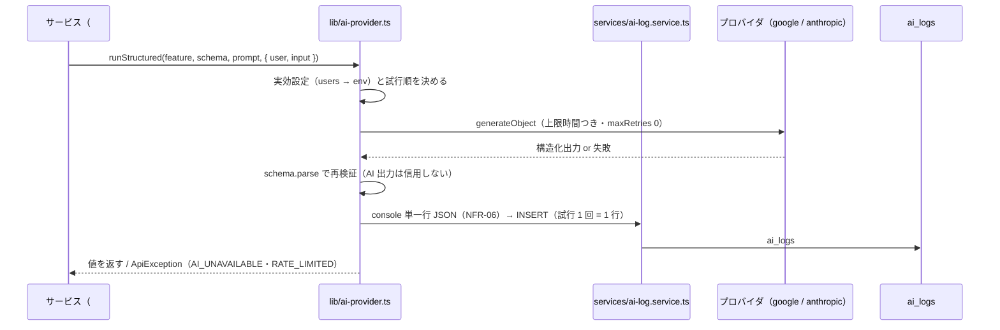

# spec: AI プロバイダ抽象化と AI ログ

| 項目 | 内容 |
|---|---|
| 対象 FR / NFR | FR-14（AI ログ）/ FR-17（AI 設定）/ NFR-03（秘密情報）/ NFR-05（入力検証）/ NFR-06（可観測性）。要件は `docs/requirements.md` §9.1 `ai_logs` / §13.1 / §13.4 |
| 優先度 | P1 |
| 担当 | @takutaku |
| Issue | #65（DB は #35） |
| ブランチ | `sasaki/ai-lane-2026-08-26` |

---

## 0. ユーザーストーリー

- 利用者として、AI がどのプロバイダ・モデルで何を返したかを `/logs` の AI タブで後から確認したい
  （AI 駆動開発の可視化。§1「AI ログ機能（FR-14）で開発プロセス自体を可視化」）。
- 開発者として、AI 呼び出しを 1 か所に集約し、候補生成（#66）・独自性（#67）・サブドメイン提案（#68）が
  タイムアウト・フォールバック・再検証・ログ記録を各自で書かなくて済むようにしたい。

## 1. 現状

- `apps/api/src/lib/ai-provider.ts` は無く、`ai` / `@ai-sdk/google` / `@ai-sdk/anthropic` も依存に無かった。
- 語彙と契約は揃っている: `packages/shared/src/ai.ts`（`AI_FEATURES` / `AI_PROVIDERS` /
  `AI_LOG_STATUSES` / `summarizeForAiLog` / `AI_SUMMARY_MAX_LENGTH`）、
  `packages/shared/src/logs.ts`（`aiLogItemSchema`）。
- 実効設定の解決は `apps/api/src/services/settings.ts` の `resolveAiSettings` / `getAiSettingsForUser`
  が FR-17 用に既に持っている。
- `ai_logs` テーブルは #35（`packages/db/drizzle/0007_blue_living_lightning.sql`）で追加済み。
- 環境変数は #61 で `AI_PROVIDER` / `AI_MODEL` / `GOOGLE_GENERATIVE_AI_API_KEY` /
  `ANTHROPIC_API_KEY` が `apiEnvSchema` に入っている。

## 2. 設計

- **責務の境界**:
  - `packages/shared`: 語彙（`AI_FEATURES` / `AI_PROVIDERS` / `AI_LOG_STATUSES`）と
    `summarizeForAiLog`（200 字の要約 = AC-14-2 の担保点）
  - `apps/api/src/services/settings.ts`: 実効設定（FR-17）と API キーの有無（`aiProviderApiKey`）。
    AI 呼び出し側と設定画面が同じ 1 か所を見る
  - `apps/api/src/lib/ai-provider.ts`: 呼び出し・タイムアウト・フォールバック・再検証・
    統一エラーへの変換、記録の呼び出しと失敗の握りつぶし
  - `apps/api/src/services/ai-log.service.ts`: `AiCallRecord` → 行 / console 行の純関数と INSERT。
    握りつぶさない（呼び出し側の責務）
  - 呼び出し元（#66 / #67 / #68）はログを意識しない
- **プロバイダの生成**: `createGoogleGenerativeAI({ apiKey })` / `createAnthropic({ apiKey })` に
  `aiProviderApiKey()` で取った値を渡す。SDK 既定のシングルトン（環境変数を自分で読む）は使わない
  ——キーの出所を zod 検証済みの `getApiEnv()` 1 か所に固定するため（NFR-03 / NFR-05）。
- **タイムアウトはプロバイダを待つ合計 20 秒**（§13.1）。予算に積むのは AI 呼び出しの実時間だけで、
  `ai_logs` の書き込み待ち（最大 3 秒）は含めない——含めると DB が遅いだけで残り予算が尽き、
  AI とは無関係の理由でフォールバックが消えてしまうため。`AbortSignal.timeout()` ではなく
  `Promise.race` + `AbortController` で実装する。理由: (a) 偽タイマーで検証できる
  （リポの `recordOperationLog` と同じ流儀）、(b) 打ち切りと同時に HTTP も中断できる。
  `maxRetries: 0` を明示し、再試行は SDK 内部ではなく本モジュールのフォールバック 1 回に寄せる
  （SDK 既定の 2 回はバックオフで 20 秒の予算をプロバイダ 1 つで使い切る）。
- **フォールバックは 1 回だけ**。発火条件をすべて満たすとき: (a) 本命が失敗した、
  (b) `settings.providers` が 2 件（= 両プロバイダのキーがある。§13.1「両方有効な場合」）、
  (c) 残り予算が `AI_FALLBACK_MIN_BUDGET_MS`（1 秒）以上。
  結果として、本命がタイムアウトで予算を使い切った場合はフォールバックしない
  （速い失敗＝ 429 / 5xx / 出力不正のときだけ切り替わる）。
- **記録は試行 1 回 = 1 行**（AC-14-1）。フォールバックすると error 行 + success 行の 2 件になり、
  「切り替わったか」が画面から分かる。`provider` / `model` は実際にその試行で使った値。
- **書き込みは await、順序は console → INSERT**（`operation_logs` と同じ理由。
  INSERT 失敗・関数フリーズでも Vercel ログには残す）。INSERT の待ちは 3 秒上限
  （`AI_LOG_WRITE_TIMEOUT_MS`）。失敗は `type:"ai_log_write_failed"` の console.error だけで、
  AI 呼び出しの成否には影響させない。

### エラーマッピング（§10.3）

| 失敗 | 統一コード | HTTP | retryable |
|---|---|---|---|
| プロバイダの 429（`APICallError.statusCode === 429`） | `RATE_LIMITED` | 429 | true |
| 上限時間内に応答が無い（`AiCallTimeoutError`） | `AI_UNAVAILABLE` | 503 | true |
| プロバイダの 5xx・通信断・出力が zod に通らない | `AI_UNAVAILABLE` | 503 | true |
| どのプロバイダの API キーも未設定 | `AI_UNAVAILABLE` | 503 | false |

`RATE_LIMITED` は `Retry-After` が正の秒数のときだけ `details: { retryAfter }` を付ける
（`apps/web/lib/error-messages.ts` が `z.number().positive()` で読む）。
プロバイダの生の文言はクライアントに返さず、`ai_logs.error_message` と console にだけ残す（NFR-03）。

## 3. 画面・UI

なし（`GET /logs/ai` と `/logs` 画面の接続は #64）。ローカルは SQL / Drizzle Studio、
本番は Vercel の関数ログで確認する。

## 4. API 契約

なし（新しいルートは増えない）。公開するのは apps/api 内部の関数のみ:

| 関数 | 概要 |
|---|---|
| `resolveModel(user?)` | `users.ai_provider / ai_model` → env 既定で `LanguageModel` を作る（§13.1） |
| `resolveAiAttempt(user?)` | 同じ解決の結果を `{ provider, model }` で返す（ログ用） |
| `runStructured(feature, schema, prompt, options)` | 構造化生成 + 再検証 + 記録 + 統一エラー変換 |
| `buildAiLogRow` / `buildAiLogConsoleLine` / `recordAiLog` | `ai_logs` への写像と INSERT |

`RunStructuredOptions.input` は必須にした。呼び出し側に「意味的な入力」を明示させることで、
プロンプト全文が要約経路に流れ込む余地を型で塞ぐ（AC-14-2）。

## 5. データ変更

なし。`ai_logs` は #35（`packages/db/drizzle/0007_blue_living_lightning.sql`）で追加済み。

- `error_message` は 300 字で切り詰めて保存する（`AI_ERROR_MESSAGE_MAX_LENGTH`）。
  プロバイダのエラーは応答ボディを丸ごと含むことがあり、AC-14-2 と同じ理由で DB を肥大させるため。
  値は `registries.ts` の console 出力の切り詰めと同じ。
- `input_summary` は `summarizeForAiLog`（200 字）を通した値だけが入る。

## 6. 受け入れ条件

- [x] AC-14-1: すべての AI 呼び出しが成功・失敗を問わず記録される（試行 1 回 = 1 行）
- [x] AC-14-2: プロンプト全文ではなく要約 + 構造化出力を保存する
- [x] §13.1: 生成は `generateObject`（zod スキーマ必須）のみ。自由文生成をしない
- [x] §13.1: 上限 20 秒、失敗時は 1 回だけ別プロバイダにフォールバック（両方有効な場合）
- [x] §13.1: 出力を zod で再検証してから返す
- [x] `AI_UNAVAILABLE`（503）/ `RATE_LIMITED`（429）に変換される
- [x] 記録の失敗が AI 呼び出し・API 応答を壊さない
- [x] API キーの値がクライアントにもログにも出ない（NFR-03）

## 7. テスト観点

| 種別 | 内容 |
|---|---|
| unit | `apps/api/test/services/ai-log.test.ts`（行マッピング・要約 200 字・error_message 300 字・console 行・INSERT の上限時間） |
| 契約 / 統合 | `apps/api/test/lib/ai-provider.test.ts`（実効設定、成功・失敗の記録、フォールバックの発火条件と 1 回制限、合計 20 秒、429 → RATE_LIMITED、出力不正 → AI_UNAVAILABLE、生文言の非漏洩、記録失敗の握りつぶし）。プロバイダは `setAiModelFactoryForTesting` + `ai/test` の `MockLanguageModelV4` で差し替え、`ai_logs` は pglite の実 DB で確認する |
| 手動 | `GOOGLE_GENERATIVE_AI_API_KEY` を入れて #66 の候補生成を叩き、`SELECT * FROM ai_logs` に行が入ること。キーを外して 503 になること |

## 8. 未決事項・要確認

| # | 事項 | 本書の仮置き | 選択肢 |
|---|---|---|---|
| 1 | `resolveEmbeddingModel()`（issue #65 と §13.1 のコード例に記載） | **実装しない**。§13.3 で埋め込みは不採用（ADR-0003）で、他に埋め込みを要する機能が無い | §13.1 のコード例と `EMBEDDING_PROVIDER` / `EMBEDDING_MODEL` env の削除は別 issue に切る |
| 2 | 「タイムアウト」の適用範囲（1 試行あたりか合計か）が §13.1 で未定義 | **プロバイダを待つ合計**（当初 10 秒。requirements v0.1.22 で 20 秒に緩和）。API の応答が上限の 2 倍になるのを避け、#66 の「上限超で AI_UNAVAILABLE」とも揃う。記録の書き込み待ちは予算外なので、呼び出し側の実待ち時間は最大 20 秒 + INSERT 上限 3 秒 | 1 試行あたり上限（タイムアウト時もフォールバックできるが最悪 2 倍） |
| 3 | `generateObject` は AI SDK v7 で deprecated（後継は `generateText` + `Output.object`） | §13.1 の文言どおり `generateObject` を使う。lint も通る | 後継 API へ移行する（`callProvider` 1 か所の差し替えで済む） |
| 4 | `ai_logs.user_id` が NOT NULL（#35） | `runStructured` は `user` を必須の明示引数にする。`operation_logs` と違い ALS からは `requestId` しか読まない | システム起点の AI 呼び出しが必要になったら NULL 可に変更する |
| 5 | ログの保持期間・容量制御 | 無期限（削除しない）。`operation_logs` と同じ扱い | TTL / アーカイブは運用が固まってから要件化 |

---

## 更新履歴

| 版 | 日付 | 内容 |
|---|---|---|
| v0.1 | 2026-08-26 | 初版（#65）。プロバイダ抽象化・合計 10 秒・1 回フォールバック・再検証・`ai_logs` 記録を確定 |
| v0.1.1 | 2026-08-27 | 実装との乖離を修正。`ai_logs` のマイグレーションを採番し直し後の `0007_blue_living_lightning.sql`（#35 / 2775731）に合わせた |
| v0.1.2 | 2026-08-27 | `AI_CALL_TIMEOUT_MS` を 10 → 20 秒に緩和（requirements v0.1.22 / §13.1）。合計で測る・記録の書き込み待ちは予算外、という設計は不変で、値だけが 2 倍になった。§8 #2 の決定も値を追記して現状に揃えた |
