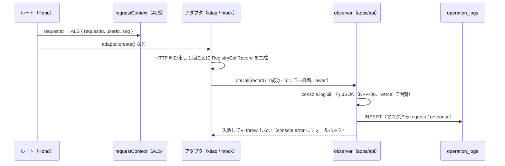

# spec: 操作ログ（レジストリ通信の記録）

| 項目 | 内容 |
|---|---|
| 対象 FR / NFR | FR-15（操作ログ）/ NFR-06（可観測性）。DB は #35 の operation_logs 分のみ |
| 優先度 | P1 |
| 担当 | @takutaku |
| Issue | #63（DB 変更は #35 の一部を含む） |
| ブランチ | `feat/fr-15-operation-logs` |

---

## 0. ユーザーストーリー

- 運用者として、きたQ（kitaqsign / kitaqnic）への全レジストリ呼び出しを後から追跡したい。
  ローカル実行では DB（`operation_logs`）に恒久保存され、本番（Vercel）では関数ログで
  すぐ確認できる必要がある（障害調査で「500 はあったか？」に即答できない状態の解消）。

## 1. 現状

- `operation_logs` テーブルはスキーマのみ存在し、書き込みコードが無かった
  （`docs/specs/registry-api.md` §7 の旧・未決事項）。
- レジストリ呼び出しは `packages/registry/src/http.ts` の `KitaqHttpClient.command()` に
  集約されているが、envelope（clTRID / svTRID）は各アダプタメソッドで破棄されていた。
- 要件: `docs/requirements.md` §9.1（列定義）/ FR-15（AC-15-1 / AC-15-2）/ NFR-06 /
  L888「呼び出し側の RegistryClient ラッパーが担当。アダプタはログを意識しない」/
  v0.1.7（補助コマンドは独立した行）。`docs/registry/spec-notes.md`（clTRID / svTRID 両方保存）。

## 2. 設計

- **発行点は HTTP クライアント層**（`packages/registry/src/http.ts`）。issue #63 のスケッチ
  「`lib/registry-client.ts` を Proxy でラップ」は不採用。理由:
  (a) Proxy ではアダプタが破棄する envelope（clTRID / svTRID）が見えない、
  (b) `create()` 内部の補助コマンド（host_info / host_create / contact_create）を
  「1 HTTP 呼び出し = 1 行」（v0.1.7）で捕捉できない、
  (c) 生 request / response が見えない。
  アダプタは `RegistryCallRecord`（`packages/registry/src/observer.ts`）を通知するだけで、
  マスク・保存・出力は apps/api 側 observer の責務（= 要件 L888 と整合）。
- **責務の境界**:
  - `packages/shared`: `maskSensitiveValues()`（`masking.ts`。AC-15-2 のマスク規則）
  - `packages/registry`: `RegistryCallRecord` / `RegistryCallObserver` / `ClTridFactory` 型、
    kitaq / mock 両アダプタからのレコード発行、`RegistryError.svTrid`
  - `apps/api`: ALS コンテキスト（`lib/operation-log-context.ts` + `middleware/request-context.ts`）、
    observer 実体（`lib/registries.ts` の `handleRegistryCall`）、
    行マッピング・console 行の純関数と INSERT（`services/operation-log.service.ts`）
  - `packages/db`: スキーマ変更（§5）
- **clTRID = request_id**（§9.1「X-Cl-TRID に送る値と一致させる」）: apps/api が
  `nextClTrid()`（Hono requestId + 連番 `<requestId>-1`, `-2`…、64 文字以内）を注入する。
  prefix で同一 API リクエスト内の複数呼び出しを相関できる。ALS 外や未注入時は
  アダプタ既定の採番（`dp-...` / `mock-...`）にフォールバック。
- **userId / requestId の伝搬**: AsyncLocalStorage（Node 22）。`requireSession` が
  `setContextUserId()` で補完する。未認証（`/health` の hello）や Poll 由来は userId NULL。
- **mock もログする**: ローカル既定（`REGISTRY_MODE=mock`）で受入確認できるようにするため。
  公開メソッド 1 回 = 1 行。HTTP 往復が無いため補助コマンド行は発行せず svTrid は null
  （mock の忠実度の限界として明記）。
- **書き込みは await**（fire-and-forget は Vercel の関数フリーズで消失リスク）。
  順序は console → INSERT: INSERT 失敗・フリーズでも Vercel ログには必ず残る。
  INSERT 失敗は `type:"operation_log_write_failed"` の console.error のみで、
  ユーザーリクエストは壊さない。INSERT の待ち時間は 3 秒を上限とし
  （`OPERATION_LOG_WRITE_TIMEOUT_MS`。DB に到達できないときに postgres-js の接続タイムアウト
  30s までレジストリ操作の応答を遅らせないため）、超過時は `reason:"timeout"` で同じ
  console.error を出して続行する。console.error にはペイロードを載せず、根本原因
  （`cause.cause` の ECONNREFUSED / SQLSTATE 等）の message を 300 文字に切って出す。
- **console 行**（NFR-06、`error-handler.ts` と同じ単一行 JSON.stringify 流儀）:
  `{"level":"info|warn","type":"operation_log",requestId,userId,registry,command,domainName,status,errorCode,registryCode,clTrid,svTrid,latencyMs}`。
  マスク済みペイロードは console には載せない（量と秘匿の多層防御。DB のみ）。
- **エラー時の svTRID**: `RegistryError` に `svTrid?` を追加し、envelope が得られた失敗
  （レジストリ拒否・HTTP/result 不整合・resData 不一致）で値を持ち回る。
  ネットワーク断・タイムアウト・非 JSON 応答は null。

## 3. 画面・UI

なし（閲覧 API `GET /logs/operations` と `/logs` 画面の接続は #64。
ローカルは SQL / Drizzle Studio、本番は Vercel の関数ログで閲覧する）。

## 4. API 契約

なし（既存ルートの応答は変えない。副作用として operation_logs への INSERT と
構造化 console ログが増えるのみ）。

## 5. データ変更

`packages/db/drizzle/0003_fat_miek.sql`（後方互換）:

- `operation_logs.sv_trid text` を追加（§9.1）
- `operation_logs.user_id` の NOT NULL を外す（システム起点の呼び出しは NULL。§9.1）
- `user_id` FK の `ON DELETE cascade` → `SET NULL`
  （退会でレジストリ通信ログが消えると「恒久保存」と矛盾するため。#35 の範囲を半歩超える決定）
- `ai_logs` テーブル（#35 の残り・FR-14）は本タスクに**含めない**

デプロイ順序: **migrate → deploy**（先にコードが出ると hello() の INSERT が
NOT NULL 違反で落ち、フォールバック console にしか残らない）。

## 6. 受け入れ条件

- [x] AC-15-1: タイムアウト・5xx・レジストリ拒否のいずれもエラー種別付きで記録される
- [x] AC-15-2: API キー・AuthCode は `***` にマスクされる（認証ヘッダはそもそも記録経路に乗せない）
- [x] 補助コマンド（hello / host_info / host_create / contact_create）が独立した行で記録される（v0.1.7）
- [x] clTRID / svTRID の両方が保存される（spec-notes.md）
- [x] 未認証呼び出し（/health の hello）は user_id NULL で記録される
- [x] 記録の失敗がレジストリ操作・API 応答を壊さない

## 7. テスト観点

| 種別 | 内容 |
|---|---|
| unit | `packages/shared/src/masking.test.ts`（マスク規則）、`apps/api/test/services/operation-log.test.ts`（行マッピング・console 行） |
| 契約 / 統合 | `packages/registry/src/http.test.ts`（成功 / 拒否 / タイムアウト / spec_mismatch / observer 例外 / makeClTrid）、`kitaq.test.ts`（create の複数レコード）、`mock.test.ts`、`apps/api/test/routes/operation-logs.test.ts`（HTTP → mock → observer → pglite INSERT の全経路） |
| 手動 | `pnpm dev` → check / health → `SELECT * FROM operation_logs`、`MOCK_REGISTRY_FAIL_MODE` でエラー行、（任意）`test:connect` で実レジストリの svTrid |

## 8. 未決事項・要確認

| # | 事項 | 本書の仮置き | 選択肢 |
|---|---|---|---|
| 1 | ログの保持期間・容量制御 | 無期限（削除しない） | TTL / パーティション / アーカイブは運用が固まってから要件化 |
| 2 | mock の補助コマンド行 | 発行しない（svTrid 同様、mock の忠実度の限界） | mock にも host/contact 相当の行を合成する |
| 3 | kitaq の `transferQuery` の command | kitaq には transfer query の専用エンドポイントが無く `info` で代替しているため、実レジストリでは `transfer_query` 行は記録されず `info` として残る（1 HTTP 呼び出し = 1 行の原則どおり）。`transfer_query` を出すのは mock のみ | 将来 kitaq に transfer query エンドポイントが追加されたら command を `transfer_query` に差し替える |
| 4 | INSERT の待ち方（Vercel） | await（§2。3 秒上限）。レジストリ呼び出し 1 回ごとに Supabase への往復が応答経路に乗る（NS 付き create は 5 回） | `@vercel/functions` の `waitUntil` で INSERT を応答後に流す（関数フリーズによる消失リスクとのトレードオフ。遅延が問題になったら検討） |

---

## 更新履歴

| 版 | 日付 | 内容 |
|---|---|---|
| v0.1 | 2026-08-26 | 初版（FR-15 実装と同時に作成） |
| v0.2 | 2026-08-26 | レビュー反映: マスクを部分一致に、INSERT の 3 秒上限と console.error の出力方針（§2）、kitaq transferQuery = info と waitUntil の余地（§8） |
