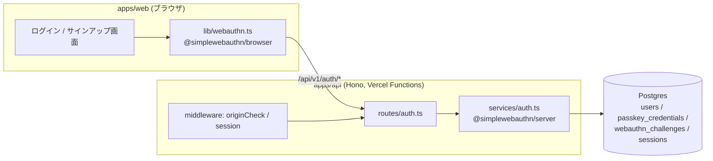
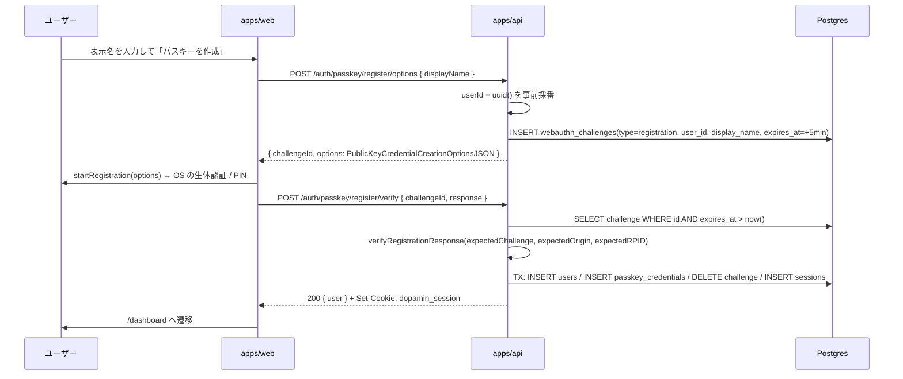
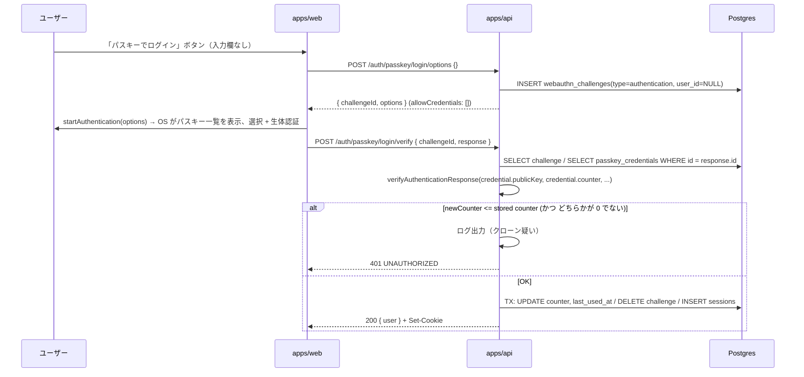

# FR-01 パスキー認証 — 実装仕様

対応要件: `docs/requirements.md` FR-01 / §9.1（users, passkey_credentials, webauthn_challenges, sessions）/ §10.1–10.3 / §12 / NFR-03。
本書は要件を実装単位に噛み砕いたもので、要件と矛盾する場合は `docs/requirements.md` が正。

---

## 0. 最初に共有したい結論（よくある誤解）

| 誤解 | 実際 |
|---|---|
| 「パスキーでもメールアドレスは必要」 | **不要**。WebAuthn がユーザー識別に使うのはサーバー発行のランダム ID（`user.id`）だけ。本プロダクトはメール・パスワード・ユーザー名入力を一切持たない |
| 「ログイン時にユーザー名を入れて、そのユーザーのパスキーを探す」 | **やらない**。Discoverable Credential（resident key）を使い、`allowCredentials` を空で送る。どのパスキーで入るかはブラウザ/OS のダイアログでユーザーが選ぶ |
| 「Supabase Auth のパスキー機能を使う」 | **使わない**。Supabase は Postgres としてのみ使う。Relying Party は `apps/api`（Hono + `@simplewebauthn/server`） |
| 「パスキーは 1 ユーザー 1 つ」 | **複数登録できる**。むしろ復旧手段がメールに無い分、複数登録を推奨する。最後の 1 つは削除不可 |
| 「パスキーを失ったらメールで復旧」 | **復旧手段は無い**（仕様どおり）。同期パスキー（iCloud Keychain / Google Password Manager）と複数登録が唯一の緩和策 |
| 「チャレンジはメモリに持てばよい」 | **DB に持つ**。Vercel Functions はリクエストごとに別インスタンスになりうるため、`webauthn_challenges` テーブルで 1 回限り・5 分失効で管理する |
| 「localhost と本番で同じ設定」 | RP ID / Origin は**環境ごとに違う**。`WEBAUTHN_RP_ID` / `WEBAUTHN_ORIGIN` で切り替える（§6 参照） |
| 「セッションは JWT」 | **DB 管理の不透明トークン**。Cookie 値 = `sessions.id`（32 byte ランダム）。JWT は使わない |

---

## 1. 用語

| 用語 | 意味 |
|---|---|
| パスキー | WebAuthn の Discoverable Credential（resident key）を指す一般名。生体認証 / PIN で使う公開鍵クレデンシャル |
| RP（Relying Party） | 認証を受ける側 = 本サービス（`apps/api`）。**RP ID** はその「ドメイン」（例: `localhost`, `dopamin.ut42tech.com`）。スキームやポートは含まない |
| Origin | ブラウザが検証に使う完全なオリジン（例: `http://localhost:3000`, `https://dopamin.ut42tech.com`）。RP ID と整合していなければブラウザが拒否する |
| user handle (`user.id`) | RP がパスキー作成時に渡す不透明なバイト列（≤64 byte）。認証時に authenticator から `userHandle` として返ってくる。**本プロダクトでは `users.id`（UUID）をバイト化したものを使う** |
| challenge | リプレイ防止のためサーバーが毎回発行するランダム値。1 回使ったら破棄 |
| attestation | 登録時に authenticator が返す「新しい公開鍵」の応答 |
| assertion | 認証時に authenticator が返す「秘密鍵で署名した」応答 |
| signature counter | authenticator が署名ごとに増やすカウンタ。保存値以下ならクローンの疑いで拒否（AC-01-4） |

---

## 2. 全体像



責務の境界:

- **`apps/web`**: `navigator.credentials.*` の呼び出し（`startRegistration` / `startAuthentication`）と画面遷移だけ。検証ロジックを持たない。
- **`apps/api`**: options 生成・検証・DB 更新・セッション発行。秘密情報と検証はすべてここ。
- **`packages/shared`**: リクエスト/レスポンスの zod スキーマ（`displayName` の 1〜32 文字制約など）。
- **`packages/db`**: 4 テーブルの Drizzle スキーマ。

---

## 3. フロー

### 3.1 サインアップ（新規ユーザー + 最初のパスキー）



ポイント:

- `users` 行はこの時点まで**作らない**（verify 成功時に作る）。途中離脱しても空ユーザーが残らない。
- `options.user.id` には事前採番した UUID を使う。`options.user.name` / `displayName` には `displayName` をそのまま入れる（OS のパスキー一覧に出る名前になる）。
- `excludeCredentials` は空（新規なので）。

### 3.2 ログイン



ポイント:

- **誰がログインするかサーバーは事前に知らない**。`response.id`（credential ID）で `passkey_credentials` を引き、その `user_id` がログインユーザー。
- `response.response.userHandle` が返ってきた場合は `credential.user_id` と一致することを確認する（不一致は 401）。
- `userVerification: 'preferred'` なので、検証側の `requireUserVerification` は `false`。

### 3.3 パスキー追加登録（ログイン済み）

サインアップと同じ流れだが:

- `session` ミドルウェア必須。`user.id` は `c.get('user').id`。
- `excludeCredentials` に**そのユーザーの既存 credential ID をすべて**渡す（同じ authenticator での二重登録を防ぐ）。
- verify 成功時は `passkey_credentials` の INSERT のみ（users / sessions は触らない）。

### 3.4 削除・ログアウト

- `DELETE /auth/passkeys/:id`: 自分のものでなければ 404。残り 1 件なら 409（`LAST_PASSKEY`）。
- `PATCH /auth/passkeys/:id { name }`: 自分のものでなければ 404。名前は 1〜32 文字（`passkeyNameSchema` = `displayNameSchema` と同じ制約）。更新後の `PasskeySummary` を返す。
- `POST /auth/logout`: `sessions` から該当行を削除し、Cookie を `Max-Age=0` で消す。

---

## 4. API 契約

ベースパス `/api/v1`。エラーは §10.3 の統一形式。

| メソッド | パス | 認証 | Body | 200 レスポンス |
|---|---|---|---|---|
| POST | `/auth/passkey/register/options` | 不要 | `{ displayName: string(1..32) }` | `{ challengeId: uuid, options: PublicKeyCredentialCreationOptionsJSON }` |
| POST | `/auth/passkey/register/verify` | 不要 | `{ challengeId, response: RegistrationResponseJSON }` | `{ user: { id, displayName } }` + Set-Cookie |
| POST | `/auth/passkey/login/options` | 不要 | `{}` | `{ challengeId, options: PublicKeyCredentialRequestOptionsJSON }` |
| POST | `/auth/passkey/login/verify` | 不要 | `{ challengeId, response: AuthenticationResponseJSON }` | `{ user }` + Set-Cookie |
| POST | `/auth/logout` | 要 | — | `{ ok: true }` + Cookie 削除 |
| GET | `/auth/me` | 要 | — | `{ user, features: { demoReset }, ai: { provider, model, providers: [{ id, models[] }] } }`（`meResponseSchema`。requirements v0.1.8 §10.1） |
| GET | `/auth/passkeys` | 要 | — | `{ passkeys: [{ id, name, deviceType, backedUp, createdAt, lastUsedAt }] }` |
| POST | `/auth/passkeys/register/options` | 要 | `{}` | 登録 options（`excludeCredentials` 付き） |
| POST | `/auth/passkeys/register/verify` | 要 | `{ challengeId, response }` | `{ passkey }` |
| DELETE | `/auth/passkeys/:id` | 要 | — | `{ ok: true }` |
| PATCH | `/auth/passkeys/:id` | 要 | `{ name: string(1..32) }` | `{ passkey }` |

`*JSON` 型は SimpleWebAuthn v13 で `@simplewebauthn/types` が本体に統合されたため、各パッケージから取る。API 側は `@simplewebauthn/server` から `RegistrationResponseJSON` / `AuthenticationResponseJSON` を import する（`apps/api/src/services/auth.ts`）。web 側は `@simplewebauthn/browser` の `Parameters<typeof startRegistration>[0]["optionsJSON"]` / `Parameters<typeof startAuthentication>[0]["optionsJSON"]` で options の型を導出する（`apps/web/lib/webauthn.ts`、バージョン追従のため）。zod スキーマは `packages/shared/src/auth.ts` に置き（`webauthnResponseSchema` / `passkeyVerifyRequestSchema`）、`response` は最低限 `{ id: string, rawId: string, type: 'public-key', response: object }`（任意で `clientExtensionResults` / `authenticatorAttachment`）の形を検証してから SimpleWebAuthn に渡す。

エラーコード（`CHALLENGE_NOT_FOUND` 400 / `VERIFICATION_FAILED` 401 / `CREDENTIAL_NOT_FOUND` 401 / `LAST_PASSKEY` 409）は requirements v0.1.8 で §10.3 に取り込み済み。定義は `packages/shared/src/errors.ts` の `ERROR_CODES` / `ERROR_STATUS`（#30 で統合）。

---

## 5. SimpleWebAuthn の呼び出し規約

```ts
// 登録 options
generateRegistrationOptions({
  rpName: env.WEBAUTHN_RP_NAME,
  rpID: env.WEBAUTHN_RP_ID,
  userID: uuidToBytes(userId),          // Uint8Array, ≤64 byte
  userName: displayName,
  userDisplayName: displayName,
  attestationType: 'none',
  excludeCredentials: existing.map(c => ({ id: c.id, transports: c.transports })),
  authenticatorSelection: {
    residentKey: 'required',            // Discoverable にする
    userVerification: 'preferred',
  },
});

// 登録 verify
verifyRegistrationResponse({
  response,
  expectedChallenge: challenge.challenge,
  expectedOrigin: env.WEBAUTHN_ORIGIN,
  expectedRPID: env.WEBAUTHN_RP_ID,
  requireUserVerification: false,
});
// → registrationInfo.credential.{ id, publicKey, counter, transports }, credentialDeviceType, credentialBackedUp, aaguid を保存

// 認証 options
generateAuthenticationOptions({
  rpID: env.WEBAUTHN_RP_ID,
  allowCredentials: [],                 // 空 = Discoverable
  userVerification: 'preferred',
});

// 認証 verify
verifyAuthenticationResponse({
  response,
  expectedChallenge: challenge.challenge,
  expectedOrigin: env.WEBAUTHN_ORIGIN,
  expectedRPID: env.WEBAUTHN_RP_ID,
  credential: { id: cred.id, publicKey: cred.publicKey, counter: Number(cred.counter), transports: cred.transports },
  requireUserVerification: false,
});
// → authenticationInfo.newCounter を保存
```

ブラウザ側は `@simplewebauthn/browser` の `startRegistration({ optionsJSON })` / `startAuthentication({ optionsJSON })` を `apps/web/lib/webauthn.ts` でラップし、`browserSupportsWebAuthn()` が false なら非対応案内を出す（AC-01-5）。

バージョンは `@simplewebauthn/server` / `browser` ともに **v13 系**に固定する（v13 で引数名が `optionsJSON` / `credential` に変わっているため、古い記事のコードをそのまま貼らない）。

---

## 6. 環境変数と RP ID / Origin

| 環境 | `WEBAUTHN_RP_ID` | `WEBAUTHN_ORIGIN` | 備考 |
|---|---|---|---|
| ローカル | `localhost` | `http://localhost:3000` | `localhost` は http でも secure context 扱い。**`127.0.0.1` でアクセスすると RP ID 不一致で失敗する**ので必ず `localhost` |
| Vercel Preview | そのプレビューの host | `https://<host>` | URL が毎回変わるのでパスキーはプレビューごとに登録し直す（許容） |
| 本番 | `dopamin.ut42tech.com` | `https://dopamin.ut42tech.com` | 独自ドメイン（requirements §16.1 / §16.4）。`*.vercel.app` も併存するが RP ID には使わない —— Public Suffix なのでサブドメイン共有ができず、web（`dopamin-web`）と api（`dopamin-api`）で別ドメインになってしまうため。web と api は**同一オリジン**（`next.config.ts` の rewrites で `/api/*` → api）に揃える |

- `WEBAUTHN_RP_NAME` は表示用（例: `ドパ民.com`）。
- Origin は Cookie（`Secure`, `SameSite=Lax`）と `originCheck` ミドルウェアでも使うため、3 者（Cookie / WebAuthn / originCheck）が必ず同じオリジンを指す。
- 開発時は `pnpm dev` で web(:3000) が api(:8787) に rewrites するので、ブラウザから見えるオリジンは常に `:3000`。api 側の `WEBAUTHN_ORIGIN` に `:8787` を書かない。

---

## 7. データの扱い

- `passkey_credentials.id`: SimpleWebAuthn が返す base64url 文字列をそのまま PK にする。
- `passkey_credentials.public_key`: `Uint8Array` を `bytea` に保存。**更新しない**（改竄検出）。
- `passkey_credentials.counter`: `bigint`。多くのプラットフォーム認証器は常に 0 を返すので、**「保存値 > 0 かつ newCounter ≤ 保存値」のときだけ拒否**する（両方 0 は正常）。
- `passkey_credentials.name`: 初期値は AAGUID から推定（`apps/api/src/lib/aaguid.ts` に主要な認証器の対応表を同梱。不明なら `deviceType` に応じて「このデバイス」/「同期パスキー」）。ユーザーが設定画面で変更可（`PATCH /auth/passkeys/:id`）。
- `webauthn_challenges`: 検証成功時（および検証失敗時も）に必ず削除。期限切れ行は options 発行時に `expires_at < now()` を opportunistic に DELETE する（cron は持たない）。
- `sessions.id`: `crypto.getRandomValues` 32 byte → base64url。Cookie 値そのもの。7 日、残り 3 日を切ったらアクセス時に延長（§10.2）。

---

## 8. 画面（apps/web）

| パス | 内容 |
|---|---|
| `/login` | ボタン 1 つ「パスキーでログイン」＋「初めての方はこちら」リンク。**テキスト入力欄なし**（AC-01-2）。非対応ブラウザは案内文に差し替え |
| `/signup` | 表示名入力（1〜32 文字、zod で共有）→「パスキーを作成」 |
| `/settings/passkeys` | 一覧（名前 / 作成日 / 最終利用日 / 同期の有無）、「パスキーを追加」、各行の名前変更（インライン編集、1〜32 文字）と削除。1 件のときは削除ボタン無効＋説明 |

未認証で `/dashboard` 以下へ来た場合は `proxy.ts`（旧 middleware）で Cookie の有無だけ見て `/login` へリダイレクト。実際の有効性検証は API 側（AC-01-3）。

---

## 9. テスト観点

| 種別 | 内容 |
|---|---|
| unit（api） | challenge 期限切れ → 400 / counter 後退 → 401 + ログ / userHandle 不一致 → 401 / 最後の 1 件削除 → 409 / 他人のパスキーの名前変更 → 404 / 名前 0・33 文字 → 400 |
| unit（shared） | `displayName` 0 文字・33 文字・空白のみ → reject |
| 契約 | SimpleWebAuthn の `verify*` はモックし、API ルートが DB を正しく更新することを検証（`users`・`passkey_credentials`・`sessions` の行数、challenge 削除）。DB は `@electric-sql/pglite` + `drizzle-orm/pglite` に `packages/db/drizzle` のマイグレーションを適用したテスト用インスタンス（`apps/api/test/helpers/db.ts`）を `setDbForTesting` で注入する |
| 手動（AC-01-1） | Chrome / Safari / Edge 最新で サインアップ → ログアウト → 再ログイン。`localhost` で実施 |
| 手動（AC-01-4） | 同一 credential で counter を DB 上で手動で大きくしてからログイン → 拒否されることを確認 |

WebAuthn の実ブラウザ動作は Playwright + CDP Virtual Authenticator で自動化する（`apps/web/e2e/passkey.spec.ts`: サインアップ → ログアウト → ログイン → パスキー追加 → 削除）。API は mock レジストリ + Postgres（ローカルは docker、CI は `services: postgres`）で起動し、CI では必須にしない別ジョブとして実行する。

---

## 10. 実装順序（1 PR 想定、`feat/fr-01-passkey-auth`）

1. `packages/db`: 4 テーブルの Drizzle スキーマ + マイグレーション
2. `packages/shared`: auth 用 zod スキーマ・エラーコード
3. `apps/api`: env 検証 → `services/auth.ts`（options / verify / session）→ `routes/auth.ts` → `session` / `originCheck` ミドルウェア → unit テスト
4. `apps/web`: `lib/webauthn.ts` → `/login` `/signup` → `proxy.ts` のリダイレクト → `/settings/passkeys`
5. 手動で AC-01-1〜5 を確認し、結果を PR に記載

---

## 11. 未確定・要確認

- 本番の RP ID（独自ドメインを取るか）【要確認】— 取る場合は登録済みパスキーが全て無効になるため、デモ前に確定する。
- ~~AAGUID → 名前の対応表をどこまで持つか~~ → 解決（2026-08-26）: 主要な認証器（iCloud キーチェーン / Google パスワードマネージャー / Windows Hello / Chrome on Mac / 1Password / Bitwarden / Dashlane / Proton Pass / Samsung Pass / KeePassXC 等）だけを `apps/api/src/lib/aaguid.ts` に同梱する。全量 JSON は持たない。

---

## 12. 周辺機能の仕上げ（2026-08-26 実装計画）

§1〜§10 のコア（サインアップ / ログイン / ログアウト / パスキー一覧・追加・削除、`/login` `/signup` `/settings`）は main に実装済み。残っていたギャップを以下の 4 トラックに分け、それぞれ別 worktree・別 PR で並列に進める。マージ後に Wave 2 でエラーコードを統合する。

**状況（2026-08-26 14:00）**: 全トラックが main にマージ済み — docs #125 / A0 #132 / E #131 / A1 #133 / B #135 / D #134 / Wave 2 #140。残件は #137（web vitest の負荷時 flaky）、#141（エラーコードの別名削除）、#41（e2e デモシナリオ 1〜5）。

### 12.1 ギャップと対応

| # | ギャップ | 対応トラック | issue |
|---|---|---|---|
| 1 | `/domains*` `/transfers*` が認証なし（AC-01-3 違反） | A | #50 |
| 2 | FR-01 サービスの unit / 契約テストが無い。テスト DB 基盤も無い | A | #40 |
| 3 | 期限切れ `webauthn_challenges` の掃除なし | A | — |
| 4 | `GET /auth/me` が `{ user }` のみで、web の `meResponseSchema` を満たさない（http モードで AppShell・設定画面が動かない） | B | ui-screens §7 #2 / #3 |
| 5 | `PATCH /settings/ai`（FR-17）未実装 | B | #73 |
| 6 | web http モードの `settings.me / updateAi` が `NOT_IMPLEMENTED`、`signed-in-redirect` が `fetchMe` 回避策 | B | — |
| 7 | パスキー名が「このデバイス / 同期パスキー」固定。名前変更 API / UI が無い | D | — |
| 8 | `apps/web/lib/webauthn.ts` が API 応答を zod 検証していない | D | — |
| 9 | 実ブラウザでの signup → login の自動検証が無い | E | #41（FR-01 部分） |
| 10 | エラーコード・例外クラスの二重定義 | Wave 2 | #30 |

### 12.2 トラック A — 認証の堅牢化（`feat/fr-01-auth-hardening`）

- `apps/api/src/lib/db.ts` に `setDbForTesting(db | null)` を追加（`setRegistrySetForTesting` と同じ流儀）。`Db` 型は `drizzle-orm/postgres-js` 由来なので、pglite の drizzle インスタンスは `Db` 互換として注入する（構造的に同じクエリビルダ）。
- `apps/api/test/helpers/db.ts`: pglite を起動し `packages/db/drizzle/*.sql` を順に適用する `createTestDb()`。`apps/api/test/helpers/session.ts`: `users` + `sessions` を INSERT して Cookie ヘッダ文字列を返す `createTestSession(db, { displayName })`。
- `AppEnv.Variables` を `AuthVariables`（`user` / `sessionId`）と統合し、`domains` / `transfers` ルーターの先頭で `requireSession` を適用する。既存の `test/routes/*.test.ts` はセッション注入ヘルパーで認証済みにする。
- `services/auth.ts` の unit / 契約テスト（§9 の表）。SimpleWebAuthn の `verify*` は `vi.mock` で差し替える。
- `insertChallenge` の前に `expires_at < now()` を DELETE（掃除）。
- `docs/specs/registry-api.md` §1 の「全ルート認証なし」記述と `docs/testing.md` §1 を更新。

### 12.3 トラック B — `/auth/me` 拡張と AI 設定（`feat/fr-17-settings-me`）

- `apps/api/src/services/settings.ts`: `resolveAiSettings(user, env)` — 有効プロバイダ（`GOOGLE_GENERATIVE_AI_API_KEY` / `ANTHROPIC_API_KEY` の有無）と各プロバイダの候補モデル（`AI_MODEL` を先頭に、既知モデルの短いリスト）を返し、ユーザー設定 → env 既定の順で実効値を決める。どのキーも無い場合は `AI_PROVIDER` を唯一の選択肢として返す（ローカル開発で画面が空にならないように）。
- `GET /auth/me` を `meResponseSchema` の形に。`features.demoReset = DEMO_RESET_ENABLED`。
- `routes/settings.ts`: `PATCH /settings/ai`（`aiSettingsUpdateRequestSchema`）。有効化されていないプロバイダは `VALIDATION_ERROR`。`users.ai_provider / ai_model` を更新して実効値を返す。
- web: `http-services.ts` の `settings.me()` / `updateAi()` を Hono RPC + `unwrap(…, meResponseSchema / aiSettingsResponseSchema)` で実装。`signed-in-redirect.tsx` は http でも `useMe` を使う形に統一し `fetchMe` を削除。`demoReset` は API 未実装のため `NOT_IMPLEMENTED` のまま。

### 12.4 トラック D — パスキー管理の仕上げ（`feat/fr-01-passkey-mgmt`）

- `apps/api/src/lib/aaguid.ts`: AAGUID → 表示名の対応表と `passkeyNameFromAaguid(aaguid, deviceType)`。登録時の初期名に使う。
- `PATCH /auth/passkeys/:id`（§3.4 / §4）。`packages/shared/src/auth.ts` に `passkeyNameSchema` / `passkeyRenameRequestSchema` を追加。
- web: `AuthService.renamePasskey(id, name)`（mock / http 両実装）、`useRenamePasskey`、設定画面の行にインライン編集（鉛筆アイコン → Input + 保存 / キャンセル）。
- `lib/webauthn.ts` の `request()` を zod 検証付きにし、`authUserSchema` / `passkeySummarySchema` / options は `z.object({ challengeId: z.uuid(), options: z.record(...) })` で最低限の形を検証する。

### 12.5 トラック E — e2e（`feat/fr-01-e2e-passkey`）

- `apps/web/playwright.config.ts` と `apps/web/e2e/passkey.spec.ts`。`context.newCDPSession(page)` → `WebAuthn.enable` → `WebAuthn.addVirtualAuthenticator({ protocol: 'ctap2', transport: 'internal', hasResidentKey: true, hasUserVerification: true, isUserVerified: true })`。
- シナリオ: `/signup` で表示名入力 → パスキー作成 → `/dashboard` 到達 → ログアウト → `/login` でボタン 1 つ → 再ログイン → `/settings` でパスキー追加 → 2 件になったら 1 件削除 → 最後の 1 件は削除ボタン Disabled。
- 起動: web は `NEXT_PUBLIC_API_MODE=http`、api は `REGISTRY_MODE=mock` + `DATABASE_URL`（ローカル docker `postgres:17`、CI は `services: postgres`）。`pnpm --filter @dopamin/web e2e` で web / api を `webServer` から起動する。
- CI: `.github/workflows/ci.yml` に `e2e` ジョブを追加（`continue-on-error: true`、必須にしない）。

### 12.6 Wave 2 — エラーコード統合（`fix/error-code-unify`、#30）

A / B / D のマージ後に main から着手する。`packages/shared/src/errors.ts` を正として `api.ts` の `API_ERROR_CODES` / `apiErrorBodySchema` を削除（re-export で後方互換）、`apps/api` の `ApiError` を `ApiException` に寄せ、`error-handler.ts` を単一経路にする。

### 12.7 マージ順と衝突の見込み

1. 本書と requirements v0.1.8（docs PR）
2. A → B → D（`routes/auth.ts` の `/me` と `/passkeys/:id` は近接編集だが別ハンドラ。`index.ts` の `.route()` 追加は B のみ）
3. E（A の requireSession 適用後の挙動で検証したいので最後）
4. Wave 2

---

## 更新履歴

本書は `docs/specs/_template.md` より前に書かれたため版番号を持っていなかった。
2026-08-28 以降の変更はここに記録する（それ以前の経緯は `git log docs/specs/passkey-auth.md`）。

| 版 | 日付 | 内容 |
|---|---|---|
| v1 | 2026-08-28 | 版番号の付与。§1 / §6 の本番 RP ID・Origin を `dopamin.vercel.app` から実際の `dopamin.ut42tech.com` に更新（requirements §16.1 / §16.4） |
