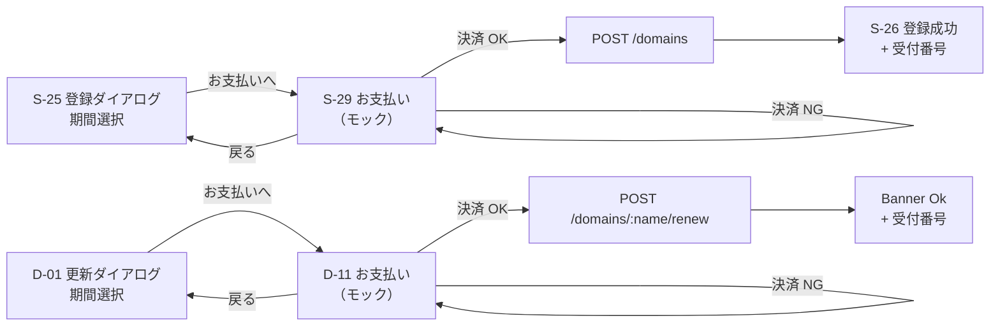

# spec: 決済（モック）

| 項目 | 内容 |
|---|---|
| 対象 FR / NFR | `FR-19`（`FR-06` / `FR-08` / `FR-11` に影響） |
| 優先度 | P1 |
| 担当 | @ut42tech |
| Issue | #145 |
| ブランチ | `feat/fr-19-payment-mock` |

---

## 0. ユーザーストーリー

- ドメインを初めて取る個人開発者が、取得・更新の直前に「いくら払うのか」を確認してから確定したい。実際のレジストラは必ず決済を挟むので、体験としてそこが抜けていると「本当に取れたのか」が分からない。
- 発表デモで「取得 → 支払い → 完了」まで一連で見せたい。ただしハッカソン成果物なので実際の請求は発生させない。

## 1. 現状

- 登録: `apps/web/features/candidates/register-dialog.tsx` の「登録する」が直接 `POST /domains` を呼んでいた（決済ステップなし）。
- 更新: `apps/web/features/domains/dialogs/renew-dialog.tsx` の「延長する」が直接 `POST /domains/:name/renew` を呼んでいた。
- 料金の表現は `apps/web/features/domains/dialogs/restore-dialog.tsx` の復旧費用（ダミー `¥3,300`、FR-11）だけが存在した。
- `packages/shared` / `apps/api` / `packages/db` に価格・決済の型・エンドポイント・テーブルは無い。
- `docs/requirements.md` は v0.1.10 まで「決済・課金・料金表示」を丸ごと非スコープとしていた。v0.1.11 で「**実**決済は非スコープ、モックのお支払い画面と固定ダミー価格はスコープ」に改訂した（本 spec の前提）。

## 2. 設計

責務の境界:

| 層 | 置くもの |
|---|---|
| `packages/shared/src/pricing.ts` | TLD 別の固定ダミー年額、消費税率、`quoteOrder()`（小計 / 税 / 合計）、`formatJpy()`、`RESTORE_FEE`。**金額の SSOT** |
| `apps/web/lib/payments/card.ts` | カード番号・有効期限の整形、ブランド推定、Luhn、入力検証。PSP には送らない |
| `apps/web/lib/api/payments/mock-gateway.ts` | `PaymentService` の実装（決済モック）。実 PSP を繋ぐときはここだけ差し替える |
| `apps/web/features/billing/` | 注文サマリー（`order-summary.tsx`）、お支払いステップ本文（`payment-step.tsx`）、状態（`use-payment-step.ts`） |
| `apps/web` の各ダイアログ | ステップ遷移とボタン。決済が成立したときだけレジストリ操作を呼ぶ |
| `apps/api` / `packages/db` | **変更なし**（AC-19-5） |

既存パターンからの逸脱と理由:

- 決済は `Services`（`apps/web/lib/api/services.ts`）に `payments` として足すが、mock / http どちらの実装も同じブラウザ内モックを使う。API にルートが無く、`http` モードでも決済だけは動いてほしいため。
- 決済の失敗は `ApiClientError` ではなく戻り値（`PaymentResult`）で表す。§10.3 の統一エラーコードに決済系が無く、表示も Error Card ではなくダイアログ内の Banner が適切なため。

## 3. 画面・UI

- Figma: 既存の `Dialog / Form` と `Card` / `Key Value Row` の組み合わせで構成し、新規コンポーネントは作らない（`docs/specs/web-ui.md` の対応表に S-29 / D-11 の専用ノードは無い）。
- 画面 ID: `S-29`（登録のお支払い）/ `D-11`（更新のお支払い）。詳細は `docs/specs/ui-screens.md`。
- 状態一覧:

| 状態 | 表示 |
|---|---|
| 通常 | 注文サマリー（品目 / 期間 / 単価 / 小計 / 消費税 / 合計）+ カード入力（デモ用カードが入力済み）+ 「¥n を支払って登録する（延長する）」/「戻る」 |
| 入力エラー | 欄ごとに warn の helper（`Input` の `error`）。送信はしない |
| 決済拒否 | 本文先頭に Banner Warn「お支払いに失敗しました」+ 理由。ダイアログは開いたまま |
| 処理中 | 主ボタンが loading、入力欄は disabled |
| レジストリ失敗 | 決済は成立済み。登録は既存の S-27 / S-28 / D-07 の分岐に合流する |

## 4. API 契約

| メソッド | パス | リクエスト | レスポンス | エラー |
|---|---|---|---|---|
| — | — | — | — | — |

**API の追加・変更はなし。** 決済はブラウザ内で完結する（AC-19-5）。既存の `POST /domains` / `POST /domains/:name/renew` を、決済成立後にそのまま呼ぶ。

型の置き場所:

- `packages/shared/src/pricing.ts`: `OrderKind` / `OrderQuoteInput` / `OrderQuote` / `quoteOrder()` / `formatJpy()` / `DUMMY_TLD_UNIT_PRICES` / `CONSUMPTION_TAX_RATE` / `RESTORE_FEE`
- `apps/web/lib/api/types.ts`: `PaymentCardInput` / `PaymentChargeInput` / `PaymentReceipt` / `PaymentResult` / `PaymentErrorCode`
- `apps/web/lib/api/services.ts`: `PaymentService`

zod は使わない。外部（HTTP / AI / レジストリ）からの入力ではなく、同一プロセス内で組み立てた値しか流れないため（CLAUDE.md の「すべての外部入力は zod で検証」の対象外）。実 PSP を繋ぐ時点で応答の zod 検証を足す。

## 5. データ変更

**なし。** 注文・支払い・請求のテーブルは追加しない。受付番号（`pay_xxxxxxxx`）はその場で生成し、成功画面・成功バナーに出すだけで永続化しない。

## 6. 受け入れ条件

- [x] AC-19-1: 登録ダイアログで期間を選ぶと、ドメイン名・期間・単価 × 年数・消費税・税込合計が表示され、支払い実行後に `POST /domains` が呼ばれる
- [x] AC-19-2: 更新ダイアログでも同じ内容が表示され、支払い実行後に `POST /domains/:name/renew` が呼ばれる
- [x] AC-19-3: 決済が失敗した場合、レジストリ操作は呼ばれず、ダイアログ内にエラーと再試行が表示される
- [x] AC-19-4: デモ用カードが既定で入力済みで、カード欄に触れずに登録まで到達できる
- [x] AC-19-5: 決済に関する API エンドポイント・DB テーブルを追加していない

## 7. テスト観点

| 種別 | 内容 |
|---|---|
| unit | `packages/shared/src/pricing.test.ts`: 対応 TLD 22 種の単価の存在、税の切り捨て、年数の境界（0 / 11 / 小数）、未対応 TLD で null。`apps/web/lib/payments/card.test.ts`: 整形（4 桁区切り・MM/YY）、ブランド推定、Luhn、有効期限の当月末境界。`apps/web/lib/api/payments/mock-gateway.test.ts`: 成功時の控えの中身、末尾 `0002` の拒否、摘要の文言 |
| 契約 / 統合 | `apps/web/features/candidates/domains-new-flow.test.tsx`: S-25 → S-29 → S-26 の通し、決済拒否で `register` が呼ばれないこと、「戻る」で S-25 に戻ること。`apps/web/features/domains/detail/domain-detail-page.test.tsx`: D-01 → D-11 → Banner Ok、決済拒否で `renew` が呼ばれないこと |
| 手動 | `pnpm dev` で `/domains/new` から取得、`/domains/[name]` から更新。デモ用カードのまま完了できること、`4000 0000 0000 0002` で拒否されること |

## 8. 未決事項・要確認

| # | 事項 | 本書の仮置き | 選択肢 |
|---|---|---|---|
| 1 | ダミー単価の水準（実在レジストラの価格に寄せるか） | 実在の相場を参考にした固定値（`.com` ¥1,480 など）。あくまでダミーで、画面にも「固定ダミー価格」と明示する | (a) すべて同額にして「ダミー」であることをより強く示す (b) 実レジストリの料金 API があれば参照する |
| 2 | 復旧（FR-11）にもお支払いステップを挟むか | 挟まない（費用の文言表示のみ、現行どおり） | 復旧・移管にも同じステップを広げる |
| 3 | 決済の記録（操作ログ / 領収履歴）を残すか | 残さない（受付番号はその場限り） | `operation_logs` とは別に決済ログを持つ（DB 変更が必要） |

---

## 更新履歴

| 版 | 日付 | 内容 |
|---|---|---|
| v0.1 | 2026-08-26 | 初版。requirements v0.1.11 の FR-19 に対応。取得（S-25 → S-29）・更新（D-01 → D-11）にモック決済ステップを追加 |
