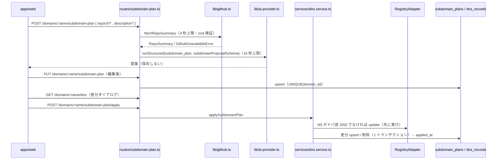

# spec: サブドメイン設計支援と疑似 DNS ゾーン

| 項目 | 内容 |
|---|---|
| 対象 FR / NFR | FR-13（サブドメイン設計支援）/ FR-09（NS 変更）/ FR-15（操作ログ）/ FR-18（エラー）/ NFR-04（所有権）/ NFR-05（入力検証）。要件は `docs/requirements.md` §9.1 `subdomain_plans`・`dns_records` / §10.1 / §13.2 |
| 優先度 | P1 |
| 担当 | @takutaku |
| Issue | #36（db）/ #68（提案）/ #69（保存・取得）/ #70（反映・DNS） |
| ブランチ | `sasaki/nightly-2026-08-27` |

---

## 0. ユーザーストーリー

- 利用者として、取得したドメインに対して「どんなサブドメインを切ればいいか」を
  GitHub の公開リポジトリから AI に提案してほしい。提案を編集して保存し、
  ボタン 1 つでアプリ内の疑似 DNS ゾーンに反映したい。
- 外部 DNS を使っている場合は、同じ内容を手で設定するためのテキストが欲しい。
- 非公開リポや存在しない URL のときも、プロジェクト概要を打てば提案してほしい。

## 1. 現状

- 契約と純粋関数は `packages/shared/src/subdomains.ts`（#29）に揃っていた:
  `subdomainProposalSchema` / `subdomainPlanSaveRequestSchema` / `subdomainPlanResponseSchema` /
  `dnsZoneResponseSchema` / `diffDnsRecords` / `subdomainApplyState` / `needsNameserverSwitch`。
- `subdomain_plans` / `dns_records` テーブルは無かった（#36 で追加）。
- `apps/api` には GitHub クライアントも FR-13 のルートも無かった。
- NS 切替の経路は `PATCH /domains/:name`（FR-09）に既にある（`apps/api/src/routes/domains.ts`）。

## 2. 設計

### 2.1 責務の境界

| 置き場所 | 持つもの |
|---|---|
| `packages/shared/src/subdomains.ts` | 契約スキーマ、差分計算（`diffDnsRecords`）、反映状態（`subdomainApplyState`）、手順テキスト（`buildDnsSetupInstructions`） |
| `packages/db/src/schema/` | `subdomain_plans` / `dns_records` |
| `apps/api/src/lib/github.ts` | GitHub REST の取得と zod 検証、mock 切替、失敗の分類 |
| `apps/api/src/prompts/subdomain-plan.ts` | システムプロンプトと入力の整形（§13.2） |
| `apps/api/src/services/subdomain-plan.service.ts` | 提案生成、保存 / 取得、応答への写像 |
| `apps/api/src/services/subdomain-plan-store.ts` | 2 テーブルの永続化と読み戻しの検証 |
| `apps/api/src/services/dns.service.ts` | 差分の実行（NS 切替 → レコード書き込み → 操作ログ） |
| `apps/api/src/routes/subdomain-plan.ts` | 認証・所有権チェック・サービス呼び出し |

ルートは `/domains` に重ねてマウントする（`routes/domains.ts` とは関心が違うのでファイルを分ける）。

### 2.2 GitHub 解析（#68）

- 集めるもの: 説明 / トピック / 言語（バイト数の降順）/ README 先頭 8KB / ルート直下 /
  `apps` `packages` `docs` `api` の直下 1 段（構造ヒント）/ ルートのマニフェスト最大 2 件。
- **実キー前提にしない**。`GITHUB_MODE`（既定 `mock`）でネットワークに出ないフェイク応答へ切り替えられる。
  失敗系は `GITHUB_MOCK_FAIL_MODE`（`not_found` / `rate_limited` / `unreachable`）で再現する。
  `GITHUB_TOKEN` は `real` でも任意で、未設定なら未認証で叩く（レート制限の緩和用。§17）。
- 失敗の分類: 404 / 403 は `NOT_FOUND`「取得できません」、429 と
  `x-ratelimit-remaining: 0` の 403 は `RATE_LIMITED`（§10.3 は GitHub のレート制限を
  `RATE_LIMITED` に寄せている）。README / マニフェストの 404 は解析を止めない。
- README の切り出しは **UTF-8 の文字境界まで戻す**。素朴にバイトで切ると多バイト文字が分断されて
  U+FFFD に置き換わり、かえって 8KB を超える。
- 全体の上限は 4 秒。AI の 10 秒と合わせて AC-13-1 の 15 秒に収める。

### 2.3 保存と反映状態（#69）

- `PUT` は `UNIQUE(domain_id)` を競合キーにした upsert。**`applied_at` と `repo_summary` は
  上書きしない**。保存は DNS を変えないので、反映済みの日時は残したまま、内容の変わったホストだけが
  `changed` に倒れる（AC-13-6）。
- 反映状態はテーブルに持たせず、取得のたびに `dns_records` との突き合わせで導出する。
  `dns_records` 側だけが変わったときに実体とズレるのを避けるため。
- 保存済み設計の形（`savedSubdomainProposalSchema`）は提案（`subdomainProposalSchema`）と別。
  編集で `www` を外したり 1 件だけ残したりできるので、`www` 必須と 3 件以上を課さない。
- `instructions`（手順テキスト）は `buildDnsSetupInstructions` が生成する。画面のコピーボタンと
  API 応答で文言がずれないよう、生成を `packages/shared` に 1 本化する。

### 2.4 反映（#70）

- 順序が重要。**NS 切替を先に行う**。切替に失敗したらレコードを 1 件も変更せず FR-18 のエラーを返す
  （AC-13-5）。タイムアウトは `info` で照合する（AC-18-2）。
- レコードの upsert / 削除は 1 トランザクション。競合キーは `UNIQUE(domain_id, host, record_type)`。
- 差分が空でも `applied_at` は進める（その時点の設計は反映済みなので。AC-13-4）。
- 差分計算は `GET /dns` の dry-run と同じ関数を使う。確認ダイアログの表示と実際に起きることが
  ずれないため（AC-13-7）。
- 設計が未保存のドメインの `GET /dns` は差分を**空**で返す。desired を空集合として扱うと
  既存レコードが全部 `removed` に見えてしまう。
- 操作ログには `subdomain_plan.apply` を 1 行残す（AI 呼び出しは伴わない）。これはレジストリ通信では
  ないので `packages/shared` の `APP_OPERATION_COMMANDS` という別カテゴリに置き、
  `<機能>.<操作>` 表記でレジストリコマンド（snake_case）と見分けられるようにする。
  NS 切替のレジストリ呼び出しは従来どおり `update` として別行で記録される。

## 3. 画面・UI

本書の範囲外（設計ツリー・差分ダイアログの接続は #91 / #92）。

## 4. API 契約

| メソッド | パス | リクエスト | レスポンス | エラー |
|---|---|---|---|---|
| POST | `/domains/:name/subdomain-plan` | `subdomainPlanGenerateRequestSchema`（`repoUrl` か `description` のどちらか必須） | `subdomainPlanProposalResponseSchema` | 401 / 403 / 404（未保有・リポ取得不可）/ 400 / 429 / 503 |
| PUT | `/domains/:name/subdomain-plan` | `subdomainPlanSaveRequestSchema` | `subdomainPlanResponseSchema` | 401 / 403 / 404 / 400 / 409（移管 OUT 済み） |
| GET | `/domains/:name/subdomain-plan` | — | `subdomainPlanResponseSchema` | 401 / 403 / 404（未保存） |
| POST | `/domains/:name/subdomain-plan/apply` | — | `subdomainPlanApplyResponseSchema` | 401 / 403 / 404（未保存）/ 409 / レジストリ由来（502 / 504 / 422） |
| GET | `/domains/:name/dns` | — | `dnsZoneResponseSchema` | 401 / 403 / 404 |

- 応答の件数名は §10.1 どおり `updated`（差分計算側の `changed` に対応）。
- スキーマは `packages/shared/src/subdomains.ts`。

## 5. データ変更

`packages/db/drizzle/0008_odd_caretaker.sql`（#36）。

- `subdomain_plans`: `UNIQUE(domain_id)` で 1 ドメイン 1 設計。`applied_at` は未反映を NULL で表す。
- `dns_records`: `UNIQUE(domain_id, host, record_type)` を差分 upsert の競合キーにする。
  `ttl` の既定は 3600。
- どちらも `domains` への FK は `ON DELETE CASCADE`（ドメインが消えたら設計もゾーンも残さない）。

## 6. 受け入れ条件

- [x] AC-13-1: 提案表示まで 15 秒以内（GitHub 4 秒 + AI 10 秒の上限で担保）
- [x] AC-13-2: 取得できないリポジトリは「取得できません」。概要テキストがあれば提案できる
- [x] AC-13-3: 保存 → 再取得 → 再編集できる
- [x] AC-13-4: 反映後の `GET /dns` が設計と一致し、バッジが `applied` になる
- [x] AC-13-5: NS がドパ民 DNS でなければ自動で切り替わる。切替失敗時はレコードを変更しない
- [x] AC-13-6: 反映後に編集保存すると該当ホストが `changed`、再反映で `applied` に戻る
- [x] AC-13-7: `GET /dns` が追加 / 変更 / 削除の対象を返し、apply と同じ計算になる

## 7. テスト観点

| 種別 | 内容 |
|---|---|
| unit | `packages/shared/src/subdomains.test.ts`（差分・反映状態・手順テキスト）、`packages/db` のスキーマ制約は `apps/api/test/db/subdomain-schema.test.ts` |
| 契約 / 統合 | `apps/api/test/lib/github.test.ts`（mock / real 両経路、失敗の分類、8KB 切り出し）、`test/routes/subdomain-plan-generate.test.ts`、`test/routes/subdomain-plan-save.test.ts`、`test/routes/subdomain-plan-apply.test.ts` |
| 手動 | `GITHUB_MODE=real` で実リポジトリを解析し、提案が構造ヒントを反映していること |

## 8. 未決事項・要確認

| # | 事項 | 本書の仮置き | 選択肢 |
|---|---|---|---|
| 1 | `subdomain_plans.repo_summary` の書き込み | 現状どこからも書かない（提案は保存しない / 保存は再解析しない） | 生成時に解析結果だけ先に保存する / PUT で `repoUrl` があれば再解析する |
| 2 | 疑似 DNS ゾーンの手動編集 | 持たない（`source` は `subdomain_plan` 固定） | `source = 'manual'` を足して個別編集を許す |

---

## 更新履歴

| 版 | 日付 | 内容 |
|---|---|---|
| v0.1 | 2026-08-27 | 初版（#36 / #68 / #69 / #70 の実装に合わせて起票） |
