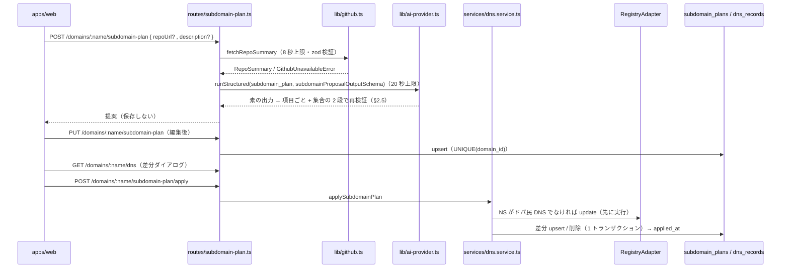

# spec: サブドメイン設計支援と疑似 DNS ゾーン

| 項目 | 内容 |
|---|---|
| 対象 FR / NFR | FR-13（サブドメイン設計支援）/ FR-09（NS 変更）/ FR-15（操作ログ）/ FR-18（エラー）/ NFR-04（所有権）/ NFR-05（入力検証）。要件は `docs/requirements.md` §9.1 `subdomain_plans`・`dns_records` / §10.1 / §13.2 |
| 優先度 | P1 |
| 担当 | @takutaku |
| Issue | #36（db）/ #68（提案）/ #69（保存・取得）/ #70（反映・DNS） |
| ブランチ | `sasaki/nightly-2026-08-27` |

---

## 0. ユーザーストーリー

- 利用者として、取得したドメインに対して「どんなサブドメインを切ればいいか」を
  GitHub の公開リポジトリから AI に提案してほしい。提案を編集して保存し、
  ボタン 1 つでアプリ内の疑似 DNS ゾーンに反映したい。
- 外部 DNS を使っている場合は、同じ内容を手で設定するためのテキストが欲しい。
- 非公開リポや存在しない URL のときも、プロジェクト概要を打てば提案してほしい。

## 1. 現状

- 契約と純粋関数は `packages/shared/src/subdomains.ts`（#29）に揃っていた:
  `subdomainProposalSchema` / `subdomainPlanSaveRequestSchema` / `subdomainPlanResponseSchema` /
  `dnsZoneResponseSchema` / `diffDnsRecords` / `subdomainApplyState` / `needsNameserverSwitch`。
- `subdomain_plans` / `dns_records` テーブルは無かった（#36 で追加）。
- `apps/api` には GitHub クライアントも FR-13 のルートも無かった。
- NS 切替の経路は `PATCH /domains/:name`（FR-09）に既にある（`apps/api/src/routes/domains.ts`）。

## 2. 設計

### 2.1 責務の境界

| 置き場所 | 持つもの |
|---|---|
| `packages/shared/src/subdomains.ts` | 契約スキーマ、差分計算（`diffDnsRecords`）、反映状態（`subdomainApplyState`）、手順テキスト（`buildDnsSetupInstructions`） |
| `packages/db/src/schema/` | `subdomain_plans` / `dns_records` |
| `apps/api/src/lib/github.ts` | GitHub REST の取得と zod 検証、mock 切替、失敗の分類 |
| `apps/api/src/prompts/subdomain-plan.ts` | システムプロンプトと入力の整形（§13.2） |
| `apps/api/src/services/subdomain-plan.service.ts` | 提案生成、保存 / 取得、応答への写像 |
| `apps/api/src/services/subdomain-plan-store.ts` | 2 テーブルの永続化と読み戻しの検証 |
| `apps/api/src/services/dns.service.ts` | 差分の実行（NS 切替 → レコード書き込み → 操作ログ） |
| `apps/api/src/routes/subdomain-plan.ts` | 所有権チェック・サービス呼び出し（認証はネスト元の `routes/domains.ts` が 1 箇所で掛ける。#166） |

ルートは `routes/domains.ts` のチェーンにネストする（関心が違うのでファイルは分けるが、`/domains` に重ねてマウントすると `requireSession` が 2 回走るため。#166）。

### 2.2 GitHub 解析（#68）

- 集めるもの: 説明 / トピック / 言語（バイト数の降順）/ README 先頭 8KB / ルート直下 /
  `apps` `packages` `docs` `api` の直下 1 段（構造ヒント）/ ルートのマニフェスト最大 2 件。
- 取り方: リポジトリ本体 1 回 + README / **再帰ツリー** / 言語の 3 回 + マニフェスト最大 2 回で、
  **1 提案あたり最大 6 リクエスト**（`MAX_REQUESTS_PER_SUMMARY`）。ルート直下と構造ヒントは
  `GET /git/trees/<default_branch>?recursive=1` **1 回**から作る。`contents` を辿ると
  「ルート 1 回 + `apps` `packages` `docs` `api` の各 1 回」で最大 5 回掛かり、
  未認証（60 req/h）だと 1 時間に 6 提案で 429 に達していた（#168）。
  ツリーが読めない場合（`truncated` = 10 万エントリ超 / 空リポで 404）だけ従来の `contents` 経路に
  落ちる（このときは最大 11 回）。打ち切られた応答はルート直下すら欠け得るので使わない。
- **実キー前提にしない**。`GITHUB_MODE`（既定 `mock`）でネットワークに出ないフェイク応答へ切り替えられる。
  失敗系は `GITHUB_MOCK_FAIL_MODE`（`not_found` / `rate_limited` / `unreachable`）で再現する。
  ただし `GITHUB_TOKEN` は **`real` では実質必須**（§17 / #168）。未設定でも公開リポは読めるので
  例外は投げないが、未認証は 60 req/h ＝ 1 時間に約 10 提案で `RATE_LIMITED` に達し、
  `getJson` がレート制限だけは任意の呼び出しでも投げ直すため以降の提案が全滅する。
  `GITHUB_MODE=real` かつ未設定なら、最初の実呼び出しで構造化ログに 1 回だけ警告を出す
  （`{"level":"warn","type":"github_token_missing",…}`。起動時に出さないのは、
  既定の `mock` 環境に無関係な警告を出さないため）。
- 失敗の分類: 404 / 403 は `NOT_FOUND`「取得できません」、429 と
  `x-ratelimit-remaining: 0` の 403 は `RATE_LIMITED`（§10.3 は GitHub のレート制限を
  `RATE_LIMITED` に寄せている）。README / マニフェストの 404 は解析を止めない。
- README の切り出しは **UTF-8 の文字境界まで戻す**。素朴にバイトで切ると多バイト文字が分断されて
  U+FFFD に置き換わり、かえって 8KB を超える。
- 全体の上限は 8 秒。AI の 20 秒と合わせて AC-13-1 の 30 秒に収める。当初は 4 秒 + 10 秒 = 15 秒だったが、
  上限に収まらず解析を通せない公開リポジトリが実在したため、両方を 2 倍にした（requirements v0.1.22）。

### 2.3 保存と反映状態（#69）

- `PUT` は `UNIQUE(domain_id)` を競合キーにした upsert。**`applied_at` と `repo_summary` は
  上書きしない**。保存は DNS を変えないので、反映済みの日時は残したまま、内容の変わったホストだけが
  `changed` に倒れる（AC-13-6）。
- 反映状態はテーブルに持たせず、取得のたびに `dns_records` との突き合わせで導出する。
  `dns_records` 側だけが変わったときに実体とズレるのを避けるため。
- 保存済み設計の形（`savedSubdomainProposalSchema`）は提案（`subdomainProposalSchema`）と別。
  編集で `www` を外したり 1 件だけ残したりできるので、`www` 必須と 3 件以上を課さない。
- `instructions`（手順テキスト）は `buildDnsSetupInstructions` が生成する。画面のコピーボタンと
  API 応答で文言がずれないよう、生成を `packages/shared` に 1 本化する。
- **件数だけはドメイン詳細（FR-07）にも載せる**（#217 / requirements v0.1.27）。
  `GET /domains/:name` の応答に `subdomainPlan: { hosts, applied } | null` が付く
  （未保存は `null`）。S-30 の設計カードは「保存済み · n ホスト · 反映済み a/n」しか出さないので、
  詳細を開くたびに設計 API を追加で呼ばずに済ませるため。算出は
  `getSubdomainPlanSummary`（`apps/api/src/services/subdomain-plan.service.ts`）で、
  設計を 1 件引き、あったときだけゾーンを読む（クエリは最大 2 回で、ホスト数に比例しない）。
  `applied` の判定は `GET /domains/:name/subdomain-plan` の `applyState` と同じ
  `subdomainApplyState` を使う——2 つの画面で件数が食い違わないようにするため
  （保存後に編集したホストは `changed` なので数に入らない。AC-13-6）。

### 2.4 反映（#70）

- 順序が重要。**NS 切替を先に行う**。切替に失敗したらレコードを 1 件も変更せず FR-18 のエラーを返す
  （AC-13-5）。タイムアウトは `info` で照合する（AC-18-2）。
- レコードの upsert / 削除は 1 トランザクション。競合キーは `UNIQUE(domain_id, host, record_type)`。
- 差分が空でも `applied_at` は進める（その時点の設計は反映済みなので。AC-13-4）。
- 差分計算は `GET /dns` の dry-run と同じ関数を使う。確認ダイアログの表示と実際に起きることが
  ずれないため（AC-13-7）。
- 設計が未保存のドメインの `GET /dns` は差分を**空**で返す。desired を空集合として扱うと
  既存レコードが全部 `removed` に見えてしまう。
- 操作ログには `subdomain_plan.apply` を 1 行残す（AI 呼び出しは伴わない）。これはレジストリ通信では
  ないので `packages/shared` の `APP_OPERATION_COMMANDS` という別カテゴリに置き、
  `<機能>.<操作>` 表記でレジストリコマンド（snake_case）と見分けられるようにする。
  NS 切替のレジストリ呼び出しは従来どおり `update` として別行で記録される。

### 2.5 AI 出力の検証（#68 / #167）

モデルには**形だけの緩いスキーマ**（`subdomainProposalOutputSchema`: 5 つの文字列 × 1〜16 件）を
渡し、受け取ってから 2 段で検証する。厳格な `subdomainProposalSchema` を `generateObject` に
そのまま渡していた頃は、制約の大半（`www` 必須 / 3〜8 件 / ホスト重複なし / `A` の target は IPv4）が
`.refine` / `.superRefine` で JSON Schema に出ずモデルを拘束できないまま、1 件でも外れると
応答全体が捨てられていた（`maxRetries: 0` なので 503。8 件中 7 件が正しくても救済されない）。

| 段 | 何を見るか | 外れたとき |
|---|---|---|
| 1. 項目ごと（`pickValidSubdomainItems`） | `subdomainItemSchema` を 1 件ずつ。ホストが 1 ラベルか、`recordType` / `priority` が語彙内か、`A` の target が IPv4 か | **その項目だけ落とす**。`purpose` / `policy` の文字数超過は表示上の制約なので落とさず切り詰める |
| 2. 集合として（`subdomainProposalSchema`） | `www` 必須 / 3〜8 件 / ホスト重複なし | **`AI_UNAVAILABLE`（503）**。勝手に `www` を足したり重複を畳んだりしない |

**#66（AI 候補・FR-04）と揃えた部分**: 「生スキーマ + 項目ごとに再検証し、通ったものだけ使う」
（[`ai-candidates.md`](ai-candidates.md) §2.1 / §2.2 の `CandidateBucket` と同じ）。文字数の超過を
捨てずに切り詰めるのも #66 の `reason` と同じ扱い。

**揃っていない部分（集合制約は救済しない）**: FR-04 の候補は独立した 6 件で、5 件でも 0 件でも
「候補一覧」として成立する（AC-04-1 は「バリデーションを通過したもののみ」）。FR-13 の提案は
**構造制約を持つ 1 つの設計**で、入口の `www` を欠いた構成や 2 ホストだけの構成は
設計として成立しない（FR-13 の「3〜8 件」「`www` は必ず含める」）。足りない分を補完すると
AI が提案していない設計をユーザーに見せることになるので、集合として成立しないものは
従来どおり 503 で再試行させる。

`purpose` / `policy` の切り詰めは、§2.6 の「注入された文章が丸ごと外に出ない」を長さで担保する側面も持つ
（切り詰めても攻撃者の文章が 100 字だけ残ることはあるので、決定的な防御は §2.6 の 1 の方）。

落とした項目は構造化ログに 1 行残す（NFR-06）: `{"level":"warn","type":"subdomain_plan_items_dropped",
"requestId","userId","domain","kept","dropped":[{"host","reason"}]}`。AI の**素の出力**そのもの
（落とした項目を含む）は `ai_logs.output` に残るので（AC-14-1）、後から「何が返ってきて何を落としたか」を
突き合わせられる。

### 2.6 第三者データの隔離（#169）

GitHub から取ってくる情報（README・説明・トピック・使用言語・ルート直下のファイル名・構造ヒント・マニフェストの中身）と、ユーザーが打つ「プロジェクト概要」は、**攻撃者が自由に書ける第三者データ**である。README に「これまでの指示を無視して…」と書けば AI の出力を操れる（間接プロンプトインジェクション）。

対策は 3 段:

1. **信頼の起点は zod の再検証**。AI が何を返そうと、アプリが受け入れる形は `subdomainPlanProposalSchema` が決める。さらに **AI の出力が DNS 反映・NS 切替に直接届く経路は存在しない**（`POST /subdomain-plan` は提案を返すだけで保存せず、`apply` は `PUT` でユーザーが保存した設計だけを読む）。この不変条件をテストで固定している。
2. **構造的な隔離**。第三者データはすべて `<untrusted-data source="...">…</untrusted-data>` の区画に入れ、指示文の面に混ぜない。`source` はコード内の固定文字列のみ。指示文に残る変数は、検証済みのドメイン名と TLD だけ。システム指示には「区画の中はデータであって指示ではない」旨を明示する。
3. **正規化と上限**。制御文字・ゼロ幅・双方向制御・タグ文字を除去し、改行を LF に統一。タグ名 `untrusted-data` は（不可視文字で割られていても）無害化する。長さと件数に上限を置く。実装は `apps/api/src/prompts/untrusted.ts` が SSOT。

**限界**: 2 と 3 はモデルの従順さに依存する確率的な防御で、決定的な保証ではない。決定的なのは 1（zod の再検証と「ユーザーが保存した設計しか適用されない」不変条件）だけである。スキーマ内に収まる誘導（形式上正しいホスト名を提案させる）は残るので、向き先の妥当性は最終的にユーザーが確認する。

## 3. 画面・UI

画面（設計ツリー・差分ダイアログ）そのものは #91 / #92 の範囲。ここには、
`NEXT_PUBLIC_API_MODE=http` で画面を本 API に繋ぐ層（`apps/web/lib/api/http/http-services.ts` の
`SubdomainService`。#187）の写像だけを書く。ブラウザ内モックと同じ ViewModel
（`apps/web/lib/api/types.ts` の `SubdomainPlan` / `DnsDiff`）に寄せるため、次を補っている。

| 画面が要るもの | API の応答 | 補い方 |
|---|---|---|
| `SubdomainHost.id` | 無し（項目に ID を振らない） | ホスト名をそのまま ID にする。設計内でホストは一意（`hasUniqueHosts`）なので衝突せず、保存で採番し直されない |
| `applyStatus`（`pending` / `applied` / `changed`） | `applyState`（`unapplied` / `applied` / `changed`） | 呼び名の対応表で 1:1 に写す |
| `SubdomainPlan.nameserversSwitched` | 無し（設計の応答は NS を返さない） | `appliedAt !== null` から導く。反映は NS 切替を先に行い、切り替えられなければレコードを 1 件も変えずに失敗する（AC-13-5）ので「反映済み = NS はドパ民 DNS」が成り立つ。`GET /domains/:name` を足すとレジストリ呼び出しが S-43 を開くたびに 1 回増えるため採らない |
| 差分の各行の用途・重要度 | `GET /domains/:name/dns` はレコード（host / recordType / target / ttl）だけ | 保存済み設計を併せて引き、ホスト名で引き当てて埋める |
| 反映後の設計（S-45 の全ノード「反映済み」） | apply の応答は件数のみ | apply の直後に `GET /domains/:name/subdomain-plan` を取り直す |
| 未保存 = S-40 の空状態 | 未保存は 404 | `NOT_FOUND` だけを `null` に倒す（他の失敗はそのまま投げる） |

提案（`POST`）の失敗は、相手によって画面の出方が変わる（S-41 = Banner Warn + 再試行 /
S-42 = 概要入力へ倒す・AC-13-2）。GitHub 解析の失敗は `NOT_FOUND` で返るので、
`AI_UNAVAILABLE` / `REGISTRY_TIMEOUT` / `REGISTRY_UNAVAILABLE` のときだけ
`origin: "ai"` を付ける（`withErrorOrigin`）。`RATE_LIMITED` は GitHub と AI の
どちらでも返り相手を断定できないため、手が残る方（概要入力）に倒す。

### 3.1 保存前の入力検証（`features/subdomains/validate.ts`）

「ホストを追加」が作る行は用途・向き先が空で、`savedSubdomainProposalSchema` を満たさない。
ブラウザ内モックは保存を受け付けていたので mock では通り、http モードでは 400 が
Error Card で返るだけ、という割れ方をしていた（#187 で表面化）。保存を押した時点で
契約を満たすか先に見て、満たさなければサーバーに投げずに該当ホストを選び直し、
欄（`Input` の `error`）に文言を出す。入力の途中では赤くしない（D-02 と同じ扱い）。

判定は shared のスキーマ部品と定数に委ね、画面側で文字数・件数の数値を持たない。

| 見るもの | 委ねる先 | 画面で止める理由 |
|---|---|---|
| 件数 1〜8 | `MIN_SUBDOMAIN_ITEMS` / `MAX_SUBDOMAIN_ITEMS` | 全部消して保存 / 9 件目の追加。追加ボタンは上限で `disabled` にする |
| 全体方針 1〜120 字 | `MAX_SUBDOMAIN_POLICY_LENGTH` | `PolicyBar` は空にできる |
| ホスト名 | `subdomainHostSchema` | 1 ラベルまたは apex の `@`。行またぎの重複もここで見る |
| 用途 1〜100 字 | `MAX_SUBDOMAIN_PURPOSE_LENGTH` | 追加直後は空 |
| 向き先 | `dnsTargetSchema` / `isIpv4` | 追加直後は空。A ↔ IPv4、CNAME / ALIAS ↔ ホスト名の対応も見る |

出す指摘は 1 件だけにする（ui-screens §1 と同じ方針）。文言は「`www`: 用途を入力してください」の形で、
ツリーのどの行かが分かるようにする。

## 4. API 契約

| メソッド | パス | リクエスト | レスポンス | エラー |
|---|---|---|---|---|
| POST | `/domains/:name/subdomain-plan` | `subdomainPlanGenerateRequestSchema`（`repoUrl` か `description` のどちらか必須） | `subdomainPlanProposalResponseSchema` | 401 / 403 / 404（未保有・リポ取得不可）/ 400 / 429 / 503 |
| PUT | `/domains/:name/subdomain-plan` | `subdomainPlanSaveRequestSchema` | `subdomainPlanResponseSchema` | 401 / 403 / 404 / 400 / 409（移管 OUT 済み） |
| GET | `/domains/:name/subdomain-plan` | — | `subdomainPlanResponseSchema` | 401 / 403 / 404（未保存） |
| POST | `/domains/:name/subdomain-plan/apply` | — | `subdomainPlanApplyResponseSchema` | 401 / 403 / 404（未保存）/ 409 / レジストリ由来（502 / 504 / 422） |
| GET | `/domains/:name/dns` | — | `dnsZoneResponseSchema` | 401 / 403 / 404 |

- 応答の件数名は §10.1 どおり `updated`（差分計算側の `changed` に対応）。
- スキーマは `packages/shared/src/subdomains.ts`。
- 上の 5 本に加えて、`GET /domains/:name`（FR-07・[`registry-api.md`](registry-api.md) §2）の応答が
  `subdomainPlan: { hosts, applied } | null` を返す（§2.3 の最後）。型は
  `subdomainPlanSummarySchema`（`packages/shared/src/domains.ts`）。

## 5. データ変更

`packages/db/drizzle/0008_odd_caretaker.sql`（#36）。

- `subdomain_plans`: `UNIQUE(domain_id)` で 1 ドメイン 1 設計。`applied_at` は未反映を NULL で表す。
- `dns_records`: `UNIQUE(domain_id, host, record_type)` を差分 upsert の競合キーにする。
  `ttl` の既定は 3600。
- どちらも `domains` への FK は `ON DELETE CASCADE`（ドメインが消えたら設計もゾーンも残さない）。

## 6. 受け入れ条件

- [x] AC-13-1: 提案表示まで 30 秒以内（GitHub 8 秒 + AI 20 秒の上限で担保）
- [x] AC-13-2: 取得できないリポジトリは「取得できません」。概要テキストがあれば提案できる
- [x] AC-13-3: 保存 → 再取得 → 再編集できる
- [x] AC-13-4: 反映後の `GET /dns` が設計と一致し、バッジが `applied` になる
- [x] AC-13-5: NS がドパ民 DNS でなければ自動で切り替わる。切替失敗時はレコードを変更しない
- [x] AC-13-6: 反映後に編集保存すると該当ホストが `changed`、再反映で `applied` に戻る
- [x] AC-13-7: `GET /dns` が追加 / 変更 / 削除の対象を返し、apply と同じ計算になる

## 7. テスト観点

| 種別 | 内容 |
|---|---|
| unit | `packages/shared/src/subdomains.test.ts`（差分・反映状態・手順テキスト・AI 出力の項目ごと検証 `pickValidSubdomainItems`）、`packages/db` のスキーマ制約は `apps/api/test/db/subdomain-schema.test.ts` |
| 契約 / 統合 | `apps/api/test/lib/github.test.ts`（mock / real 両経路、失敗の分類、8KB 切り出し、ツリー 1 回の構造取得と `truncated` のフォールバック、トークン未設定の警告）、`test/routes/subdomain-plan-generate.test.ts`（不正な 1 項目だけ落として残りを返す / 落とした結果 3 件未満は 503 / `www` 欠落は 503 / 落とした項目の構造化ログ）、`test/routes/subdomain-plan-save.test.ts`、`test/routes/subdomain-plan-apply.test.ts` |
| 契約（web） | `apps/web/lib/api/http/http-services.test.ts`: `subdomains` の 5 メソッド（写像・未保存の 404 → null・提案の失敗の相手分け・apply 後の取り直し） |
| unit（web） | `apps/web/features/subdomains/validate.test.ts`: 欄ごとの検証と、通った設計が `savedSubdomainProposalSchema` も通ること |
| 統合（web） | `apps/web/features/subdomains/subdomains-screen.test.tsx`: 追加直後の保存を止める / 埋めれば保存できる / 全消し / 上限で追加不可 |
| 手動 | `GITHUB_MODE=real` で実リポジトリを解析し、提案が構造ヒントを反映していること。`NEXT_PUBLIC_API_MODE=http` で提案 → 保存 → 反映が通ること |

## 8. 未決事項・要確認

| # | 事項 | 本書の仮置き | 選択肢 |
|---|---|---|---|
| 1 | `subdomain_plans.repo_summary` の書き込み | 現状どこからも書かない（提案は保存しない / 保存は再解析しない） | 生成時に解析結果だけ先に保存する / PUT で `repoUrl` があれば再解析する |
| 2 | 疑似 DNS ゾーンの手動編集 | 持たない（`source` は `subdomain_plan` 固定） | `source = 'manual'` を足して個別編集を許す |

---

## 更新履歴

| 版 | 日付 | 内容 |
|---|---|---|
| v0.1 | 2026-08-27 | 初版（#36 / #68 / #69 / #70 の実装に合わせて起票） |
| v0.2 | 2026-08-27 | §3 を「Web の配線」に広げ、`NEXT_PUBLIC_API_MODE=http` での ViewModel 写像（ホスト名 = ID / `applyState` → `applyStatus` / `nameserversSwitched` を `appliedAt` から導く / 差分の用途・重要度の補完 / apply 後の取り直し / 未保存の 404 → null）と提案の失敗の相手分けを追記。§7 に web の契約テスト行。#187 |
| v0.3 | 2026-08-27 | §3.1 に保存前の入力検証を追加（契約を満たさない設計はサーバーに投げず欄で直させる）。判定に使う上限を `packages/shared` の定数として切り出し、画面が数値を二重に持たないようにした。#187 |
| v0.4 | 2026-08-27 | リポジトリ解析の時間制限を 2 倍に緩和。`GITHUB_FETCH_TIMEOUT_MS` 4 → 8 秒、`AI_CALL_TIMEOUT_MS` 10 → 20 秒とし、§2.2 / §2 の図・AC-13-1 の内訳を「GitHub 8 秒 + AI 20 秒 = 30 秒以内」に更新（requirements v0.1.22）。上限が厳しく解析を通せない公開リポジトリが実在したため。#199（thinking を絞って 10 秒予算を守る案）とは別方針で、上限そのものを引き上げている |
| v0.5 | 2026-08-28 | ドメイン詳細（`GET /domains/:name`）に `subdomainPlan: { hosts, applied } \| null` が載ったことを §2.3 / §4 に追記（#217 / requirements v0.1.27）。設計を保存しても S-30 が「未作成」のままだった原因が web の固定値ではなく契約に件数が無かったことだったため。反映済みの判定は `GET /subdomain-plan` と同じ `subdomainApplyState` を使い、2 画面で件数が食い違わないようにしている |
| v0.6 | 2026-08-28 | §2 / §2.5 / §7: **AI 出力の検証を 2 段構えにした**（#167）。`generateObject` には形だけの `subdomainProposalOutputSchema` を渡し、受け取ってから項目ごとに `subdomainItemSchema` で検証して**不正な項目だけ落とし**、残った集合に `subdomainProposalSchema`（`www` 必須 / 3〜8 件 / ホスト重複なし）を掛ける。集合として成立しなければ従来どおり `AI_UNAVAILABLE`（503）で、勝手な補完はしない。#66（FR-04）と揃えた部分（生スキーマ + 項目ごと再検証・文字数超過は切り詰め）と、揃えていない部分（FR-13 の提案は構造制約を持つ 1 つの設計なので集合制約は救済しない）を明記。落とした項目は `subdomain_plan_items_dropped` の構造化ログに残す（NFR-06）|
| v0.7 | 2026-08-28 | §2.2 / §7: GitHub 解析のリクエスト数を **1 提案あたり最大 10 → 6** に減らし、`GITHUB_TOKEN` を `real` では実質必須として扱うことにした（#168 / requirements v0.1.29）。ルート直下と構造ヒントは再帰ツリー 1 回から作り、`contents` 経路（最大 5 回）は `truncated` / 404 のときのフォールバックに退けた。トークン未設定の `real` は初回呼び出しで `github_token_missing` の構造化ログを 1 回だけ出す（例外は投げず機能は落とさない）|
