# UI デザイン（Figma）

Figma ファイル **UI Design (Team B)**: https://www.figma.com/design/3gv0voomQ7jVtBzVUbnoZj/UI-Design--Team-B-

Claude Design の UI 清書 v1（`Dopamin UI.dc.html`、2b 標準 / 2a 極ドパモード）と Modernist DS を元に、Figma 上にデザインシステム → 全画面プロトタイプの順で構築したもの。

**Figma は要件 v0.1.5 時点のスナップショット**で、以降の変更は追随していない。画面の定義は [`docs/specs/ui-screens.md`](../specs/ui-screens.md) が正、要件は [`docs/requirements.md`](../requirements.md) が正。ノード ID とデザイントークンの対応表は [`docs/specs/web-ui.md`](../specs/web-ui.md)。

## Figma のページ構成

| ページ | 内容 |
|---|---|
| Cover / Getting Started | 原則（Modernist: 角丸なし・2px 罫線・左揃え）、テーマの切替方法、トークン対応表、正規化した値 |
| Foundations / Color · Typography · Spacing & Layout · Icons | 変数 4 コレクション（Primitives / Color=Standard・極ドパ / Dimensions / Typography）、Text Style 25、Lucide アイコン 30 |
| Brand … Code Block（Components 15 ページ） | Badge / Button / Input / Segmented Control / Tabs / Progress & Gauge / Card / Navigation / Table / Logs / Dialog / Banner / Feedback / Tree / Code Block |
| Patterns / Domain Cards | Domain Card（Status 8 種）、Candidate Card（Rarity 5 種）、Search Result Row、Transfer Item |
| Examples / Screens | 代表画面 12 枚 × Standard / 極ドパ |
| **Prototype / Screens** | 全 60 画面・状態（`S-xx` = 画面 / `D-xx` = ダイアログ / `P-xx` = パネル）。遷移を配線済み — 右上の ▶ Present で操作できる |
| Prototype / Screens (極ドパ) | 上記の極ドパモード版（遷移も再配線済み） |
| Prototype / Flow | 画面遷移マップ |

テーマは Color コレクションのモード（Standard / 極ドパ）だけで切り替わる。実装では `<html data-theme="standard|goku">` と CSS 変数（`var(--color-bg)` など。各変数の code syntax は Figma の Dev Mode に表示される）で同じ切替を行う。

## アセット（抜粋）

### デザインシステム

| | |
|---|---|
| 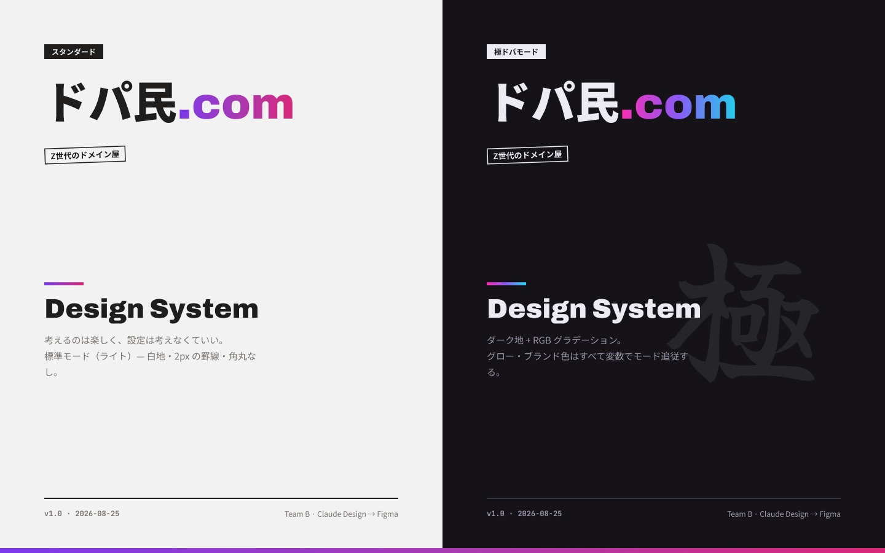 | 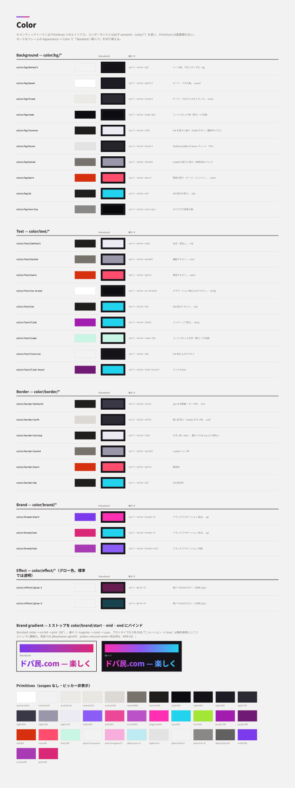 |
| 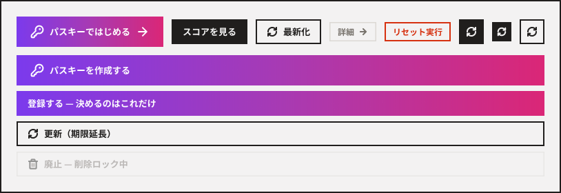 | 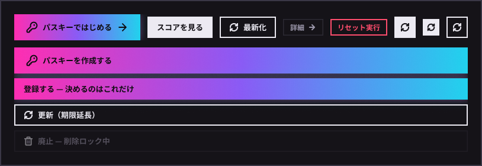 |
| 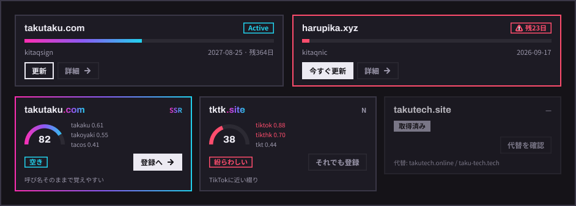 | 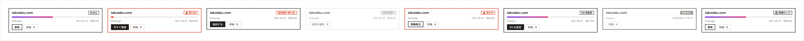 |

### 画面

| Standard | 極ドパ |
|---|---|
| 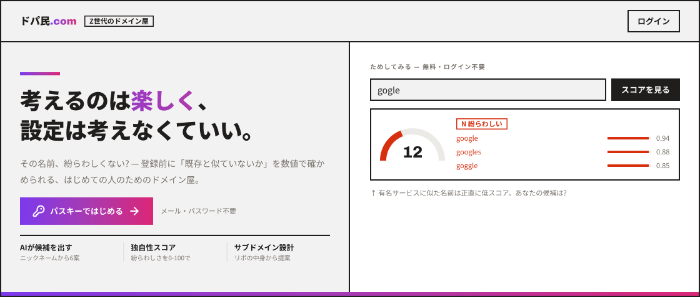 | 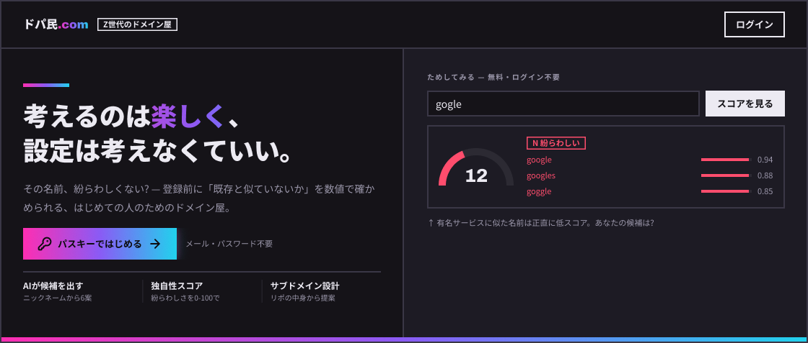 |
| 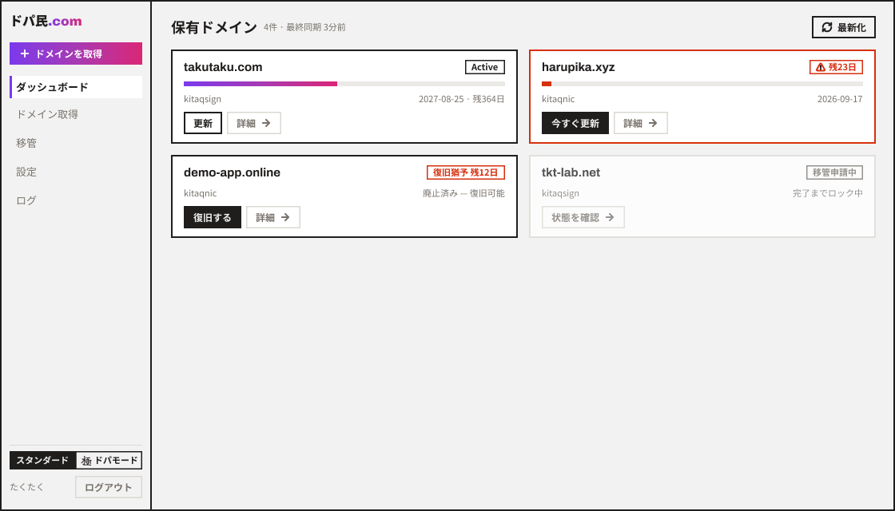 | 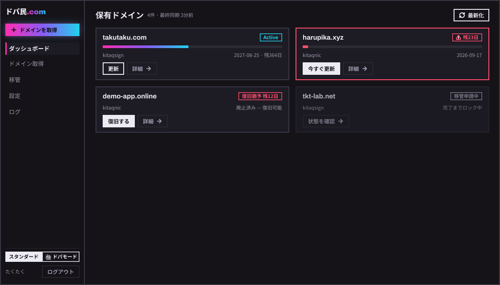 |

| | |
|---|---|
| 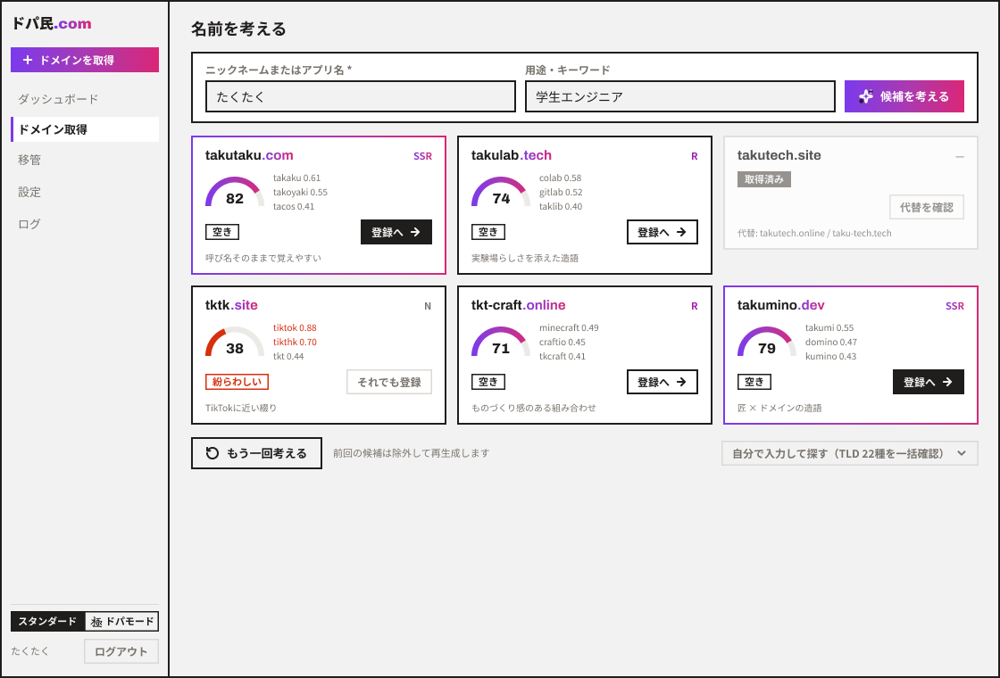 | 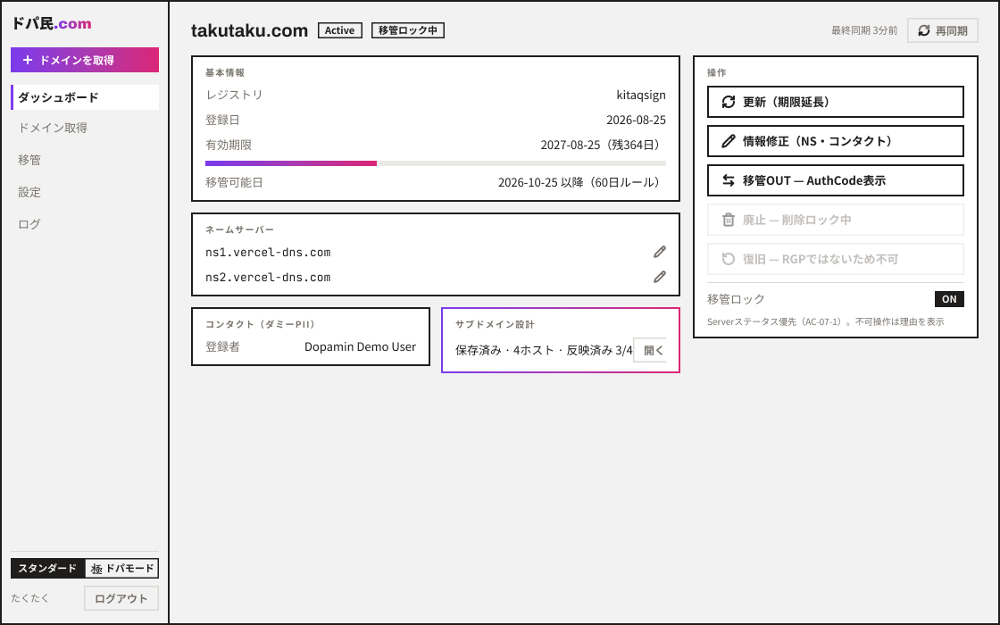 |
| 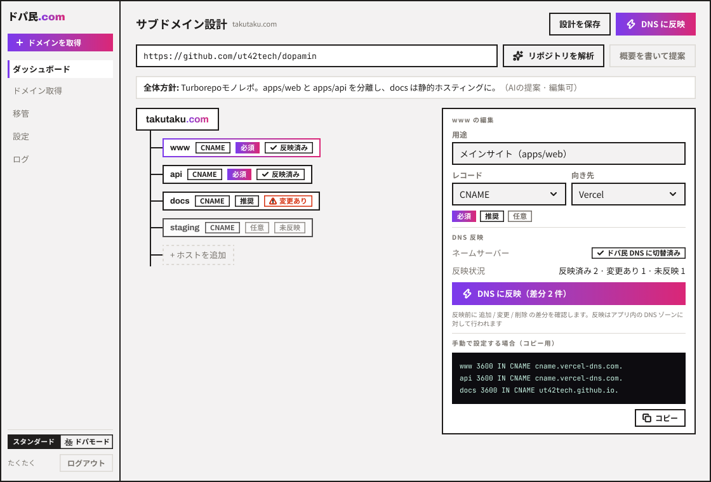 | 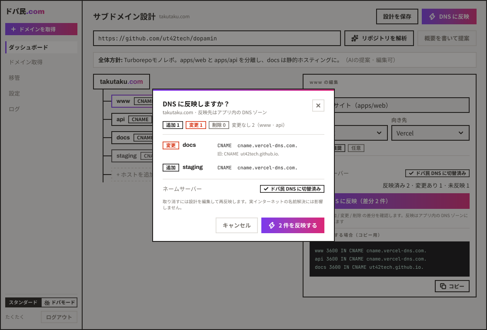 |
| 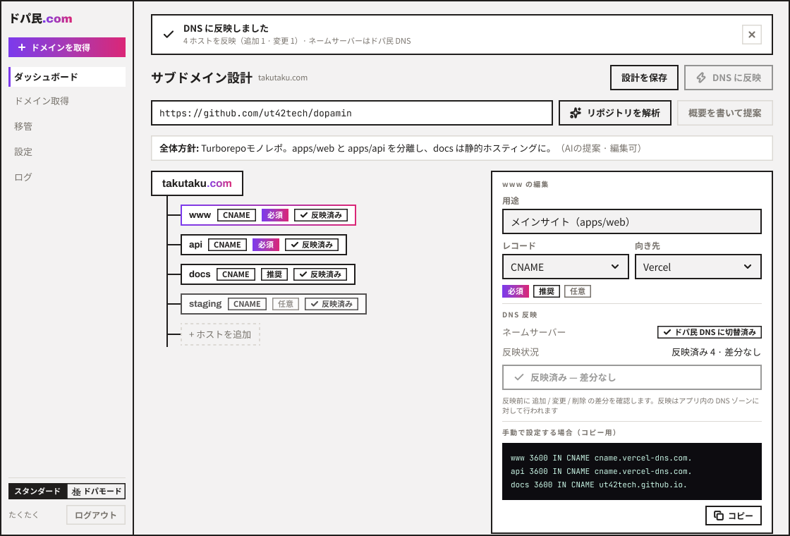 | 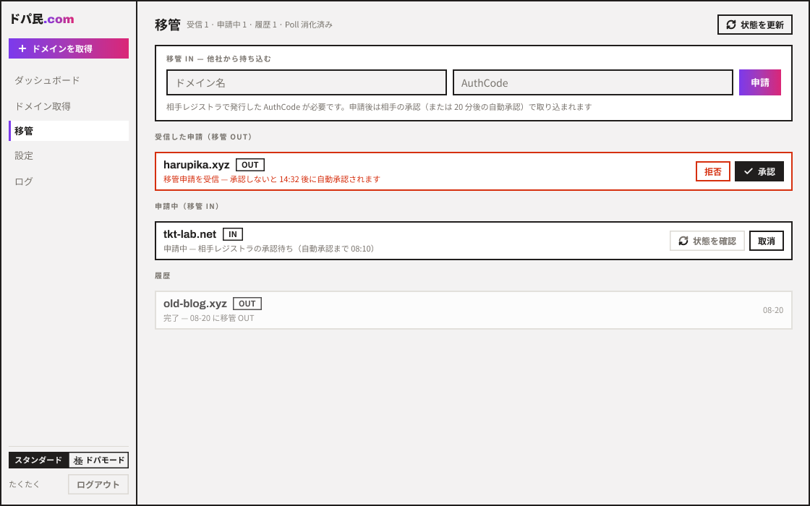 |
| 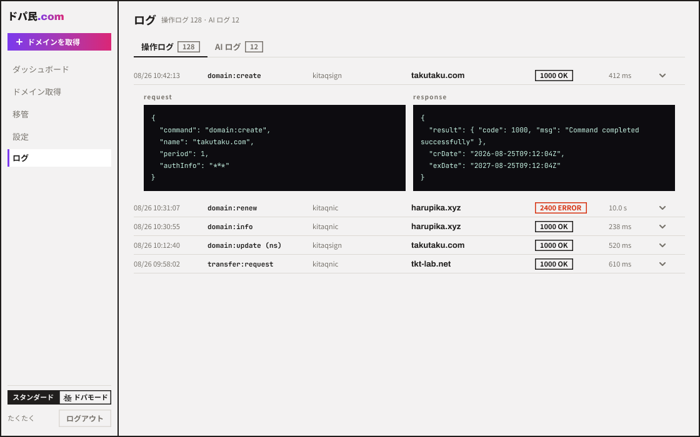 | |

### 画面遷移

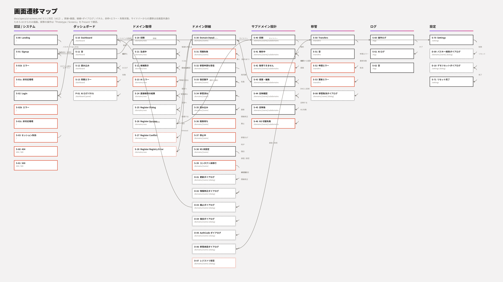

## 実装時の参照順

1. `docs/specs/ui-screens.md` で対象画面の ID と状態を確認する
2. Figma の **Prototype / Screens** で同 ID のフレームを開く（Dev Mode で余白・色・タイポの変数名を取得）
3. 使用コンポーネントは各コンポーネントページの `_Doc` フレームに使い方・プロパティの説明がある

## Figma と実装がずれている箇所

`ui-screens.md` が正。Figma のフレームをそのまま実装しないこと。

- **P-01（AI ログパネル）は廃止**。全画面から開ける右ドロワーは作らず、AI ログは `/logs` のタブ（S-61）で見る。
- **サイドバーのナビは 3 項目**（ダッシュボード / 移管 / 設定）。「ドメイン取得」は主要 CTA 1 本に寄せ、「ログ」は S-70（設定）の「開発者向け」からのみ到達する。
- **Domain Card はカード面全体が S-30 へのリンク**で、「詳細」ボタンを持たない。
- **`--color-muted`（標準）は `#736e68`**。Figma の `#77726c` はコントラスト 4.26:1 で AA を満たしていなかった（`docs/specs/web-ui.md` §3.1）。
